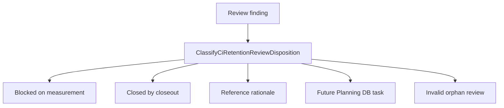

# CI Retention Review Canon User Stories

## User Stories

### US-CI-RET-CANON-001: CI Maintainer Finds The Active Gate

As a CI maintainer, I want CI review findings to point to `RC-C2`,
`CI-AUDIT-*`, or a closeout so that I do not treat review prose as the active
gate.

Acceptance:

- `RC-C2` review findings point to the AI efficiency adoption status and
  adoption log.
- CI build audit findings point to `CI-AUDIT-*` tasks or reference status.
- Negative evidence fails when a CI review has no disposition.

### US-CI-RET-CANON-002: Delivery Maintainer Sees Blocked Versus Closed

As a Delivery maintainer, I want delivery observations to distinguish shipped
tooling from blocked adoption evidence so that process work is not marked done
without measured cycles.

Acceptance:

- The board classifies `RC-C2` as blocked on measurement evidence, not closed.
- Closeouts remain evidence for shipped slices only.
- Negative evidence fails when adoption evidence is implied without the
  canonical YAML log.

### US-CI-RET-CANON-003: Retention Maintainer Reuses The Policy Component

As a Retention maintainer, I want event-retention reviews to point to the
run-event retention policy component and AR-D5/MVP-D1 evidence so that
retention behavior does not drift into review documents.

Acceptance:

- Retention kickoff, Fowler QA, risk, and residual-risk reviews are
  dispositioned as done/reference with component ownership.
- Tenant-configurable retention work points to the existing policy component.
- Negative evidence fails when retention reviews imply a new policy owner.

### US-CI-RET-CANON-004: Planning Steward Prevents Review Backlogs

As a Planning steward, I want CI, delivery, and retention reviews to become
tasks only through Planning DB so that active review boards do not become a
parallel backlog.

Acceptance:

- Remaining work becomes a task before implementation.
- Closed work links to closeout evidence.
- Reference reviews remain rationale only.
- Negative evidence fails when a review is active with no owner or disposition.

## Scenario Map

