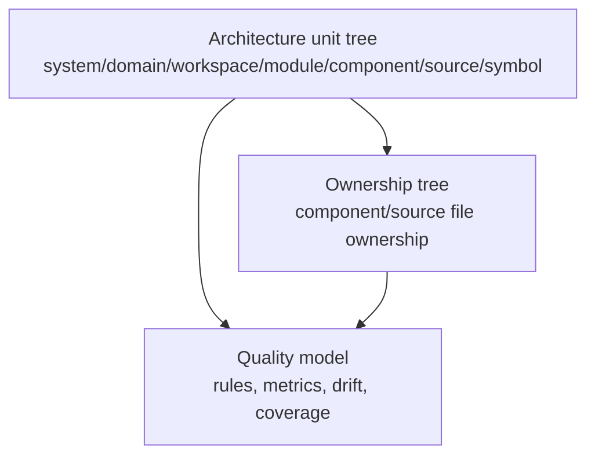
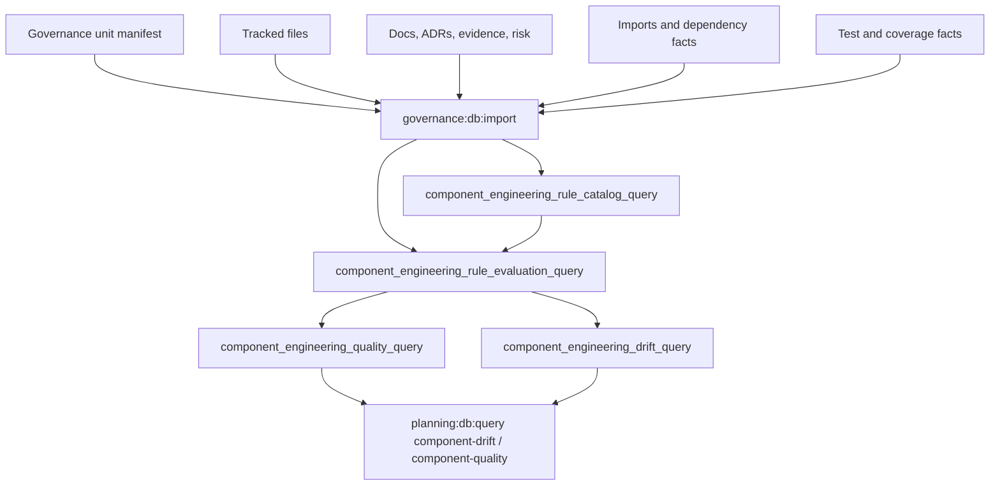

# Component Engineering Invariant Model

## Purpose

Owned concern: define the repository component engineering invariants that must
be evaluated through the planning query store.

This document is the human-readable specification for the component engineering
rule model. It is not the execution surface. The executable rule catalog,
evaluation state, drift rows, and quality summaries must live in the planning
database. A rule described here is not closed until a DB-owned query can expose
its configured predicate, evaluated subjects, pass/fail state, and remediation
metadata.

The model exists to make architecture review falsifiable. It combines ideas
from mature architecture systems:

- C4, to separate system, container/workspace, component, and code-level views.
- DDD, to keep ownership, bounded context, and command/query rails explicit.
- Composite, to allow components to contain components without flattening the
  model.
- Clean Architecture and dependency inversion, to validate dependency
  direction instead of merely documenting it.
- SOLID, to turn responsibility and interface pressure into measurable signals.
- Fowler-style evolutionary architecture, to treat drift, oversized boundaries,
  and hidden authority as repairable design feedback.
- Fitness functions, to run the rules repeatedly through CI and local query
  rails.

## Governing Sources

- `AGENTS.md`
- `docs/planning/status/governance-document-rule-inventory.md`
- `docs/architecture/command-query-rail-governance.md`
- `docs/architecture/fowler-opportunity-planning-governance.md`
- `docs/planning/status/system-governance-unit-taxonomy-20260501.md`
- `docs/planning/status/system-governance-unit-index.units.yaml`
- `docs/planning/status/db-surface-inventory.md`
- `docs/adr/ADR-0000-Code-generation-with-normative-traceability-required.en.md`
- `docs/adr/adr-0055-planning-db-canonical-operational-source.md`

## DB-First Rule

Component engineering rules must be DB-backed.

The Markdown source may explain and govern the rule language, but routine
inspection must use DB query rails. A complete implementation therefore needs
these DB concepts:

| DB concept                                    | Role                                                                 |
| --------------------------------------------- | -------------------------------------------------------------------- |
| `component_engineering_rule_catalog_query`    | Lists every active invariant rule and its evaluation contract        |
| `component_engineering_rule_evaluation_query` | Evaluates each rule against architecture units and components        |
| `component_engineering_quality_query`         | Aggregates size, responsibility, coupling, coverage, and drift state |
| `component_engineering_drift_query`           | Emits concrete drift codes for failing rule evaluations              |

The executable DB surface has `component_engineering_component_tree_query`,
`component_engineering_file_ownership_query`,
`component_engineering_component_metadata_query`,
`component_engineering_rule_catalog_query`,
`component_engineering_rule_evaluation_query`,
`component_engineering_quality_query`, and
`component_engineering_drift_query`. The rule catalog and evaluation views own
the invariant semantics; operator commands only filter and render those rows.

### Rule Catalog Record

Every invariant must have one DB catalog row.

```yaml
rule_id: CEI-RESP-001
name: canonical_unit_declares_owned_concern
category: responsibility
severity: error
subject_level: component
subject_scope: canonical_or_review
predicate_owner: planning_query_store
evaluation_view: component_engineering_rule_evaluation_query
drift_code: missing_owned_concern
governing_doc: docs/architecture/components/ci-governance/component-engineering-invariants.md
remediation: Add an ownedConcern statement to the governed component metadata.
validation_command: pnpm planning:db:query component-drift --component <component_id>
```

### Rule Evaluation Record

Every rule evaluation must produce one row per evaluated subject.

```yaml
rule_id: CEI-RESP-001
subject_id: SYS-RUNTIME-ENGINE-CORE
subject_level: component
evaluation_state: pass | fail | not_applicable | not_indexed
drift_code: missing_owned_concern | null
severity: error | warning | info
metadata: {}
source_hashes: []
evaluated_at: <database evaluation timestamp>
```

`not_indexed` is allowed only while the underlying governed source is not yet
available in the DB. It must be reported as an explicit completeness gap, not
silently treated as pass.

## Model Layers

The architecture model has three related trees. They must not be collapsed.



### Architecture Unit Tree

The architecture unit tree models the system shape. It includes all unit
levels:

```text
system -> domain -> workspace -> module -> component -> source -> symbol
```

This tree owns identity, hierarchy, responsibility, documentation, and
governance metadata. Parent closure must be evaluated here because parent
units may be modules, workspaces, domains, or systems.

### Ownership Tree

The ownership tree maps files to their deepest owning implementation unit.
Only `component` and `source` units may own files. A `module`, `workspace`,
`domain`, or `system` may aggregate descendants but must not own files
directly.

### Quality Model

The quality model evaluates architecture fitness. It joins unit identity,
ownership, file metrics, documentation, tests, dependencies, and rule
evaluations.

## Component Engineering Shape

Each architecture unit must be representable as this conceptual record.

```yaml
identity:
  unit_id:
  name:
  level:
  parent_id:
  status:
  root_unit:
  domain_unit:
responsibility:
  owned_concern:
  responsibilities:
  non_goals:
  reasons_to_change:
  decision_authority:
interfaces:
  public_api:
  commands:
  queries:
  events:
  ports:
  adapters:
  consumers:
sources:
  owns:
  excludes:
  direct_file_count:
  descendant_file_count:
  direct_loc:
  descendant_loc:
quality:
  coverage_required:
  coverage_state:
  test_file_count:
  architecture_guards:
  negative_tests:
coupling:
  afferent_coupling:
  efferent_coupling:
  instability:
  forbidden_dependencies:
  allowed_dependencies:
governance:
  doc_refs:
  adr_refs:
  evidence_refs:
  risk_refs:
  fowler_signals:
  drift_codes:
```

## Invariant Families

### Identity And Hierarchy

| Rule ID      | Invariant                                                                   | Drift code                | Severity |
| ------------ | --------------------------------------------------------------------------- | ------------------------- | -------- |
| `CEI-ID-001` | Every `unit_id` is unique and stable.                                       | `duplicate_unit_id`       | error    |
| `CEI-ID-002` | Every non-root unit has a parent in the architecture unit tree.             | `missing_parent`          | error    |
| `CEI-ID-003` | Parent chains are acyclic.                                                  | `parent_cycle`            | error    |
| `CEI-ID-004` | Parent and child levels follow the taxonomy hierarchy.                      | `invalid_parent_level`    | error    |
| `CEI-ID-005` | A component may contain component children.                                 | `invalid_component_child` | error    |
| `CEI-ID-006` | Parent closure is evaluated against the full unit tree, not component-only. | `parent_not_in_unit_tree` | error    |

`SYS-RUNTIME-ROOT` is a valid parent when it exists as a `module`. It should
not need to become a `component` only to satisfy a component-only query. The DB
rule runtime must distinguish architecture parent closure from file ownership
closure.

### Responsibility And SOLID

| Rule ID        | Invariant                                                                      | Drift code                       | Severity |
| -------------- | ------------------------------------------------------------------------------ | -------------------------------- | -------- |
| `CEI-RESP-001` | Canonical or review units declare `ownedConcern`.                              | `missing_owned_concern`          | error    |
| `CEI-RESP-002` | Components declare responsibilities.                                           | `missing_responsibilities`       | error    |
| `CEI-RESP-003` | Components declare non-goals when their parent is broad.                       | `missing_non_goals`              | warning  |
| `CEI-RESP-004` | A component has one primary reason to change.                                  | `responsibility_overload`        | warning  |
| `CEI-RESP-005` | A component with multiple reasons to change must be split or accepted by risk. | `split_required_or_risk_missing` | error    |
| `CEI-RESP-006` | Assemblies coordinate children; they do not hide child responsibilities.       | `assembly_hides_child_concern`   | warning  |

These rules are the SRP gate. The DB must be able to answer why a unit changes,
which responsibilities it owns, and whether its children express separate
concerns.

### Interface And API Surface

| Rule ID       | Invariant                                                                                                     | Drift code                      | Severity |
| ------------- | ------------------------------------------------------------------------------------------------------------- | ------------------------------- | -------- |
| `CEI-API-001` | Public API is declared for units that expose commands, queries, ports, routes, exports, or operator surfaces. | `missing_public_api`            | error    |
| `CEI-API-002` | Every public API has at least one consumer or a documented rationale.                                         | `unused_api_surface`            | warning  |
| `CEI-API-003` | Command/query rails have DDD ownership.                                                                       | `rail_without_ddd_owner`        | error    |
| `CEI-API-004` | Interface segregation is visible through consumer-specific APIs.                                              | `interface_too_broad`           | warning  |
| `CEI-API-005` | Adapter surfaces translate semantics; they do not own domain decisions.                                       | `adapter_owns_domain_semantics` | error    |

These rules are the ISP and API governance gate. A component cannot be judged
only by files; it must expose a bounded contract.

### Source Ownership

| Rule ID       | Invariant                                                                        | Drift code                        | Severity |
| ------------- | -------------------------------------------------------------------------------- | --------------------------------- | -------- |
| `CEI-SRC-001` | Every tracked file has exactly one owning unit.                                  | `file_without_owner`              | error    |
| `CEI-SRC-002` | No tracked file has multiple owning units.                                       | `file_with_multiple_owners`       | error    |
| `CEI-SRC-003` | Only `component` and `source` units own files.                                   | `file_owned_by_non_owner_level`   | error    |
| `CEI-SRC-004` | File ownership resolves to the deepest valid ownership unit.                     | `file_not_owned_by_leaf`          | error    |
| `CEI-SRC-005` | Non-leaf components do not own files unless the file role is explicitly allowed. | `non_leaf_file_owner`             | warning  |
| `CEI-SRC-006` | Source units have component parents.                                             | `source_without_component_parent` | error    |

### Size And Complexity

| Rule ID        | Invariant                                                             | Drift code                    | Severity |
| -------------- | --------------------------------------------------------------------- | ----------------------------- | -------- |
| `CEI-SIZE-001` | Every unit exposes direct and descendant file counts.                 | `missing_file_metrics`        | error    |
| `CEI-SIZE-002` | Every unit exposes direct and descendant LOC once indexed.            | `missing_loc_metrics`         | warning  |
| `CEI-SIZE-003` | A component exceeding its file or LOC threshold is oversized.         | `oversized_component`         | warning  |
| `CEI-SIZE-004` | A component with too many children is an unbounded assembly.          | `unbounded_assembly`          | warning  |
| `CEI-SIZE-005` | `childrenRequired: true` requires at least one child unit.            | `hollow_assembly`             | error    |
| `CEI-SIZE-006` | Large components require explicit split rationale or risk acceptance. | `oversized_without_rationale` | error    |

Initial threshold posture:

| Unit kind       | File threshold  | LOC threshold    | Child threshold |
| --------------- | --------------- | ---------------- | --------------- |
| assembly module | 0 direct files  | 0 direct LOC     | 12 children     |
| component       | 20 direct files | 1,500 direct LOC | 8 children      |
| adapter         | 15 direct files | 1,200 direct LOC | 6 children      |
| port/contract   | 20 direct files | 1,500 direct LOC | 8 children      |
| source          | 1 file          | 500 LOC          | 0 children      |

Thresholds are warning gates until measured against repository history. The DB
must store threshold source and severity so the rule can be tuned without
rewriting evaluation logic.

### Coupling And Dependency Direction

| Rule ID        | Invariant                                                       | Drift code                               | Severity |
| -------------- | --------------------------------------------------------------- | ---------------------------------------- | -------- |
| `CEI-COUP-001` | Afferent coupling (`Ca`) is measured for every component.       | `missing_afferent_coupling`              | warning  |
| `CEI-COUP-002` | Efferent coupling (`Ce`) is measured for every component.       | `missing_efferent_coupling`              | warning  |
| `CEI-COUP-003` | Instability is computed as `Ce / (Ca + Ce)`.                    | `missing_instability`                    | warning  |
| `CEI-COUP-004` | Core components do not depend on adapter implementations.       | `dependency_direction_violation`         | error    |
| `CEI-COUP-005` | Adapters depend inward on ports or contracts.                   | `adapter_dependency_inversion_violation` | error    |
| `CEI-COUP-006` | Highly consumed unstable components raise shotgun-surgery risk. | `shotgun_surgery_risk`                   | warning  |
| `CEI-COUP-007` | High outgoing coupling from core raises unstable-core risk.     | `unstable_core`                          | warning  |

Coupling rules require dependency extraction from TypeScript imports, package
metadata, and documented command/query rails. Until that extractor exists, the
DB evaluation state must be `not_indexed`, not pass.

### Tests, Coverage, And Fitness Functions

| Rule ID        | Invariant                                                                    | Drift code                   | Severity |
| -------------- | ---------------------------------------------------------------------------- | ---------------------------- | -------- |
| `CEI-TEST-001` | `coverage-required` units expose test file count.                            | `missing_test_metrics`       | error    |
| `CEI-TEST-002` | Coverage-required components have tests or accepted risk.                    | `missing_tests`              | error    |
| `CEI-TEST-003` | Boundary components have architecture guards.                                | `missing_architecture_guard` | error    |
| `CEI-TEST-004` | Contract or port components have contract tests, fixtures, or vector checks. | `missing_contract_test`      | error    |
| `CEI-TEST-005` | Drift rules have negative tests.                                             | `missing_negative_test`      | warning  |
| `CEI-TEST-006` | Test-only confidence is drift when no production invariant is indexed.       | `test_only_confidence`       | warning  |

The DB must preserve both direct tests and descendant tests. A parent assembly
can be covered by children, but a leaf component with behavior cannot claim
coverage only through parent-level tests.

### Documentation, Evidence, And ADRs

| Rule ID       | Invariant                                                                        | Drift code                 | Severity |
| ------------- | -------------------------------------------------------------------------------- | -------------------------- | -------- |
| `CEI-DOC-001` | Canonical components have a component document.                                  | `missing_component_doc`    | error    |
| `CEI-DOC-002` | Component docs declare public API, invariants, transitions, and consumers.       | `component_doc_incomplete` | error    |
| `CEI-DOC-003` | Normative behavior changes link ADR, evidence, or risk as required by ARC rules. | `missing_normative_trace`  | error    |
| `CEI-DOC-004` | Documentation and manifest metadata agree.                                       | `documentation_drift`      | warning  |
| `CEI-DOC-005` | Generated indexes remain generated; they are not manual rule sources.            | `generated_doc_as_source`  | error    |

### Lifecycle And Drift

| Rule ID        | Invariant                                                                                | Drift code                   | Severity |
| -------------- | ---------------------------------------------------------------------------------------- | ---------------------------- | -------- |
| `CEI-LIFE-001` | `canonical` means code, docs, tests, and DB evaluations agree.                           | `canonical_with_open_drift`  | error    |
| `CEI-LIFE-002` | `coverage-required` cannot close without child split or risk acceptance.                 | `coverage_required_unclosed` | error    |
| `CEI-LIFE-003` | `legacy` units cannot gain new changed files without explicit approval.                  | `legacy_unit_changed`        | error    |
| `CEI-LIFE-004` | Drift must be fixed in source, docs, tests, or DB rules, not hidden by query exceptions. | `drift_suppressed`           | error    |

## Fowler And SOLID Mapping

| Signal                | Data needed                                                    | Rule family           |
| --------------------- | -------------------------------------------------------------- | --------------------- |
| Single Responsibility | owned concern, responsibilities, reasons to change, file roles | responsibility, size  |
| Open/Closed pressure  | churn across consumers, API changes, extension points          | interfaces, lifecycle |
| Interface Segregation | public API count, consumer-specific usage, unused API surfaces | interfaces, coupling  |
| Dependency Inversion  | dependency direction, ports, adapters, contracts               | coupling, interfaces  |
| God Component         | size, responsibility count, coupling, direct file ownership    | size, responsibility  |
| Shotgun Surgery       | high `Ca`, unstable provider, many consumers                   | coupling, lifecycle   |
| Feature Envy          | outgoing dependency concentration on another component         | coupling              |
| Hidden Authority      | behavior guarded only by local scripts or docs                 | DB-first rule, tests  |
| Documentation Drift   | doc refs disagree with manifest or DB projection               | documentation, drift  |

## Query Semantics

The DB-backed inspection flow should look like this:



Required query behavior:

- `component-tree` reads hierarchy and ownership context.
- `component-drift` reads failing rule evaluations as drift rows.
- `component-quality` reads aggregate Fowler/SOLID signals.
- `cer --schema-version v2` renders the DB-backed record with explicit
  completeness gaps.

## Implementation Phases

### Phase 1: Documented Contract

This document defines the rule language and DB-first constraint. It does not
claim the rules are fully executable until the DB rule catalog and evaluation
views exist.

### Phase 2: DB Rule Catalog

Implemented by `034_component_engineering_rule_runtime.sql` for the active
identity, responsibility, interface, size, and source-owner rule families.

### Phase 3: Rule Evaluation Query

Implemented by `034_component_engineering_rule_runtime.sql`.
`component_engineering_drift_query` derives from failed rule evaluations instead
of maintaining a separate local drift predicate.

### Phase 4: Quality Metrics

The first DB rollup is `component_engineering_quality_query`. It exposes
hierarchy size, file size, test file count, failing rule counts, severity
counts, and drift codes. Coupling, coverage, documentation, and lifecycle
posture remain future rule families and must be added as DB rules, not Markdown
exceptions.

### Phase 5: CI And Closeout Gate

Promote critical rule families into `pnpm verify:prepush` through existing
planning and governance DB checks. The closeout standard should require no
`error` severity drift for touched components.

## Non-Goals

- This model does not replace ADRs, contracts, or component docs.
- This model does not infer domain ownership from folder names alone.
- This model does not allow a Markdown table to be the only rule source.
- This model does not silence drift by creating query exceptions for known
  roots or assemblies.

## Closure Criteria

The component engineering invariant model is complete when:

- every rule in this document is present in the DB rule catalog;
- every applicable architecture unit receives a DB evaluation row;
- `component-drift` derives from rule evaluation failures;
- `component-quality` exposes size, responsibility, coupling, tests, coverage,
  documentation, and lifecycle posture;
- `cer --schema-version v2` includes rule and quality state without inventing
  missing facts;
- `pnpm governance:refresh` and `pnpm verify:prepush` fail closed on critical
  rule drift.
