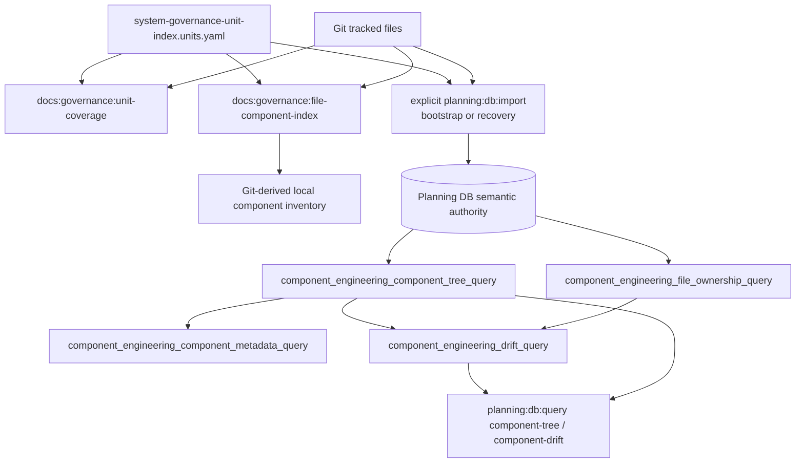

# Component Engineering Record Component

## Purpose

Owned concern: expose repository component structure as a falsifiable,
DB-backed engineering record.

This component turns the governance unit manifest, tracked repository files,
generated local projections, and planning DB query views into one component
engineering model. The model is recursive: a component may contain child
components, and every tracked file must resolve to exactly one leaf component.

## Governing Sources

- `AGENTS.md`
- `docs/planning/status/governance-document-rule-inventory.md`
- `docs/architecture/command-query-rail-governance.md`
- `docs/architecture/fowler-opportunity-planning-governance.md`
- `docs/planning/status/db-surface-inventory.md`
- `docs/planning/status/system-governance-unit-taxonomy-20260501.md`
- `docs/planning/status/system-governance-unit-index.units.yaml`
- `docs/architecture/components/ci-governance/component-engineering-invariants.md`
- `docs/adr/adr-0055-planning-db-canonical-operational-source.md`

## Public API

| Surface                                                             | Type    | Contract                                                                |
| ------------------------------------------------------------------- | ------- | ----------------------------------------------------------------------- |
| `pnpm docs:governance:unit-coverage`                                | command | Validates unit hierarchy, parent closure, and exact file ownership      |
| `pnpm docs:governance:file-component-index`                         | command | Generates local file/component inspection artifacts                     |
| `pnpm planning:db:import`                                           | command | Explicitly rebuilds projections for bootstrap or recovery               |
| `pnpm planning:db:query component-tree --component <component_id>`  | query   | Reads recursive component hierarchy rows                                |
| `pnpm planning:db:query component-drift --component <component_id>` | query   | Reads mechanical component engineering drift rows                       |
| `component_engineering_component_tree_query`                        | view    | DB-first component tree with parent, direct, and descendant file counts |
| `component_engineering_file_ownership_query`                        | view    | DB-first file-to-leaf-component ownership rows                          |
| `component_engineering_component_metadata_query`                    | view    | Derived semantic metadata and missing-metadata gaps                     |
| `component_engineering_drift_query`                                 | view    | Drift codes for unresolved parent, missing children, and non-leaf files |

## Invariants

- Every tracked file has exactly one owning unit.
- Every file owned by a component tree resolves to the deepest component in
  that file's unit path.
- `component` may parent `component`; this is the Composite pattern applied to
  governance units.
- `childrenRequired: true` means the component must contain at least one child
  component before architecture closure is claimed.
- Canonical components declare owned concern, public API, invariants,
  transitions, and consumers in the unit manifest.
- Query rails read existing DB semantic authority without importing it as a
  side effect. Git-owned physical inventory is read and validated from Git.
- A stale or unavailable DB query fails closed. Projection reconstruction is an
  explicit bootstrap or recovery operation, never routine inspection.
- Component engineering rules must be DB-backed; a Markdown invariant is not
  complete until the planning query store exposes its catalog row, evaluation
  state, drift code, and remediation metadata.
- Generated `system-governance-*` files stay local inspection artifacts, not
  manual review surfaces.

## Transitions

| Transition                        | Trigger                                       | Required checks                                                              |
| --------------------------------- | --------------------------------------------- | ---------------------------------------------------------------------------- |
| Root component becomes composite  | Broad component owns unrelated implementation | Add child components, set root `childrenRequired: true`, rerun unit coverage |
| Child component becomes canonical | Docs, tests, contracts, and owners agree      | Add semantic metadata and run governance refresh                             |
| File moves between components     | Source/test/doc path is renamed or extracted  | Update owns/excludes and regenerate the Git-derived file index               |
| Query reads a stale projection    | Governance source hash differs from DB        | Fail closed; reconstruct only through explicit bootstrap/recovery            |
| Drift is detected                 | DB view emits a drift row                     | Fix manifest, docs, tests, or component split before closeout                |
| Query rail changes                | New DB view/query behavior is added           | Update DB surface inventory, tests, migration, and plan manifest             |

## Consumers

- Repository agents using planning and governance rails.
- CI docs governance checks.
- Architecture reviewers comparing component intent with real files.
- Planning DB query users inspecting `component-tree` and `component-drift`.
- Feature mechanization guards validating changed-file scope.

## Engine Pilot

The first real slice is `SYS-RUNTIME-ENGINE-CORE`. It is no longer treated as a
flat component that owns `packages/@dvt/engine/**`. It is an assembly with
children for package surface, adapters, application services, workflow use
cases, contracts, lifecycle core, ports, security, runtime services,
start-run orchestration, run control, maintenance, state, outbox,
determinism utilities, and architecture tests.

Plan-ref policy files remain owned by `SYS-PLANSTORE-ENGINE-FETCH`, so the
engine component tree reflects the cross-domain reality instead of hiding it.

### 2026-05-27 Engine Mapping Pass

The current Planning DB query state shows the engine pilot is mechanically
mapped but not semantically complete.

Evidence:

- `pnpm planning:db:query component-tree` lists 16 child components below
  `SYS-RUNTIME-ENGINE-CORE`.
- `pnpm planning:db:query component-quality --component SYS-RUNTIME-ENGINE-CORE`
  returns `pass`, 0 direct files, 199 descendant files, and 16 children.
- `pnpm planning:db:query component-drift --component SYS-RUNTIME-ENGINE-CORE`
  returns no drift rows.
- `pnpm planning:db:query component-metadata --component SYS-RUNTIME-ENGINE-CORE`
  still returns `incomplete`.

That means the next engine component-engineering step is metadata enrichment,
not a blind source refactor. The residual is tracked by
`D-ENGINE-COMPONENT-METADATA-INDEX-1` and by the Fowler review at
`docs/planning/reviews/architecture-and-governance/20260527-docs-engine-component-reconciliation-fowler-review.md`.

## Topology

## Engine Component Tree

```mermaid
flowchart TB
  Root["SYS-RUNTIME-ENGINE-CORE"]
  Package["SYS-RUNTIME-ENGINE-PACKAGE-SURFACE"]
  Adapters["SYS-RUNTIME-ENGINE-ADAPTERS"]
  App["SYS-RUNTIME-ENGINE-APPLICATION"]
  UseCases["SYS-RUNTIME-ENGINE-WORKFLOW-USE-CASES"]
  Contracts["SYS-RUNTIME-ENGINE-CONTRACTS"]
  Core["SYS-RUNTIME-ENGINE-CORE-LIFECYCLE"]
  Ports["SYS-RUNTIME-ENGINE-DOMAIN-PORTS"]
  Security["SYS-RUNTIME-ENGINE-SECURITY"]
  Services["SYS-RUNTIME-ENGINE-RUNTIME-SERVICES"]
  StartRun["SYS-RUNTIME-ENGINE-START-RUN"]
  Control["SYS-RUNTIME-ENGINE-RUN-CONTROL"]
  Maintenance["SYS-RUNTIME-ENGINE-RUN-MAINTENANCE"]
  State["SYS-RUNTIME-ENGINE-STATE"]
  Outbox["SYS-RUNTIME-ENGINE-OUTBOX"]
  Utils["SYS-RUNTIME-ENGINE-DETERMINISM-UTILS"]
  Arch["SYS-RUNTIME-ENGINE-ARCHITECTURE-TESTS"]

  Root --> Package
  Root --> Adapters
  Root --> App
  Root --> UseCases
  Root --> Contracts
  Root --> Core
  Root --> Ports
  Root --> Security
  Root --> Services
  Root --> StartRun
  Root --> Control
  Root --> Maintenance
  Root --> State
  Root --> Outbox
  Root --> Utils
  Root --> Arch
```

## Drift Codes

| Code                                 | Meaning                                             | Typical fix                                     |
| ------------------------------------ | --------------------------------------------------- | ----------------------------------------------- |
| `unresolved_parent`                  | A component row references a parent missing in tree | Fix manifest parent or import/generator mapping |
| `children_required_without_children` | A composite candidate has no child component rows   | Add real children or remove the requirement     |
| `file_without_leaf_component`        | A file maps to a non-leaf or missing component      | Move ownership to the deepest component         |

## Fowler Comparison

Mature systems keep architecture as an executable model, not a wiki-only
inventory. This component moves the repository toward that posture:

- Composite replaces a flat component list, so assemblies are explicit.
- Query rails replace local file checks as the inspection API.
- Semantic metadata turns "component" from a label into an owned concern.
- Drift rows make boundary decay visible before PR closeout.
