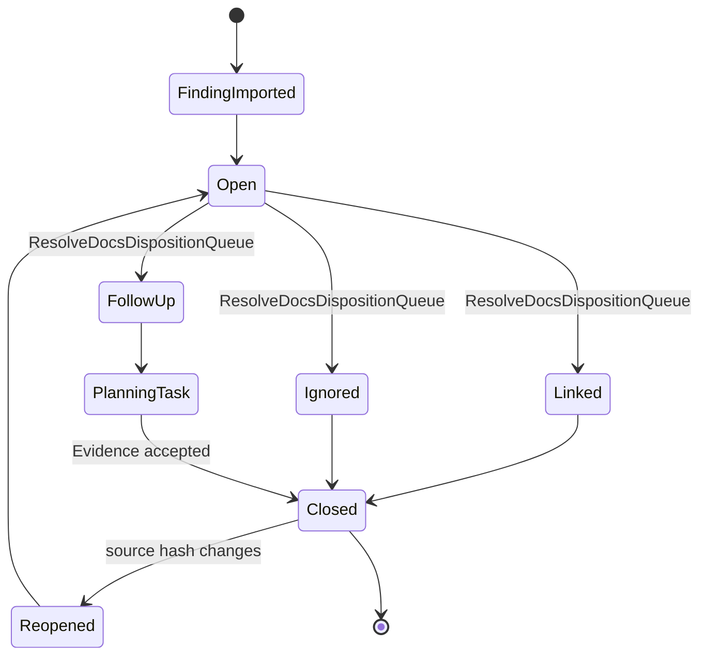
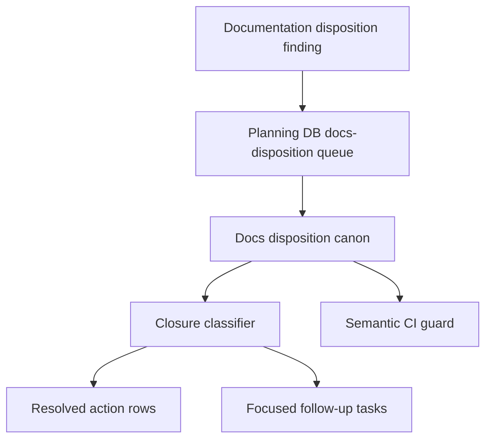

# Docs Disposition Canon Component

> Owned concern: this component owns semantic closure for active Draft,
> Superseded, and task-like identifier documentation findings through the
> Planning DB docs-disposition rail.

## Public API

- `ResolveDocsDispositionQueue(input)`: records a disposition action resolution
  with actor, referenced evidence, source hash, and status.
- `ClassifyDocsDispositionClosure(input)`: classifies a finding as open,
  linked, ignored, reopened, or requiring a focused follow-up.

## Invariants

- Planning DB is the operational queue for docs disposition findings.
- A status inventory is evidence and triage input; it is not an execution queue.
- Draft and Superseded labels are not enough to move ADRs, closeouts, or
  evidence documents without owner and backlink checks.
- Task-like identifiers are classified by semantic family before any planning
  task is created.
- Docs, component guide, user stories, canonical Fowler mechanization, and
  semantic test must name the same command/query rails.

## Transitions

## Consumers

- Documentation maintainers use the classification before moving or rewriting
  active documents.
- Planning stewards use the closure state to avoid duplicate tasks and stale
  status-board work.
- Architecture reviewers use the component to distinguish real active findings
  from historical IDs, rails, user stories, and invariants.
- Governance operators use the semantic test to ensure status snapshots do not
  become hidden workboards.

## Command And Query Rail

| Rail                             | Type    | Owner                               | Surface                              |
| -------------------------------- | ------- | ----------------------------------- | ------------------------------------ |
| `ResolveDocsDispositionQueue`    | command | Docs disposition canon aggregate    | Planning DB operation and audit log  |
| `ClassifyDocsDispositionClosure` | query   | Docs disposition closure read model | Component guide and semantic CI test |

## Semantic Fitness Function

`tools/ci/docs-disposition-canon.test.mjs` validates that the canon plan,
component guide, user stories, documentation-governance domain, and canonical
Fowler mechanization tokens name the same semantic rails. It also rejects the
retired May status snapshots and their former Git-owned catalog entry, while
requiring the existing DB-owned resolution overlay and command/query rails.

It validates disposition ownership and DB-first closure rather than only
checking generated index freshness.

## Component Grouping

## Related Docs

- [Docs Disposition Canon User Stories](./docs-disposition-canon-user-stories.md)
- [Docs Disposition Canon Plan 2026-05-24](../../../planning/proposals/mandatory/governance-and-docs/docs-disposition-canon-plan-20260524.md)
- [Docs Disposition Mailbox Analysis](https://github.com/dunay2/dvt/blob/2df68680de46b9104282a58fd203a7eef551ca38/buzon/20260524-codex-fowler-docs-disposition-canon.md)
