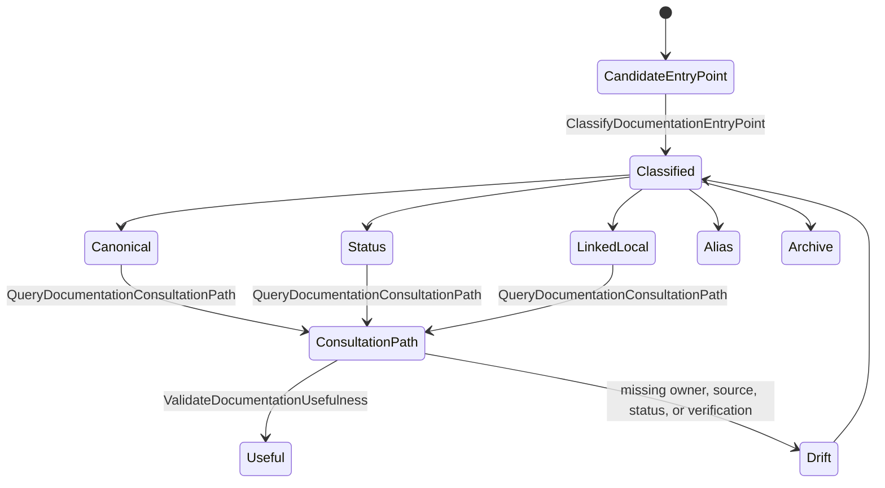
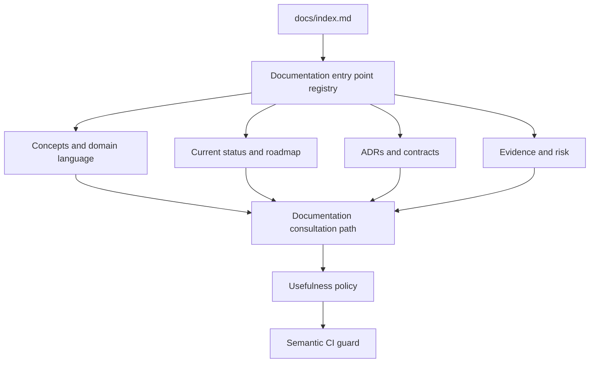

# Documentation Usability Canon Component

> Owned concern: this component owns documentation consultation semantics:
> entry-point classification, reader path resolution, and usefulness validation.

## Public API

- `ClassifyDocumentationEntryPoint(input)`: classifies active documentation as
  canonical, status, local reference, alias, archive, evidence, risk, or
  operational runbook.
- `QueryDocumentationConsultationPath(input)`: returns the canonical path a
  reader should follow for concepts, current status, decisions, contracts,
  evidence, package ownership, or workflow guidance.
- `ValidateDocumentationUsefulness(input)`: validates that governed docs remain
  useful, discoverable, owned, and traceable beyond syntax and link health.

## Invariants

- `docs/index.md` is the consultation entry point; hidden active sections must
  not become parallel start pages.
- Roadmap, status, historical assessment, evidence, and risk are different
  reader intents and must not share ambiguous entry-point semantics.
- Package and app docs are either canonical, linked-local, or reference-only;
  important but unpublished docs are drift.
- `ValidateDocumentationUsefulness` cannot pass when a governed docs change
  removes the reader path to concepts, status, decisions, contracts, or
  verification.
- Docs, proposal, component guide, user stories, mailbox analysis, and semantic
  test must name the same rails.

## Transitions

## Consumers

- New contributors use consultation paths to find what DVT is, where status
  lives, and which docs govern a workflow.
- Documentation maintainers use entry-point classification before moving,
  aliasing, or archiving active docs.
- Architecture reviewers use usefulness invariants to distinguish IA fixes from
  cosmetic navigation changes.
- Governance operators use the semantic guard to prevent docs changes that pass
  markdown checks while regressing consultation.

## Command And Query Rail

| Rail                                 | Type  | Owner                                 | Surface                              |
| ------------------------------------ | ----- | ------------------------------------- | ------------------------------------ |
| `ClassifyDocumentationEntryPoint`    | query | Documentation entry point registry    | Proposal, domain note, semantic test |
| `QueryDocumentationConsultationPath` | query | Documentation consultation read model | Component guide and user stories     |
| `ValidateDocumentationUsefulness`    | query | Documentation usefulness policy       | CI guard and future docs checks      |

## Semantic Fitness Function

`tools/ci/documentation-usability-canon.test.mjs` validates that the canon
plan, component guide, user stories, documentation-governance domain, original
usability proposal, and mailbox analysis exist together and name the same
rails.

The test protects consultation semantics and usefulness ownership, not only
markdown syntax or link validity.

## Component Grouping

## Related Docs

- [Documentation Usability Canon User Stories](./documentation-usability-canon-user-stories.md)
- [Documentation Usability Canon Plan 2026-05-24](../../../planning/proposals/mandatory/governance-and-docs/documentation-usability-canon-plan-20260524.md)
- [Documentation Usability Mailbox Analysis](../../../../buzon/20260524-codex-fowler-documentation-usability-canon.md)
