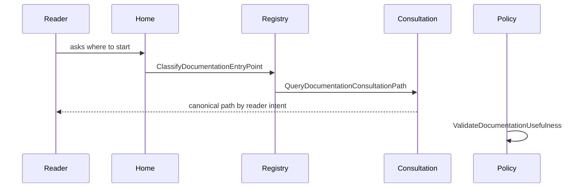

# Documentation Usability Canon User Stories

> Owned concern: this story set covers consultation-path scenarios governed by
> `ClassifyDocumentationEntryPoint`, `QueryDocumentationConsultationPath`, and
> `ValidateDocumentationUsefulness`.

## Stories

| Persona                  | Story                                                                                                                                                      | Acceptance                                                                                                                                   |
| ------------------------ | ---------------------------------------------------------------------------------------------------------------------------------------------------------- | -------------------------------------------------------------------------------------------------------------------------------------------- |
| New contributor          | As a new contributor, I want one path from home to concepts, status, roadmap, and governing decisions so I can answer basic orientation questions quickly. | `QueryDocumentationConsultationPath` returns canonical entry points for concept, status, roadmap, decision, and contract questions.          |
| Documentation maintainer | As a documentation maintainer, I want active docs classified by reader intent before changing navigation.                                                  | `ClassifyDocumentationEntryPoint` records canonical, status, local-reference, alias, archive, evidence, risk, or runbook semantics.          |
| Architecture reviewer    | As an architecture reviewer, I want docs usability reviewed as an architecture concern, not only a markdown concern.                                       | `ValidateDocumentationUsefulness` fails when a governed docs change removes owner, status, source, code, test, or verification traceability. |
| Governance operator      | As a governance operator, I want CI to guard consultation usefulness so fragmented docs do not return silently.                                            | The semantic guard verifies all canon artifacts name the same rails and component API.                                                       |

## Scenario Coverage

## Negative Scenarios

- A roadmap-like document cannot become a competing roadmap of record without
  `ClassifyDocumentationEntryPoint`.
- A package doc cannot remain important but unpublished without a linked-local
  or canonical entry point.
- `ValidateDocumentationUsefulness` fails when a governed docs change preserves
  links but removes the reader path to status, decisions, code, tests, or
  evidence.
- Alias and archive pages must not become primary consultation paths.
