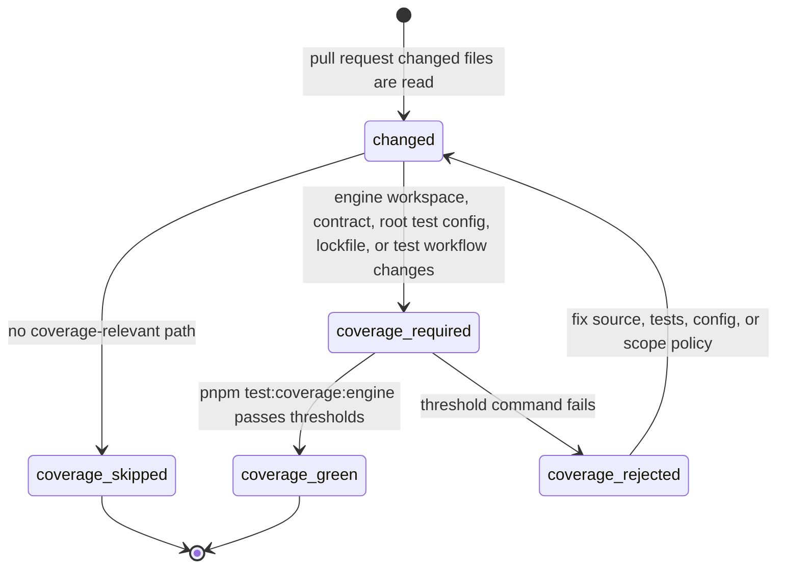
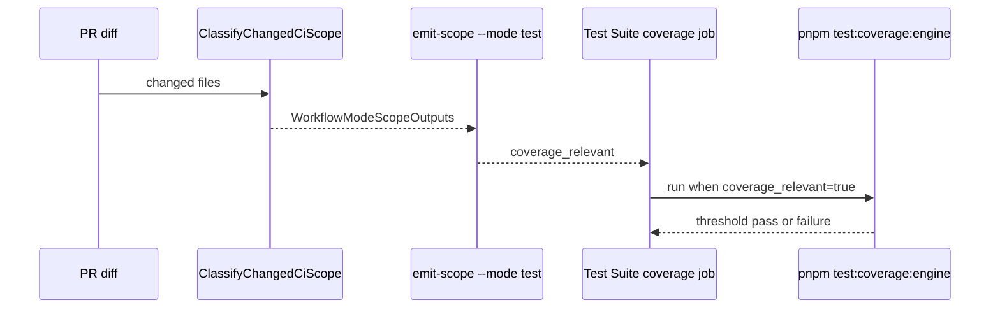

# Engine Coverage Scope Gate Component

## Purpose

The Engine Coverage Scope Gate owns one operational question: when must the Test
Suite workflow run `pnpm test:coverage:engine` with threshold enforcement?

The gate exists because a mature CI system does not let a coverage command and a
package-test command carry different meanings for "engine changed." Coverage
threshold enforcement is expensive enough to route, but important enough to fail
closed for every engine package change that can affect the runner or covered
code.

## Governing Sources

- `AGENTS.md`
- `docs/planning/status/governance-document-rule-inventory.md`
- `docs/guides/ai-work-protocol.md`
- `docs/guides/testing-and-ci-capabilities.md`
- `docs/architecture/command-query-rail-governance.md`
- `docs/architecture/fowler-opportunity-planning-governance.md`
- `docs/planning/reviews/ci-and-delivery/20260506-ci-build-audit-review.md`
- `docs/planning/proposals/mandatory/governance-and-docs/ci-audit-engine-coverage-plan-20260515.md`

## Owned Concern

Owned concern: classify changed files into the `coverage_relevant` Test Suite
output and keep engine coverage threshold enforcement aligned with the governed
engine workspace scope.

The component does not own:

- engine coverage thresholds or Vitest runtime behavior;
- package test execution outside the coverage job;
- GitHub branch-protection settings;
- adapter, contract, or application runtime behavior.

## Public API

| API                                                              | Owner                       | Responsibility                                                                        |
| ---------------------------------------------------------------- | --------------------------- | ------------------------------------------------------------------------------------- |
| `computeWorkflowModeScopeOutputs('test', changedFiles, context)` | `tools/ci/scope-config.mjs` | Returns `coverage_relevant` and package-scope booleans for Test Suite consumers.      |
| `TEST_SCOPE_PATTERNS.coverage_relevant`                          | `tools/ci/scope-config.mjs` | Names the file patterns that can require engine coverage threshold enforcement.       |
| `TEST_SCOPE_PATTERNS.engine`                                     | `tools/ci/scope-config.mjs` | Names the engine workspace package scope used by package tests and coverage canaries. |
| `node tools/ci/emit-scope.mjs --mode test`                       | `tools/ci/emit-scope.mjs`   | Emits GitHub Action outputs for Test Suite jobs.                                      |
| `pnpm test:coverage:engine`                                      | root `package.json`         | Runs the engine coverage command whose execution is gated by `coverage_relevant`.     |
| `pnpm test:ci-tools`                                             | root `package.json`         | Runs semantic CI scope tests that prevent coverage false negatives.                   |

## Command And Query Rails

| Rail                                  | Type  | DDD owner                  | Application port                  | Adapter surface               | Negative tests                                                        |
| ------------------------------------- | ----- | -------------------------- | --------------------------------- | ----------------------------- | --------------------------------------------------------------------- |
| `ClassifyChangedCiScope`              | query | Repository CI scope policy | `computeWorkflowModeScopeOutputs` | GitHub Actions scope emission | Engine config changes must set `coverage_relevant=true`.              |
| `EmitWorkflowCapabilityScopes`        | query | Repository CI scope policy | `emit-scope.mjs --mode test`      | `.github/workflows/test.yml`  | PR coverage job setup and run steps must consume `coverage_relevant`. |
| `ValidateEngineCoverageScopeContract` | query | CI tool contract tests     | `node --test tools/ci/*.test.mjs` | `pnpm test:ci-tools`          | Test fails if coverage stops covering the engine workspace policy.    |

No new user-facing command is introduced. This slice changes an internal CI
query read model consumed by GitHub Actions.

## DDD Objects

| Object                     | Kind        | Invariants                                                                                                          |
| -------------------------- | ----------- | ------------------------------------------------------------------------------------------------------------------- |
| `ChangedFileSet`           | query input | Contains normalized repository paths for a PR or non-PR workflow event.                                             |
| `EngineWorkspaceScope`     | policy      | `packages/@dvt/engine/**` is the package ownership boundary for engine test routing.                                |
| `EngineCoverageScope`      | policy      | Engine workspace changes, contracts, root test config, lockfiles, and the Test Suite workflow can require coverage. |
| `WorkflowModeScopeOutputs` | read model  | `coverage_relevant` is the only Test Suite output that controls the Engine Coverage Gate.                           |

## Invariants

- `packages/@dvt/engine/vitest.config.ts` must make
  `coverage_relevant=true`.
- Every pattern in the governed engine workspace scope must be covered by the
  engine coverage scope.
- `coverage_relevant` must also remain true for contracts, root package
  dependency changes, root Vitest config, TypeScript config, lockfiles, and the
  Test Suite workflow.
- The coverage workflow must not introduce a second inline path filter.
- The coverage job setup, build, and threshold steps must all consume
  `steps.scope.outputs.coverage_relevant`.
- Non-PR workflow events remain fail-closed and emit all scope outputs as true.

## Transitions

## Consumers

- `.github/workflows/test.yml` consumes `coverage_relevant` in the Engine
  Coverage Gate job.
- `tools/ci/emit-scope.mjs` emits `coverage_relevant` for PR and non-PR events.
- `tools/ci/emit-scope.test.mjs` proves concrete changed-file behavior.
- `tools/ci/workflow-pattern-parity.test.mjs` proves the workflow and scope
  policy stay wired to the component contract.
- `docs/guides/testing-and-ci-capabilities.md` describes the contributor-facing
  behavior.

## User Stories

| Story           | Scenario                                                                   | Acceptance criteria                                      | Negative coverage                                     |
| --------------- | -------------------------------------------------------------------------- | -------------------------------------------------------- | ----------------------------------------------------- |
| `US-CI-ECG-001` | As an engine maintainer, I change engine source.                           | Engine package tests and coverage thresholds run.        | Coverage cannot be false while `engine=true`.         |
| `US-CI-ECG-002` | As an engine maintainer, I change `packages/@dvt/engine/vitest.config.ts`. | `coverage_relevant=true` and the coverage job runs.      | CI tool tests fail if the config path is omitted.     |
| `US-CI-ECG-003` | As a contract maintainer, I change contracts used by engine tests.         | Coverage remains relevant.                               | Contracts cannot become coverage-silent.              |
| `US-CI-ECG-004` | As a CI maintainer, I edit `.github/workflows/test.yml`.                   | Coverage remains relevant because the runner can change. | Workflow does not add an inline coverage path filter. |
| `US-CI-ECG-005` | As a docs author, I edit unrelated docs.                                   | Coverage can stay skipped on PRs.                        | Docs-only changes must not fake coverage relevance.   |

## Test Coverage

- `tools/ci/emit-scope.test.mjs` proves engine config changes set both
  `engine=true` and `coverage_relevant=true`.
- `tools/ci/workflow-pattern-parity.test.mjs` proves coverage scope stays
  aligned with the engine workspace policy and workflow consumers use
  `coverage_relevant`.
- `pnpm test:ci-tools` runs the CI tool contract suite.
- `pnpm verify:prepush` remains the closeout gate for changed code, docs, and
  CI policy.

## Mature-System Comparison

Mature delivery systems make CI routing a read model over owned component
boundaries. They do not let individual jobs keep private path subsets for the
same package intent. This component follows that posture by treating the engine
workspace policy as the package boundary and making coverage a consumer of that
boundary.

The anti-pattern avoided here is source/test-only coverage routing. That route
is attractive because it looks cheaper, but it lets config files change the
coverage command without executing the command.

## Drift Watch

- Do not add inline `paths-filter` or `git diff` logic to the coverage workflow.
- Do not remove `packages/@dvt/engine/**` from coverage relevance unless a new
  accepted package-scope policy replaces it.
- Do not treat engine package configuration as docs-only or test-only metadata.
- Do not close CI audit findings with workflow-string assertions only; include
  semantic changed-path tests.
