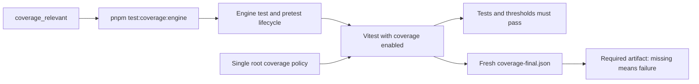
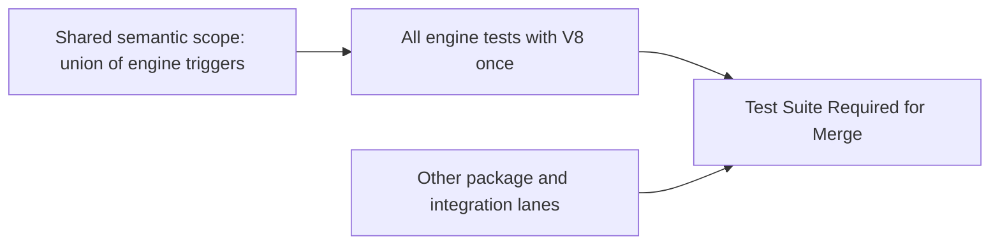
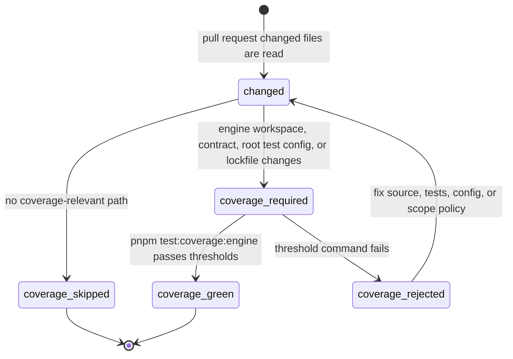
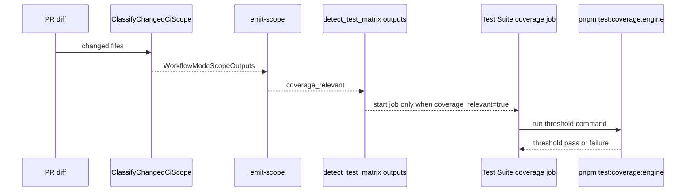

# Engine Coverage Scope Gate Component

## Purpose

The Engine Coverage Scope Gate owns one operational question: when must the Test
Suite workflow run `pnpm test:coverage:engine` with threshold enforcement?

The gate exists because a mature CI system does not let a coverage command and a
package-test command carry different meanings for "engine changed." Coverage
threshold enforcement is expensive enough to route, but important enough to fail
closed for every engine package change that can affect the runner or covered
code.

## Governing Sources

- `AGENTS.md`
- `docs/planning/status/governance-document-rule-inventory.md`
- `docs/guides/ai-work-protocol.md`
- `docs/guides/testing-and-ci-capabilities.md`
- `docs/architecture/command-query-rail-governance.md`
- `docs/architecture/fowler-opportunity-planning-governance.md`
- `docs/planning/reviews/ci-and-delivery/20260506-ci-build-audit-review.md`
- `docs/planning/proposals/mandatory/governance-and-docs/ci-audit-engine-coverage-plan-20260515.md`

## Owned Concern

Owned concern: classify changed files into the `coverage_relevant` Test Suite
output and keep engine coverage threshold enforcement aligned with the governed
engine workspace scope.

The component does not own:

- engine coverage thresholds or Vitest runtime behavior;
- package test execution outside the coverage job;
- GitHub branch-protection settings;
- adapter, contract, or application runtime behavior.

## Public API

| API                                                              | Owner                        | Responsibility                                                                        |
| ---------------------------------------------------------------- | ---------------------------- | ------------------------------------------------------------------------------------- |
| `computeWorkflowModeScopeOutputs('test', changedFiles, context)` | `tools/ci/scope-config.mjs`  | Returns `coverage_relevant` and package-scope booleans for Test Suite consumers.      |
| `TEST_SCOPE_PATTERNS.coverage_relevant`                          | `tools/ci/scope-config.mjs`  | Names the file patterns that can require engine coverage threshold enforcement.       |
| `TEST_SCOPE_PATTERNS.engine`                                     | `tools/ci/scope-config.mjs`  | Names the engine workspace package scope used by package tests and coverage canaries. |
| `node tools/ci/emit-scope.mjs`                                   | `tools/ci/emit-scope.mjs`    | Emits GitHub Action outputs for Test Suite jobs.                                      |
| `detect_test_matrix.outputs.coverage_relevant`                   | `.github/workflows/test.yml` | Gates the Engine Coverage Gate job before runner setup on pull requests.              |
| `pnpm test:coverage:engine`                                      | root `package.json`          | Runs the engine coverage command whose execution is gated by `coverage_relevant`.     |
| `pnpm test:ci-tools`                                             | root `package.json`          | Runs semantic CI scope tests that prevent coverage false negatives.                   |

## Command And Query Rails

| Rail                                  | Type  | DDD owner                  | Application port                  | Adapter surface               | Negative tests                                                        |
| ------------------------------------- | ----- | -------------------------- | --------------------------------- | ----------------------------- | --------------------------------------------------------------------- |
| `ClassifyChangedCiScope`              | query | Repository CI scope policy | `computeWorkflowModeScopeOutputs` | GitHub Actions scope emission | Engine config changes must set `coverage_relevant=true`.              |
| `EmitWorkflowCapabilityScopes`        | query | Repository CI scope policy | `emit-scope.mjs`                  | `.github/workflows/test.yml`  | PR coverage job must consume `coverage_relevant` before runner setup. |
| `ValidateEngineCoverageScopeContract` | query | CI tool contract tests     | `node --test tools/ci/*.test.mjs` | `pnpm test:ci-tools`          | Test fails if coverage stops covering the engine workspace policy.    |

No new user-facing command is introduced. This slice changes an internal CI
query read model consumed by GitHub Actions.

## Coverage Evidence Consumer

Routing does not prove that the selected job actually measures coverage.
The existing `pnpm test:coverage:engine` command implements the
`ValidateEngineCoverageEvidence` query in CI Governance, owned by the
`EngineCoverageEvidence` policy. Its input is the checked-out engine source,
tests and Vitest policy; its output is the validation exit status and JSON
coverage report. Vitest is the CLI adapter, and Test Suite is the remote
consumer. This is separate from the routing-only scope query above.

The command retains the engine package test/pretest lifecycle and passes
`--coverage` directly to Vitest. An extra `--` separator would disable the
coverage flag in the installed Vitest CLI and is rejected by the executable
contract. Root `vitest.config.ts` owns `engineCoveragePolicy`: V8, the existing
65% statement/line/function and 55% branch thresholds, all source files, clean
reports, and text/JSON/HTML/LCOV reporters. The engine config reuses that policy
and owns only its package-relative source inclusion/exclusion paths.

This query reads repository files and writes disposable reports only. Local
operators and GitHub workflows need no application database or tenant data;
workflow contents access remains read-only. Every invocation cleans its report
directory, so an earlier report cannot satisfy the current execution. The
workflow uploads `coverage/coverage-final.json` explicitly and treats a missing
file as an error. A passing unit suite without coverage is not valid evidence.

```mermaid
flowchart LR
    Scope[coverage_relevant] --> Command[pnpm test:coverage:engine]
    Command --> Lifecycle[Engine test and pretest lifecycle]
    Lifecycle --> Vitest[Vitest with coverage enabled]
    Policy[Single root coverage policy] --> Vitest
    Vitest --> Thresholds[Tests and thresholds must pass]
    Vitest --> Report[Fresh coverage-final.json]
    Report --> Upload[Required artifact: missing means failure]
```

`tools/ci/engine-coverage.test.mjs` belongs to the executable CI-tool partition.
It checks the installed CLI argument parser, resolves both actual configs,
checks the workflow artifact contract, and executes a real Vitest negative
fixture: unexecuted source must be counted and low coverage must return nonzero.
A fully covered control must succeed. The fixture is isolated under `tmp/` and
removed after the test. No mock replaces the coverage provider.

The coverage-command repair is tracked in
[#3494](https://github.com/dunay2/dvt/issues/3494). The single-execution cut is
governed by [#2928](https://github.com/dunay2/dvt/issues/2928).

## Single Engine Evidence Lane

Within Test Suite, Engine Coverage Gate owns the entire engine test suite,
including architecture, determinism and replay tests. The generic package matrix
excludes engine, and no separate determinism/replay job repeats its collection.
Local focus commands remain available. Real adapter/provider integrations and
the Code Quality main/manual baseline remain independent and unchanged.

`coverage_relevant` includes the union of the displaced routes: engine package
scope, determinism scope, existing coverage scope and root-build-sensitive
changes (including conservative unknown classifications). The shared scope
policy owns this union; the workflow has no path classifier of its own.

```mermaid
flowchart LR
    Scope[Shared semantic scope: union of engine triggers] --> Coverage[All engine tests with V8 once]
    Coverage --> Aggregate[Test Suite Required for Merge]
    Other[Other package and integration lanes] --> Aggregate
```

The existing required aggregate implements `ValidateTestSuiteEvidenceResult`, a
CI Governance query owned by `TestSuiteEvidenceResult`. Its inputs are the
current event, draft posture, detector outputs and this run's named job results;
its output is an accepted/rejected check status. Its application port is
`Test Suite Required for Merge`, adapted by the workflow's GitHub script. It
reads workflow metadata only, has no tenant/application data access, and cannot
reuse another SHA's successful result.

For ready PRs, the detector must succeed and each selected lane must succeed.
Only out-of-scope lanes may be skipped. Drafts require the detector and heavy
lanes to be skipped; `ready_for_review` recalculates the current SHA's scope.
Push and manual events require every lane. Missing/malformed scope, missing
results, failure, cancellation and unsupported events reject. The check name
and repository protections remain unchanged. Executable workflow tests in
`tools/ci/test-suite-outcome.test.mjs` protect these outcomes.

## DDD Objects

| Object                     | Kind        | Invariants                                                                                 |
| -------------------------- | ----------- | ------------------------------------------------------------------------------------------ |
| `ChangedFileSet`           | query input | Contains normalized repository paths for a PR or non-PR workflow event.                    |
| `EngineWorkspaceScope`     | policy      | `packages/@dvt/engine/**` is the package ownership boundary for engine test routing.       |
| `EngineCoverageScope`      | policy      | Engine workspace changes, contracts, root test config, and lockfiles can require coverage. |
| `WorkflowModeScopeOutputs` | read model  | `coverage_relevant` is the only Test Suite output that controls the Engine Coverage Gate.  |

## Invariants

- `packages/@dvt/engine/vitest.config.ts` must make
  `coverage_relevant=true`.
- Every pattern in the governed engine workspace scope must be covered by the
  engine coverage scope.
- Root-build-sensitive and determinism routes must also select coverage, even
  when they do not match a literal engine source path.
- `coverage_relevant` must also remain true for contracts, root package
  dependency changes, root Vitest config, TypeScript config, and lockfiles.
- Test Suite workflow YAML changes stay on CI-tool contract and changed-file
  validation rails; they must not open engine coverage by filename alone.
- The coverage workflow must not introduce a second inline path filter.
- The Test Suite workflow must emit `coverage_relevant` once from
  `detect_test_matrix` and gate the Engine Coverage Gate job with
  `needs.detect_test_matrix.outputs.coverage_relevant` before runner setup.
- Non-PR workflow events remain fail-closed and emit all scope outputs as true.

## Transitions

```mermaid
stateDiagram-v2
    [*] --> changed: pull request changed files are read
    changed --> coverage_required: engine workspace, contract, root test config, or lockfile changes
    changed --> coverage_skipped: no coverage-relevant path
    coverage_required --> coverage_green: pnpm test:coverage:engine passes thresholds
    coverage_required --> coverage_rejected: threshold command fails
    coverage_skipped --> [*]
    coverage_green --> [*]
    coverage_rejected --> changed: fix source, tests, config, or scope policy
```

```mermaid
sequenceDiagram
    participant PR as PR diff
    participant Scope as ClassifyChangedCiScope
    participant Emit as emit-scope
    participant Detect as detect_test_matrix outputs
    participant Workflow as Test Suite coverage job
    participant Coverage as pnpm test:coverage:engine

    PR->>Scope: changed files
    Scope-->>Emit: WorkflowModeScopeOutputs
    Emit-->>Detect: coverage_relevant
    Detect-->>Workflow: start job only when coverage_relevant=true
    Workflow->>Coverage: run threshold command
    Coverage-->>Workflow: threshold pass or failure
```

## Consumers

- `.github/workflows/test.yml` consumes `coverage_relevant` in the Engine
  Coverage Gate job.
- `tools/ci/emit-scope.mjs` emits `test_scope.coverage_relevant` for PR and non-PR events.
- `tools/ci/emit-scope.test.mjs` proves concrete changed-file behavior.
- `tools/ci/workflow-pattern-parity.test.mjs` proves the workflow and scope
  policy stay wired to the component contract.
- `docs/guides/testing-and-ci-capabilities.md` describes the contributor-facing
  behavior.

## User Stories

| Story           | Scenario                                                                   | Acceptance criteria                                 | Negative coverage                                   |
| --------------- | -------------------------------------------------------------------------- | --------------------------------------------------- | --------------------------------------------------- |
| `US-CI-ECG-001` | As an engine maintainer, I change engine source.                           | Engine package tests and coverage thresholds run.   | Coverage cannot be false while `engine=true`.       |
| `US-CI-ECG-002` | As an engine maintainer, I change `packages/@dvt/engine/vitest.config.ts`. | `coverage_relevant=true` and the coverage job runs. | CI tool tests fail if the config path is omitted.   |
| `US-CI-ECG-003` | As a contract maintainer, I change contracts used by engine tests.         | Coverage remains relevant.                          | Contracts cannot become coverage-silent.            |
| `US-CI-ECG-004` | As a CI maintainer, I edit `.github/workflows/test.yml`.                   | CI tool contracts cover the workflow edit.          | Workflow edits do not open engine coverage.         |
| `US-CI-ECG-005` | As a docs author, I edit unrelated docs.                                   | Coverage can stay skipped on PRs.                   | Docs-only changes must not fake coverage relevance. |

## Test Coverage

- `tools/ci/emit-scope.test.mjs` proves engine config changes set both
  `engine=true` and `coverage_relevant=true`.
- `tools/ci/workflow-pattern-parity.test.mjs` proves coverage scope stays
  aligned with the engine workspace policy and that the Test Suite workflow
  gates heavy PR lanes at job level from the shared detector outputs.
- `pnpm test:ci-tools` runs the CI tool contract suite.
- `pnpm verify:prepush` remains the closeout gate for changed code, docs, and
  CI policy.

## Mature-System Comparison

Mature delivery systems make CI routing a read model over owned component
boundaries. They do not let individual jobs keep private path subsets for the
same package intent. This component follows that posture by treating the engine
workspace policy as the package boundary and making coverage a consumer of that
boundary.

The anti-pattern avoided here is source/test-only coverage routing. That route
is attractive because it looks cheaper, but it lets config files change the
coverage command without executing the command.

## Drift Watch

- Do not add inline `paths-filter` or `git diff` logic to the coverage workflow.
- Do not remove `packages/@dvt/engine/**` from coverage relevance unless a new
  accepted package-scope policy replaces it.
- Do not treat engine package configuration as docs-only or test-only metadata.
- Do not close CI audit findings with workflow-string assertions only; include
  semantic changed-path tests.
