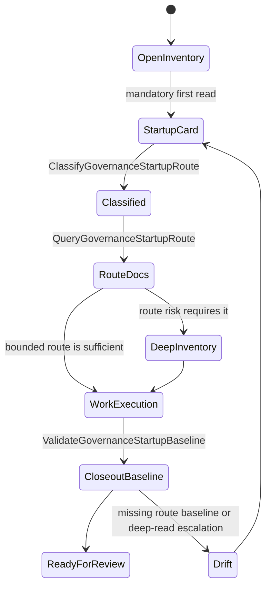
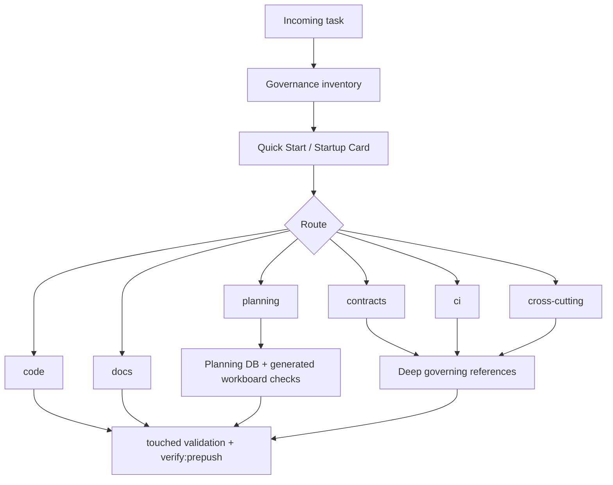

# Governance Startup Card Canon Component

> Owned concern: this component owns governance startup route semantics:
> task classification, next-document routing, and minimum validation baseline
> selection.

## Public API

- `ClassifyGovernanceStartupRoute(input)`: classifies a work request as `code`,
  `docs`, `planning`, `contracts`, `ci`, or `cross-cutting`.
- `QueryGovernanceStartupRoute(input)`: returns the canonical documents to open
  next and states when the deep inventory is required.
- `ValidateGovernanceStartupBaseline(input)`: validates that closeout uses the
  route-specific minimum baseline plus `pnpm verify:prepush`.

## Invariants

- The mandatory first document remains
  `docs/planning/status/governance-document-rule-inventory.md`.
- The startup card must route before deep catalog reading; it must not replace
  the deeper inventory.
- Every route must name the next documents, deep-read condition, and minimum
  validation baseline.
- `contracts`, `ci`, and `cross-cutting` routes always require deeper reading.
- No second active governance inventory or startup note may own the same
  product intent.
- Docs, proposal, component guide, user stories, mailbox analysis, and semantic
  test must name the same rails.

## Transitions

## Consumers

- Bounded-task contributors use the startup card to select governing docs
  without paying full inventory cost for local docs or code work.
- Cross-cutting implementers use deep-read escalation rules before touching
  multiple contexts or public boundaries.
- Planning operators use the planning route to keep task lifecycle writes in
  Planning DB and regenerate planning views only through generators.
- PR reviewers use this component to evaluate whether a governance startup
  change preserved route semantics instead of only preserving markdown shape.

## Command And Query Rail

| Rail                                | Type  | Owner                      | Surface                              |
| ----------------------------------- | ----- | -------------------------- | ------------------------------------ |
| `ClassifyGovernanceStartupRoute`    | query | Documentation governance   | Inventory startup card               |
| `QueryGovernanceStartupRoute`       | query | Documentation governance   | AI work protocol and component guide |
| `ValidateGovernanceStartupBaseline` | query | Governance validation / CI | Semantic architecture test           |

## Semantic Fitness Function

`tools/ci/startup-card-canon.test.mjs` validates that the canon plan, component
guide, user stories, original router plan, documentation-governance domain, and
mailbox analysis all retain the same rails. It also checks that the active
inventory still lists every route: `code`, `docs`, `planning`, `contracts`,
`ci`, and `cross-cutting`.

## Current State Diagram

## Future Change Rule

Any future route addition, removal, or validation-baseline change must update
the canon plan, component guide, user stories, domain index, original router
plan, and `tools/ci/startup-card-canon.test.mjs` in the same slice.
