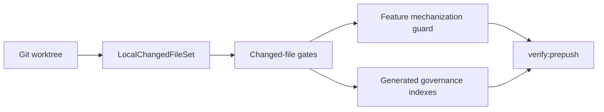

# CI Governance Component

`ci-governance` is the canonical component home for repository automation that
guards changed files, feature mechanization, generated governance indexes,
workflow parity, and local-to-remote quality gates.

## Current Responsibilities

- own local changed-file detection semantics for pre-push, docs, lint, format,
  QA artifact, and generated-governance gates;
- keep feature mechanization manifests executable before implementation is
  called complete;
- keep generated governance indexes, file fingerprints, and coverage reports
  aligned with the real worktree;
- expose operational commands through `package.json`, scripts, and workflow
  checks without moving product behavior into CI scripts.

## Component Decomposition

- [Local Changed Files Gate Component](./local-changed-files-gate-component.md)

## Public Operational Surface

- [`scripts/git-local-changes.cjs`](../../../../scripts/git-local-changes.cjs)
- [`scripts/check-changed.cjs`](../../../../scripts/check-changed.cjs)
- [`scripts/check-governance-changed-files.cjs`](../../../../scripts/check-governance-changed-files.cjs)
- [`scripts/check-feature-mechanization.cjs`](../../../../scripts/check-feature-mechanization.cjs)
- [`scripts/type-check-prepush.cjs`](../../../../scripts/type-check-prepush.cjs)
- [`tools/docs/check-filenames.ts`](../../../../tools/docs/check-filenames.ts)
- [`tools/docs/check-frontmatter.ts`](../../../../tools/docs/check-frontmatter.ts)

## Component Topology

## Current Posture

The component is active repository infrastructure. It must fail closed when
local files are added, unstaged, staged, renamed, or modified, because agent
work is commonly validated before a commit exists.
