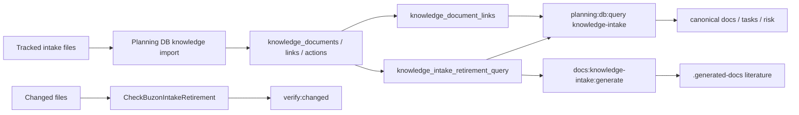

# Knowledge Intake Retirement Component

## Owned Concern

This component owns the DB-first read model used to retire analysis intake files
without keeping `buzon/` as a second authority system.

The component does not delete intake files. It classifies each tracked intake
document into a retirement posture that planning and docs agents can query
before moving or removing files.

## Command And Query Rails

| Rail                                | Type    | DDD owner                             | Read model or projection                         | Negative guard                                                            |
| ----------------------------------- | ------- | ------------------------------------- | ------------------------------------------------ | ------------------------------------------------------------------------- |
| `ListKnowledgeIntakeRetirement`     | query   | `KnowledgeIntakeRetirementReadModel`  | `knowledge_intake_retirement_query`              | Query must read DB rows and must not parse `buzon/*.md` directly.         |
| `GenerateKnowledgeIntakeLiterature` | command | `KnowledgeIntakeLiteratureProjection` | generated local knowledge-intake literature view | Generator must read the DB retirement query and must not walk `buzon`.    |
| `CheckBuzonIntakeRetirement`        | command | `KnowledgeIntakeRetirementGuard`      | changed-file diff against the repository base    | Changed-slice validation must reject added or renamed `buzon/*.md` files. |

## Retirement States

| State          | Meaning                                                                          |
| -------------- | -------------------------------------------------------------------------------- |
| `canonized`    | The intake document names a canonical disposition in frontmatter.                |
| `open-actions` | The intake document still has open extracted knowledge action rows.              |
| `referenced`   | Governed docs still reference the intake document but no open action is present. |
| `unclassified` | No disposition, action, or inbound governed reference is visible in DB.          |

## Query Surface

```bash
pnpm planning:db:query knowledge-intake --state unclassified --limit 30
pnpm planning:db:query knowledge-intake --state open-actions --limit 30
pnpm planning:db:query knowledge-intake --path buzon/example.md --limit 5
pnpm planning:db:query knowledge-intake --references --limit 30
pnpm planning:db:query knowledge-intake --references --path buzon/example.md --limit 5
```

The `--references` variant lists DB-backed inbound references from
`knowledge_document_links` plus the current component ownership projection for
the referencing document. It is the operator surface for retiring live
`buzon/` backrefs without running ad-hoc repository searches.

## Generated Literature Surface

```bash
pnpm governance:db:import -- --if-stale
pnpm docs:knowledge-intake:generate
pnpm docs:knowledge-intake:check
```

The generated literature render is local and ignored:

```text
.generated-docs/planning/status/generated-knowledge-intake-literature.md
```

The tracked status page
`docs/planning/status/generated-knowledge-intake-literature.md` is only a
stable navigation pointer. It must not duplicate the generated literature.

## Write Retirement Guard

```bash
pnpm planning:db:knowledge-intake:retirement:check
pnpm verify:changed
```

The guard is changed-only. It blocks added or renamed Markdown files under
`buzon/` while allowing existing files to be deleted or moved through governed
canonization work. New Fowler analysis intake must be captured through the
Planning DB command/query rails and then rendered from DB-backed projections.

## Invariants

- `buzon/` is an intake import source, not a canonical planning queue.
- No added or renamed `buzon/*.md` file may enter a changed slice after the
  DB-first retirement guard is active.
- Retirement state is derived from Planning DB knowledge tables and links.
- Active reference cleanup is derived from Planning DB document links and file
  ownership projections, not from raw `rg` output.
- Generated literature must use this DB read model or a later DB projection,
  not raw directory traversal as authority.
- Generated literature must remain outside Git unless a later accepted plan
  moves the canonical content into a DB seed, migration, or other governed
  single-writer store.
- Physical deletion is allowed only after the DB state shows a safe
  disposition and active docs/tests no longer require the raw file.

## Flow



## Validation

- `node --test scripts/planning-db-knowledge-intake-retirement-guard.test.cjs`
- `node --test scripts/generate-knowledge-intake-literature.test.cjs`
- `node --test scripts/planning-db-query.test.cjs`
- `node --test scripts/planning-db-migrate.test.cjs`
- `pnpm planning:db:knowledge-intake:retirement:check`
- `pnpm docs:knowledge-intake:check`
