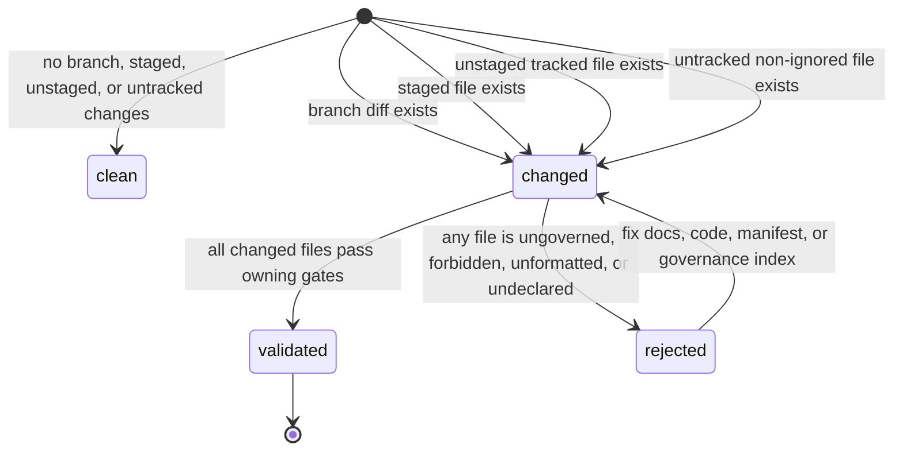
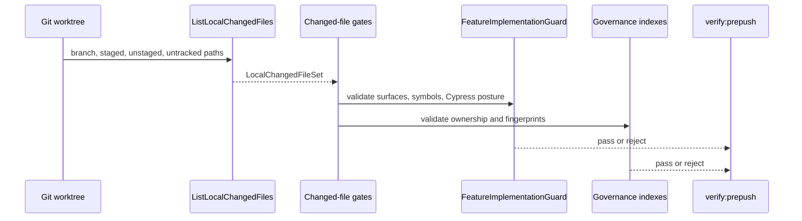

# Local Changed Files Gate Component

## Purpose

The Local Changed Files Gate owns the repository-wide answer to one operational
question: which files must the local gates validate before a branch can be
called ready?

The component exists because mature delivery systems do not let each lint,
docs, type-check, or governance script invent a different interpretation of
"changed". The local worktree is authoritative before a commit exists, so the
gate must include merge-base diff, staged files, unstaged tracked files, and
untracked non-ignored files.

## Governing Sources

- `AGENTS.md`
- `docs/planning/status/governance-document-rule-inventory.md`
- `docs/guides/ai-work-protocol.md`
- `docs/guides/testing-and-ci-capabilities.md`
- `docs/architecture/command-query-rail-governance.md`
- `docs/architecture/fowler-opportunity-planning-governance.md`
- `docs/planning/proposals/mandatory/governance-and-docs/local-changed-files-gate-hardening-plan-20260503.md`
- `docs/adr/ADR-0053-file-state-fingerprint-governance.md`

## Owned Concern

Owned concern: provide the canonical local changed-file read model and keep all
changed-file gates consuming that read model rather than raw, script-local git
queries.

The component does not own:

- package-specific lint, type-check, or test semantics;
- product feature behavior;
- GitHub Actions scheduling;
- generated governance file contents beyond changed-file admission;
- contract, engine, planner, or adapter ARC policy decisions.

## Public API

| API                                               | Owner                                | Responsibility                                                                |
| ------------------------------------------------- | ------------------------------------ | ----------------------------------------------------------------------------- |
| `listLocalChangedFiles(options)`                  | `scripts/git-local-changes.cjs`      | Returns the canonical `LocalChangedFileSet` for changed-only local gates.     |
| `resolveDiffBaseRefs(options)`                    | `scripts/git-local-changes.cjs`      | Resolves the base refs used for branch diff detection.                        |
| `readLocalNameStatusDiff(base, head, git)`        | `check-governance-changed-files.cjs` | Returns name-status records for governance fingerprint validation.            |
| `readUntrackedNameStatus(git)`                    | `check-governance-changed-files.cjs` | Converts untracked files into added name-status records.                      |
| `validateFeatureImplementationManifests(options)` | `check-feature-mechanization.cjs`    | Validates that real diff files and added symbols match feature manifests.     |
| `node scripts/check-changed.cjs`                  | changed lint/format gate             | Applies lint and format checks to the canonical changed-file set.             |
| `node scripts/type-check-prepush.cjs`             | pre-push type-check scope selector   | Selects no-op, affected workspace, or root type-check from changed files.     |
| `pnpm docs:governance:changed-files:check`        | governance changed-files command     | Validates changed files against accepted governance indexes and fingerprints. |
| `pnpm docs:feature-mechanization:implementation`  | feature mechanization implementation | Validates allowed surfaces, forbidden surfaces, symbols, and Cypress rules.   |

## Command And Query Rails

| Rail                          | Type    | DDD owner                   | Application port                     | Adapter surface              | Negative tests                                                                 |
| ----------------------------- | ------- | --------------------------- | ------------------------------------ | ---------------------------- | ------------------------------------------------------------------------------ |
| `ListLocalChangedFiles`       | query   | `LocalChangedFileSet`       | local changed-file query rail        | git CLI adapter              | Empty branch diff still returns staged, unstaged, and untracked files.         |
| `ValidateChangedFiles`        | command | `ChangedFileValidationGate` | changed-file validation command rail | lint/docs/governance scripts | Added files missing governance ownership fail closed.                          |
| `SelectPrepushTypecheckScope` | query   | `PrepushTypecheckScope`     | pre-push type-check scope query rail | package manager scripts      | Root graph changes select root type-check; non-TS changes do not fake success. |

## DDD Objects

| Object                       | Kind       | Invariants                                                                 |
| ---------------------------- | ---------- | -------------------------------------------------------------------------- |
| `LocalChangedFileSet`        | read model | Unique POSIX paths from branch, staged, unstaged, and untracked sources.   |
| `ChangedFileValidationGate`  | policy     | A changed file is either governed and validated or rejected.               |
| `PrepushTypecheckScope`      | read model | Type-check scope is derived from file ownership, not from human choice.    |
| `FeatureImplementationGuard` | policy     | Real diff surfaces and symbols must match feature mechanization manifests. |

## Invariants

- A local pre-push pass must not skip because the branch has no commit ahead of
  `origin/main`.
- Untracked non-ignored files are part of local readiness.
- Staged and unstaged tracked files are part of local readiness.
- Name-only changed-file consumers must call `listLocalChangedFiles()`.
- The governance fingerprint gate may own name-status parsing because it needs
  added, modified, deleted, and renamed semantics.
- The feature mechanization guard validates actual changed files against
  `allowedImplementationSurfaces` and `forbiddenImplementationSurfaces`.
- Cypress specs changed by a feature must not intercept or directly seed
  `/workspace/graph/draft` when the governing feature forbids that path.
- No script may downgrade a failed local changed-file state into a silent no-op.

## Transitions

## Consumers

- `scripts/check-changed.cjs` consumes `ListLocalChangedFiles` for changed-only
  lint and format checks.
- `scripts/type-check-prepush.cjs` consumes `ListLocalChangedFiles` to select
  the pre-push type-check scope.
- `scripts/lint-markdown-changed.cjs` and
  `scripts/format-markdown-changed.cjs` consume `ListLocalChangedFiles` for
  changed Markdown checks.
- `scripts/docs-workboard-check-changed.cjs` consumes `ListLocalChangedFiles`
  so lane YAML changes regenerate planning views before pre-push.
- `scripts/fix-changed.cjs` consumes `ListLocalChangedFiles` for the local
  autofix surface.
- `scripts/qa-artifact-check.cjs` consumes `ListLocalChangedFiles` to keep QA
  evidence checks scoped to real local work.
- `scripts/validate-arc-evidence-frontmatter.cjs` consumes
  `ListLocalChangedFiles` for changed evidence and risk docs.
- `scripts/check-markdown-locations.cjs`, `tools/docs/check-filenames.ts`, and
  `tools/docs/check-frontmatter.ts` consume `ListLocalChangedFiles` for changed
  docs governance.
- `scripts/check-governance-changed-files.cjs` owns name-status parsing for
  add, delete, rename, and fingerprint semantics while keeping local worktree
  inclusion aligned with this component.
- `scripts/check-feature-mechanization.cjs` consumes the changed-file set when
  validating implementation manifests.

## User Stories

| Story            | Scenario                                                   | Acceptance criteria                                                                  | Negative coverage                                                           |
| ---------------- | ---------------------------------------------------------- | ------------------------------------------------------------------------------------ | --------------------------------------------------------------------------- |
| `US-CI-LCFG-001` | As an agent, I create a new source file before committing. | `verify:prepush` sees the untracked file and validates governance/feature ownership. | The gate fails if the file is outside `allowedImplementationSurfaces`.      |
| `US-CI-LCFG-002` | As an agent, I edit a tracked file without staging it.     | Changed-only lint, docs, and type-check routing see the unstaged path.               | The gate does not report "No changed files".                                |
| `US-CI-LCFG-003` | As an agent, I stage a file after lint-staged changes it.  | The staged path remains in the local changed-file set.                               | The gate fails if generated governance indexes are stale.                   |
| `US-CI-LCFG-004` | As a reviewer, I receive a PR after local validation.      | Local gates and CI use the same readiness semantics for changed files.               | Added symbols fail when missing from feature mechanization manifests.       |
| `US-CI-LCFG-005` | As a maintainer, I add a new changed-only gate.            | The new gate consumes `listLocalChangedFiles()` instead of raw git diff logic.       | Architecture coverage fails if the gate invents a separate name-only query. |

## Test Coverage

- `scripts/git-local-changes.test.cjs` proves local changed-file query semantics
  and this component guide.
- `scripts/check-governance-changed-files.test.cjs` proves name-status local
  change inclusion for governance fingerprints.
- `scripts/check-feature-mechanization.test.cjs` proves implementation-surface,
  symbol, forbidden-surface, and Cypress draft-boundary validation.
- `pnpm docs:feature-mechanization:implementation` proves changed files stay
  inside planned implementation rails.
- `pnpm verify:prepush` proves the full local readiness gate.

## Mature-System Comparison

Mature systems normally centralize change detection behind one query and let
individual gates decide only what to validate, not what changed. This component
matches that model:

- `LocalChangedFileSet` is the canonical read model;
- lint, docs, type-check, QA, and feature mechanization scripts are consumers;
- governance fingerprint validation owns its richer name-status adapter;
- feature mechanization turns planned surfaces into executable guardrails.

The anti-pattern avoided here is script-local `git diff` scattering. Scattering
lets one gate skip untracked files while another catches them, producing false
green local readiness.

## Drift Watch

- Do not add a new changed-only script that shells out to raw `git diff
--name-only` instead of consuming `listLocalChangedFiles()`.
- Do not use `HEAD~1` as the primary local readiness base when an upstream,
  `origin/main`, or `main` ref exists.
- Do not treat untracked files as outside readiness just because CI cannot see
  them before they are committed.
- Do not loosen feature mechanization checks to get `verify:prepush` green.
- Do not classify a file as governed only in generated status if the owning
  component doc and feature manifest still disagree.
