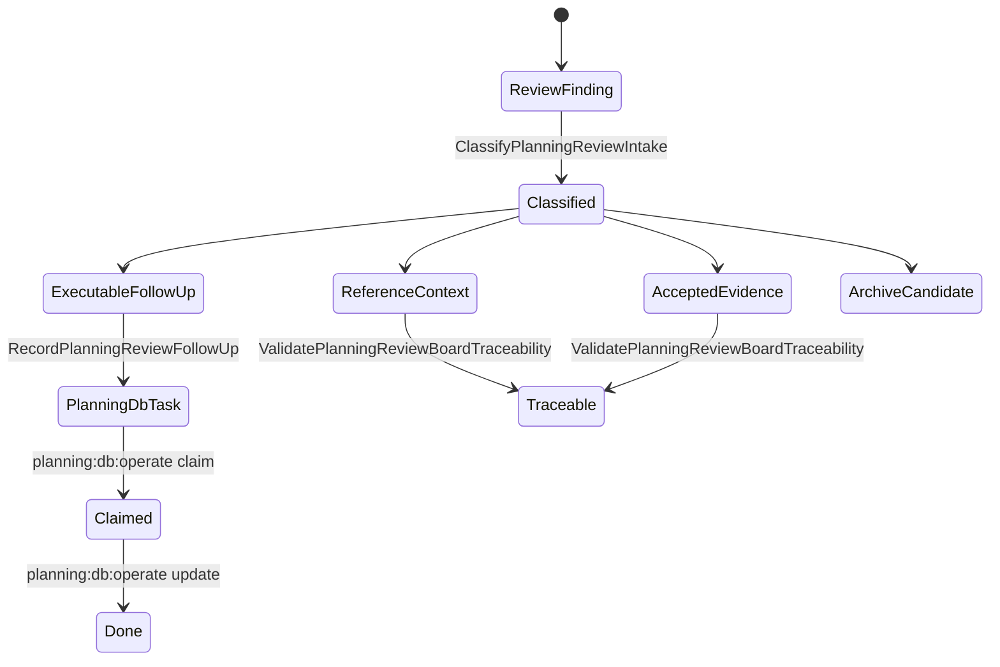
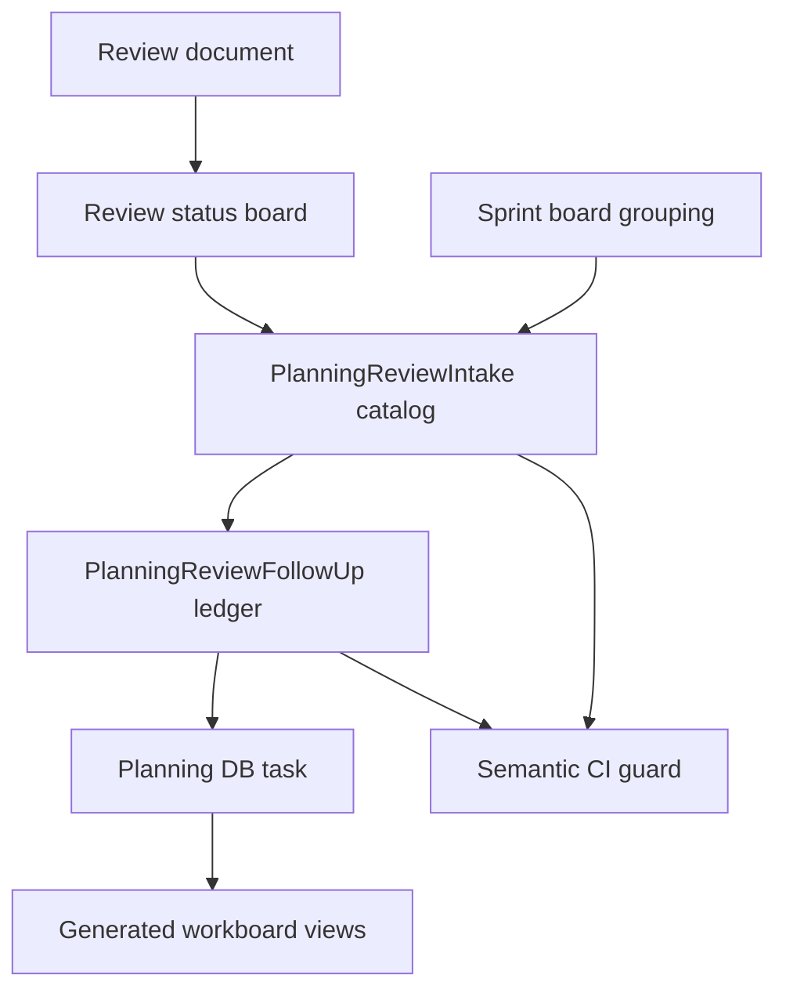
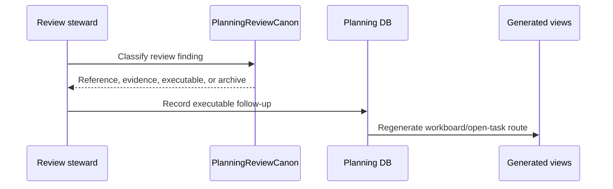

# Planning Review Canon Component

> Owned concern: this component owns planning review intake semantics: review
> finding classification, DB-first follow-up recording, and board-to-task
> traceability validation.

## Public API

- `ClassifyPlanningReviewIntake(input)`: classifies review material as
  reference context, accepted evidence, executable follow-up, sprint grouping,
  or archive candidate.
- `RecordPlanningReviewFollowUp(input)`: records executable follow-up by
  creating or updating a Planning DB task through the repository command rail.
- `ValidatePlanningReviewBoardTraceability(input)`: validates that the review
  board, sprint board, plan, user stories, and semantic test preserve DB-first
  ownership.

## Invariants

- Review documents are intake and rationale, not task lifecycle authority.
- Sprint board files group concrete review needs; they do not own claim,
  progress, dependency, or evidence state.
- Planning DB is the canonical execution queue for review follow-up.
- Review filenames must follow `review-naming-policy.md`.
- A review finding that needs execution must point to an existing Planning DB
  task or be promoted through `pnpm planning:db:operate task create`.

## Transitions

## Consumers

- Review stewards use the component to decide whether a review row is reference,
  evidence, executable work, or archive material.
- Sprint operators use it to keep board files from becoming a second backlog.
- Product planners use DB state, not sprint prose, to select the next work.
- Agents use it to continue from Planning DB after compaction.

## Command And Query Rail

| Rail                                      | Type    | Owner                            | Surface                         |
| ----------------------------------------- | ------- | -------------------------------- | ------------------------------- |
| `ClassifyPlanningReviewIntake`            | query   | Planning review intake catalog   | Plan, component guide, test     |
| `RecordPlanningReviewFollowUp`            | command | Planning review follow-up ledger | Planning DB command rail        |
| `ValidatePlanningReviewBoardTraceability` | query   | Planning board traceability      | CI guard, review board, stories |

## Semantic Fitness Function

`tools/ci/planning-review-canon.test.mjs` validates that planning review
canonization has a plan, component guide, user stories, mailbox analysis, board
notes, and consistent rails.

The test prevents a future regression where review or sprint docs imply
executable work without a Planning DB task.

## Diagrams

## Related Docs

- [Planning Review Canon User Stories](./planning-review-canon-user-stories.md)
- [Planning Review Canon Plan 2026-05-24](../../../planning/proposals/mandatory/governance-and-docs/planning-review-canon-plan-20260524.md)
- [Review Status Board](../../../planning/reviews/review-status-board.md)
- [Review Sprint Board](../../../planning/reviews/sprints/index.md)
- [Planning Review Mailbox Analysis](../../../../buzon/20260524-codex-fowler-planning-review-canon.md)
