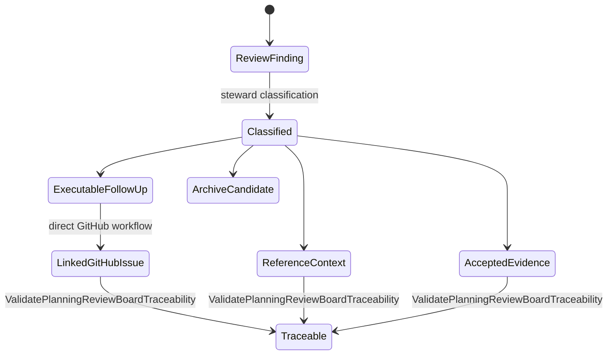
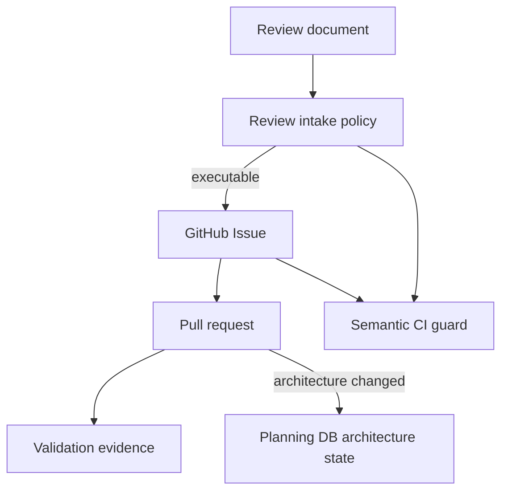
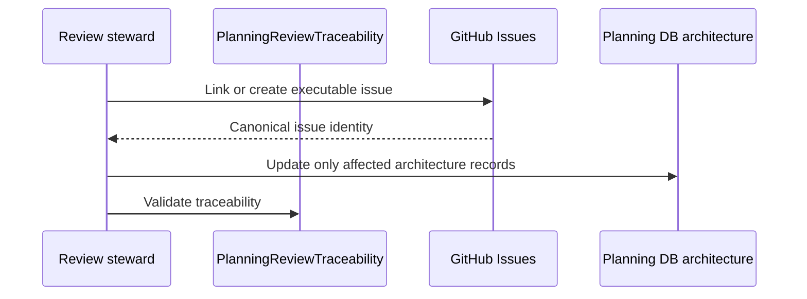

# Planning Review Canon Component

> Owned concern: validate that executable review findings link to the single
> GitHub Issues MVP backlog without owning task lifecycle.

## Public API

- `ValidatePlanningReviewBoardTraceability(input)`: validates that executable
  review findings link to GitHub Issues and that local documents do not become
  a parallel task registry.

## Invariants

- Review documents are intake and rationale, not task lifecycle authority.
- GitHub Issues is the only MVP task and lifecycle authority.
- This component never creates, claims, updates, or closes task state.
- Planning DB is used only when a finding changes architecture components,
  capabilities, relationships, command/query rails, feature mechanization, or
  governance evidence.
- Review filenames follow `review-naming-policy.md`.

## Transitions

## Consumers

- Review stewards classify review rows and link executable findings to existing
  or newly created GitHub Issues.
- Product operators select the next MVP slice from GitHub.
- Reviewers use the traceability query to detect local parallel backlogs.
- Architecture maintainers update Planning DB only for architecture or
  mechanization changes caused by the issue.

## Command And Query Rail

| Rail                                      | Type  | Owner                       | Surface                    |
| ----------------------------------------- | ----- | --------------------------- | -------------------------- |
| `ValidatePlanningReviewBoardTraceability` | query | Planning board traceability | CI guard, reviews, stories |

Task lifecycle has no repository command rail. It is performed directly through
the GitHub Issues product boundary.

## Semantic Fitness Function

`tools/ci/planning-review-canon.test.mjs` validates that review intake has a
component guide, user stories, governing workflow, and one implemented query.
It prevents a regression where review or sprint documents become an executable
backlog or direct agents to Planning DB task commands.

## Diagrams

## Related Docs

- [Planning Review Canon User Stories](./planning-review-canon-user-stories.md)
- [GitHub MVP Issue Workflow](../../../planning/state/github-mvp-issue-workflow.md)
- [ADR-0061](../../../adr/ADR-0061-github-mvp-task-authority-and-planning-db-architecture-boundary.md)
- [Review Naming Policy](../../../planning/reviews/review-naming-policy.md)
