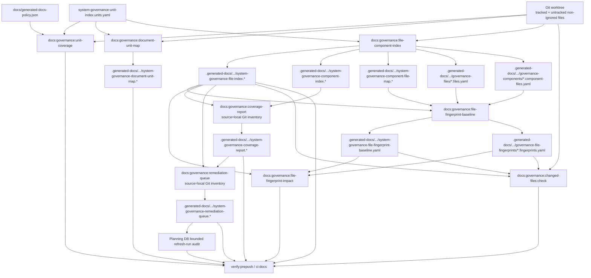

# System Governance Generation Workflow Component

## Purpose

This component records the `system-governance-*` generation workflow as an
explicit operational contract.

The workflow remains deterministic, but the generated read side is no longer a
tracked review surface. File indexes, component maps, fingerprints, coverage
reports, remediation queues, and shard files are local artifacts under
`.generated-docs/planning/status/`. Git is the physical inventory authority for
paths, contents, hashes, symbols, and documentation structure. Planning DB is
the semantic authority for architecture, component relations, rails, and
mechanization. Routine governance refresh derives local inspection artifacts
from Git and does not import or rebuild Planning DB.

## Governing Sources

- `AGENTS.md`
- `docs/planning/status/governance-document-rule-inventory.md`
- `docs/DOCS_README.md`
- `docs/generated-docs-policy.json`
- `docs/architecture/command-query-rail-governance.md`
- `docs/architecture/fowler-opportunity-planning-governance.md`
- `docs/architecture/components/ci-governance/local-changed-files-gate-component.md`
- `docs/planning/proposals/mandatory/governance-and-docs/planning-state-query-store-plan-20260506.md`
- `docs/adr/ADR-0053-file-state-fingerprint-governance.md`

## Owned Concern

Owned concern: define the current docs-governance generation workflow,
including its source inputs, generated outputs, check commands, and review
fan-out.

This component does not own:

- product runtime behavior;
- planner, engine, adapter, API, or web state;
- Postgres schema or migration implementation;
- the governance unit taxonomy itself;
- manual edits to generated `system-governance-*` files.

## Source Classification

| Surface                                                        | Role                                              | Current authority       |
| -------------------------------------------------------------- | ------------------------------------------------- | ----------------------- |
| `docs/planning/status/system-governance-unit-index.units.yaml` | Governance unit manifest                          | Editable tracked source |
| Git tracked files plus untracked non-ignored local files       | Observed file set                                 | Git worktree            |
| `docs/generated-docs-policy.json`                              | Generated artifact ownership registry             | Editable tracked source |
| `scripts/generate-governance-document-unit-map.cjs`            | Document-to-unit generator                        | Script source           |
| `scripts/generate-governance-file-component-index.cjs`         | File/component/shard generator                    | Script source           |
| `scripts/check-governance-file-fingerprint-baseline.cjs`       | Fingerprint baseline and impact generator/checker | Script source           |
| `scripts/generate-governance-coverage-report.cjs`              | Coverage report generator                         | Script source           |
| `scripts/generate-governance-remediation-queue.cjs`            | Remediation queue generator                       | Script source           |
| `scripts/check-governance-changed-files.cjs`                   | Changed-file governance validation                | Script source           |

Generated Markdown and YAML outputs are local artifacts, not manual authoring
surfaces and not tracked review files. The editable root is the owning source
plus the generator declared in the generated-docs policy.
When `docs/generated-docs-policy.json` declares a generated shard family as
DB-backed, the local shard remains an inspection artifact and the size gate must
validate the declared DB projection contract instead of treating shard bytes as
the authority.

## Current Workflow

## Stage Contract

- `Unit coverage` runs `pnpm docs:governance:unit-coverage` through
  `scripts/check-governance-unit-coverage.cjs`. It reads the unit index and
  repository file list, writes nothing, and fails when a file has zero or
  multiple unit owners.
- `Document unit map` runs `pnpm docs:governance:document-unit-map` through
  `scripts/generate-governance-document-unit-map.cjs`. It reads the unit index
  and tracked docs, writes `.generated-docs/planning/status/system-governance-document-unit-map.*`,
  and its check command regenerates the ignored artifact.
- `File/component index` runs `pnpm docs:governance:file-component-index`
  through `scripts/generate-governance-file-component-index.cjs`. It reads the
  unit index plus tracked and untracked non-ignored files, writes the
  `.generated-docs/planning/status/system-governance-*` outputs plus the
  `governance-files/` and `governance-components/` shards, and its check command
  regenerates ignored artifacts. `governance-files/*.files.yaml` is backed by
  `planning_query_store.governance_file_query`; `docs:gov:generated-policy`
  validates that projection metadata before exempting that shard family from
  local `maxBytes` enforcement.
- `Fingerprint baseline` runs `pnpm docs:governance:file-fingerprint-baseline`
  through `scripts/check-governance-file-fingerprint-baseline.cjs --write`. It
  reads the current generated file index and shards, writes a compact
  `.generated-docs/planning/status/system-governance-file-fingerprint-baseline.yaml`
  manifest plus deterministic
  `.generated-docs/planning/status/governance-file-fingerprints/*.fingerprints.yaml`
  shards keyed by `componentUnit` first, then `domainUnit`, then `rootUnit`,
  and its check command regenerates the ignored current baseline.
- `Fingerprint impact` runs `pnpm docs:governance:file-fingerprint-impact`
  through `scripts/check-governance-file-fingerprint-baseline.cjs --report`. It
  reads the current generated baseline manifest, fingerprint shards, and file
  index, writes
  `.generated-docs/planning/status/system-governance-file-fingerprint-impact-20260501.md`,
  and its check command regenerates the ignored current impact report.
- `Coverage report` runs `pnpm docs:governance:coverage-report` through
  `scripts/generate-governance-coverage-report.cjs`. Routine
  `governance:refresh` uses its deterministic local generated-input path, writes
  `.generated-docs/planning/status/system-governance-coverage-report.*`, and
  regenerates the ignored artifact. DB-source mode remains an explicit
  diagnostic option and is not part of refresh or closeout.
- `Remediation queue` runs `pnpm docs:governance:remediation-queue` through
  `scripts/generate-governance-remediation-queue.cjs`. Routine
  `governance:refresh` uses its deterministic local generated-input path, writes
  `.generated-docs/planning/status/system-governance-remediation-queue.*`, and
  regenerates the ignored artifact. DB-source mode remains an explicit
  diagnostic option and is not part of refresh or closeout.
- `Changed-file validation` runs `pnpm docs:governance:changed-files:check`
  through `scripts/check-governance-changed-files.cjs`. It reads the current
  generated baseline, current generated file index, and local name-status diff,
  writes nothing, and fails when changed files lack active governance.

## Canonical Refresh Command

`pnpm governance:refresh` is the canonical local command for refreshing local
inspection artifacts from the current Git inventory. It does not import,
rebuild, or replace Planning DB projections.
Agents and contributors should prefer this command over manually remembering the
individual generator order.

The command runs the docs and governance generation stages in this order:

1. `docs:sync`
2. `docs:status:generate`
3. `docs:capability:generate`
4. `docs:gov:manifest`
5. `docs:governance:document-unit-map`
6. `docs:governance:file-component-index`
7. `docs:governance:file-fingerprint-baseline`
8. `docs:governance:file-fingerprint-impact`
9. `docs:governance:coverage-report`
10. `docs:governance:remediation-queue`

After each generation pass, the runner hashes staged, unstaged, and untracked
non-ignored worktree state. It repeats generation until that fingerprint stops
changing, with a small maximum pass count. Once stable, it records the bounded
refresh-run result in Planning DB. Import, DB projection drift, export, and
publication commands are not refresh stages and run only on explicit request.

The fingerprint is a convergence guard, not a new source of truth. Git-tracked
sources, generated-docs policy, unit ownership, and generator scripts remain
authoritative.

When an operator explicitly bootstraps or recovers Planning DB,
`governance:db:import` takes a transaction-scoped advisory lock before replacing
governance read-model rows. The accepted destructive schema-recovery path is
`pnpm planning:db:reset -- --confirm-destroy-shared-planning-db`, followed by
an explicit `pnpm planning:db:import`. Reset is intentionally destructive for
the shared machine-local cache and is never a closeout or refresh side effect.

## Former Tracked Fan-Out

These output families used to be tracked review files under
`docs/planning/status/`:

- `docs/planning/status/system-governance-file-index.files.yaml`
- `docs/planning/status/system-governance-file-index-20260501.md`
- `docs/planning/status/system-governance-component-index.components.yaml`
- `docs/planning/status/system-governance-component-index-20260501.md`
- `docs/planning/status/system-governance-component-file-map.components.yaml`
- `docs/planning/status/system-governance-component-file-map-20260503.md`
- `docs/planning/status/system-governance-file-fingerprint-baseline.yaml`
- `docs/planning/status/system-governance-file-fingerprint-impact-20260501.md`
- `docs/planning/status/system-governance-coverage-report.coverage.yaml`
- `docs/planning/status/system-governance-coverage-report-20260502.md`
- `docs/planning/status/system-governance-remediation-queue.queue.yaml`
- `docs/planning/status/system-governance-remediation-queue-20260502.md`
- `docs/planning/status/governance-files/*.files.yaml`
- `docs/planning/status/governance-components/*.component-files.yaml`
- `docs/planning/status/governance-file-fingerprints/*.fingerprints.yaml`

That fan-out is no longer expected in PR file lists. The same payload is still
deterministically generated under `.generated-docs/planning/status/` for local
inspection and rebuilt in memory for Postgres import, but reviewer attention
stays on root source, script, config, and plan changes.

## Derivation Boundary For GOV-S3

GOV-S3 preserves the workflow while removing tracked generated churn. The
database-backed implementation imports or reproduces the following read models,
while the local-operation slice moves agent coordination state into Postgres
audit and overlay tables:

| Read model                     | Minimum source rows                                                               |
| ------------------------------ | --------------------------------------------------------------------------------- |
| `GovernanceGenerationWorkflow` | stage id, command, script, input artifact ids, output artifact ids, check command |
| `GovernanceSourceArtifact`     | path, source class, generator owner, current content hash                         |
| `GovernanceGeneratedArtifact`  | path, artifact class, generator command, tracking posture, content hash           |
| `GovernanceWorkflowEdge`       | upstream artifact, downstream stage, edge reason                                  |
| `GovernanceReviewImpact`       | root changed source, generated artifact family, changed row count, changed hash   |
| `GovernanceFileHashProjection` | path, file id, path hash, content hash, governance hash, state fingerprint        |

The generation contract remains source-controlled: the unit manifest, the
generated-docs policy, and generator scripts still define how generated
governance artifacts are produced. The local database is the semantic
coordination and query surface for governed architecture state. Generated
governance files are ignored local artifacts, not PR review files. When an
import is explicitly requested, it must rebuild its projections from Git-owned
sources or the same generator modules; `.generated-docs` files are never the
database import source.

## Invariants

- No derived `system-governance-*` artifact may be tracked under
  `docs/planning/status/`; those outputs belong under `.generated-docs/`.
- Every generated `system-governance-*` artifact must have one owning generator
  command in `docs/generated-docs-policy.json`.
- Check commands must regenerate deterministic ignored artifacts and fail
  closed on generator, ownership, or DB drift errors.
- `docs:governance:changed-files:check` must include staged, unstaged, branch,
  and untracked non-ignored local files through the local name-status flow.
- The fingerprint baseline is a current generated read-model artifact, not an
  accepted tracked review file.
- A Postgres store may own semantic architecture queries, local audit, and
  overlays, but it does not replace Git as physical repository inventory.
- Postgres hash projections may derive file id, path hash, governance hash, and
  state fingerprint from imported governance file rows. The imported
  `content_hash` remains the byte-level input fact until repository file
  contents are imported directly.
- The DB import rail must not require `.generated-docs` files to exist before
  import. It may keep generated repo paths as stable source identifiers, but the
  source content hash must be computed from the in-memory projection payload
  being imported.
- DB-backed generated shard exemptions must name the query view, import command,
  and drift-check command in `docs/generated-docs-policy.json`; undeclared or
  invalid metadata must fail closed and keep the local `maxBytes` rule active.
- The migration must move local operational state into DB audit and overlay
  rows while keeping reviewer attention on root source changes and summarized
  artifact hashes.

## Command And Query Rails

This component formalizes existing repository automation and the proposed
GOV-S3 read model rails. It does not add product runtime behavior.

- `RefreshGovernanceDerivedSurfaces` is a Docs governance command owned by
  `GovernanceRefreshWorkflow`. Its adapter surface is the package script runner
  plus Git worktree fingerprinting; repeated generation that does not stabilize
  fails before the bounded Planning DB run audit is completed.
- `QuerySystemGovernanceGenerationWorkflow` is a Docs governance query owned by
  `GovernanceGenerationWorkflow`. Its adapter surface is the file-system
  manifest plus generated-docs policy reader; missing generator ownership for a
  generated artifact fails closed.
- `ValidateSystemGovernanceGenerationWorkflow` is a Docs governance query owned
  by `GovernanceWorkflowDriftReport`. Its routine adapter surface is the
  generator/check command adapter over Git-derived artifacts; missing
  `.generated-docs` artifacts or local drift fail closed. Explicit DB diagnostic
  checks remain separate from refresh and closeout.

These rails are documentation and tooling rails. Runtime packages, API routes,
web UI actions, engine contracts, and adapters must not depend on them.

## Review Rule

Contributors must run `pnpm governance:refresh` before closeout when governance
sources or generator scripts change. Reviewers should not expect generated
`system-governance-*` artifacts in the PR diff; they should review root source
changes, generator/script changes, the generated-docs policy, and validation
evidence.
