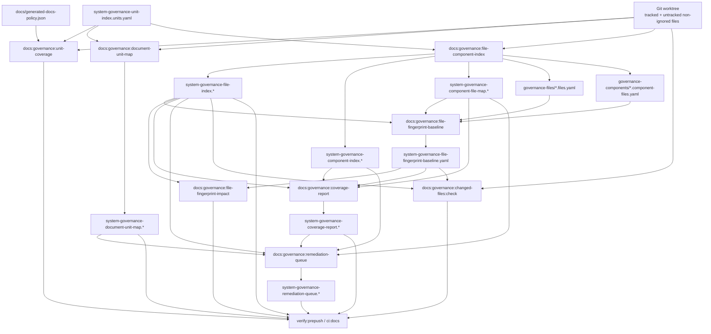

# System Governance Generation Workflow Component

## Purpose

This component records the current `system-governance-*` generation workflow as
an explicit operational contract.

The workflow is correct and deterministic today, but it is expensive to review:
a small source change can update file indexes, component maps, fingerprints,
coverage reports, remediation queues, and shard files. GOV-S3 can only move
that read side into Postgres after this workflow is preserved as a concrete
input/output graph.

## Governing Sources

- `AGENTS.md`
- `docs/planning/status/governance-document-rule-inventory.md`
- `docs/DOCS_README.md`
- `docs/generated-docs-policy.json`
- `docs/architecture/command-query-rail-governance.md`
- `docs/architecture/fowler-opportunity-planning-governance.md`
- `docs/architecture/components/ci-governance/local-changed-files-gate-component.md`
- `docs/planning/proposals/mandatory/governance-and-docs/planning-state-query-store-plan-20260506.md`
- `docs/adr/ADR-0053-file-state-fingerprint-governance.md`

## Owned Concern

Owned concern: define the current docs-governance generation workflow,
including its source inputs, generated outputs, check commands, and review
fan-out.

This component does not own:

- product runtime behavior;
- planner, engine, adapter, API, or web state;
- Postgres schema or migration implementation;
- the governance unit taxonomy itself;
- manual edits to generated `system-governance-*` files.

## Source Classification

| Surface                                                        | Role                                              | Current authority       |
| -------------------------------------------------------------- | ------------------------------------------------- | ----------------------- |
| `docs/planning/status/system-governance-unit-index.units.yaml` | Governance unit manifest                          | Editable tracked source |
| Git tracked files plus untracked non-ignored local files       | Observed file set                                 | Git worktree            |
| `docs/generated-docs-policy.json`                              | Generated artifact ownership registry             | Editable tracked source |
| `scripts/generate-governance-document-unit-map.cjs`            | Document-to-unit generator                        | Script source           |
| `scripts/generate-governance-file-component-index.cjs`         | File/component/shard generator                    | Script source           |
| `scripts/check-governance-file-fingerprint-baseline.cjs`       | Fingerprint baseline and impact generator/checker | Script source           |
| `scripts/generate-governance-coverage-report.cjs`              | Coverage report generator                         | Script source           |
| `scripts/generate-governance-remediation-queue.cjs`            | Remediation queue generator                       | Script source           |
| `scripts/check-governance-changed-files.cjs`                   | Changed-file governance validation                | Script source           |

Generated Markdown and YAML outputs are reviewable artifacts, but they are not
manual authoring surfaces. The editable root is the owning source plus the
generator declared in the generated-docs policy.

## Current Workflow

## Stage Contract

| Stage                   | Command                                          | Script                                                            | Reads                                                                                | Writes                                                                                              | Check posture                                                                    |
| ----------------------- | ------------------------------------------------ | ----------------------------------------------------------------- | ------------------------------------------------------------------------------------ | --------------------------------------------------------------------------------------------------- | -------------------------------------------------------------------------------- |
| Unit coverage           | `pnpm docs:governance:unit-coverage`             | `scripts/check-governance-unit-coverage.cjs`                      | `system-governance-unit-index.units.yaml`, repository file list                      | None                                                                                                | Fails when a file has zero or multiple unit owners                               |
| Document unit map       | `pnpm docs:governance:document-unit-map`         | `scripts/generate-governance-document-unit-map.cjs`               | `system-governance-unit-index.units.yaml`, tracked docs                              | `system-governance-document-unit-map.docs.yaml`, `system-governance-document-unit-map-20260501.md`  | `:check` fails on stale generated output                                         |
| File/component index    | `pnpm docs:governance:file-component-index`      | `scripts/generate-governance-file-component-index.cjs`            | `system-governance-unit-index.units.yaml`, tracked and untracked non-ignored files   | file index, component index, component file map, file shards, component shards                      | `:check` fails on stale generated output                                         |
| Fingerprint baseline    | `pnpm docs:governance:file-fingerprint-baseline` | `scripts/check-governance-file-fingerprint-baseline.cjs --write`  | current file index and shards                                                        | `system-governance-file-fingerprint-baseline.yaml`                                                  | `:check` fails when current file state differs from accepted baseline            |
| Fingerprint impact      | `pnpm docs:governance:file-fingerprint-impact`   | `scripts/check-governance-file-fingerprint-baseline.cjs --report` | accepted baseline and current file index                                             | `system-governance-file-fingerprint-impact-20260501.md`                                             | `:check` fails when the report is stale                                          |
| Coverage report         | `pnpm docs:governance:coverage-report`           | `scripts/generate-governance-coverage-report.cjs`                 | file index, component index, component map, fingerprint baseline                     | `system-governance-coverage-report.coverage.yaml`, `system-governance-coverage-report-20260502.md`  | `:check` fails on stale generated output                                         |
| Remediation queue       | `pnpm docs:governance:remediation-queue`         | `scripts/generate-governance-remediation-queue.cjs`               | coverage report, file index, component index, component map, document map            | `system-governance-remediation-queue.queue.yaml`, `system-governance-remediation-queue-20260502.md` | `:check` fails on stale generated output                                         |
| Changed-file validation | `pnpm docs:governance:changed-files:check`       | `scripts/check-governance-changed-files.cjs`                      | base baseline from Git, current baseline, current file index, local name-status diff | None                                                                                                | Fails when changed files lack active governance or expected fingerprint movement |

## Current Fan-Out

One accepted source change can legitimately update all of these tracked output
families:

- `docs/planning/status/system-governance-file-index.files.yaml`
- `docs/planning/status/system-governance-file-index-20260501.md`
- `docs/planning/status/system-governance-component-index.components.yaml`
- `docs/planning/status/system-governance-component-index-20260501.md`
- `docs/planning/status/system-governance-component-file-map.components.yaml`
- `docs/planning/status/system-governance-component-file-map-20260503.md`
- `docs/planning/status/system-governance-file-fingerprint-baseline.yaml`
- `docs/planning/status/system-governance-file-fingerprint-impact-20260501.md`
- `docs/planning/status/system-governance-coverage-report.coverage.yaml`
- `docs/planning/status/system-governance-coverage-report-20260502.md`
- `docs/planning/status/system-governance-remediation-queue.queue.yaml`
- `docs/planning/status/system-governance-remediation-queue-20260502.md`
- `docs/planning/status/governance-files/*.files.yaml`
- `docs/planning/status/governance-components/*.component-files.yaml`

That fan-out is expected under the current model. It becomes a problem when the
reviewer has to inspect every generated file to understand whether the root
source change was correct.

## Derivation Boundary For GOV-S3

GOV-S3 must preserve this workflow before reducing tracked generated churn. The
first database-backed implementation must therefore import or reproduce the
following read models:

| Read model                     | Minimum source rows                                                               |
| ------------------------------ | --------------------------------------------------------------------------------- |
| `GovernanceGenerationWorkflow` | stage id, command, script, input artifact ids, output artifact ids, check command |
| `GovernanceSourceArtifact`     | path, source class, generator owner, current content hash                         |
| `GovernanceGeneratedArtifact`  | path, artifact class, generator command, tracking posture, content hash           |
| `GovernanceWorkflowEdge`       | upstream artifact, downstream stage, edge reason                                  |
| `GovernanceReviewImpact`       | root changed source, generated artifact family, changed row count, changed hash   |

The database may cache and query these rows, but it must not become authority.
The authoritative sources remain Git, the unit manifest, the generated-docs
policy, and the generator scripts.

## Invariants

- Every tracked generated `system-governance-*` artifact must have one owning
  generator command in `docs/generated-docs-policy.json`.
- Check commands must compare deterministic output against the worktree and
  fail closed on drift.
- `docs:governance:changed-files:check` must include staged, unstaged, branch,
  and untracked non-ignored local files through the local name-status flow.
- The fingerprint baseline is an accepted review artifact, not an invisible
  cache.
- A Postgres query store may replace repetitive reads and review fan-out only
  after parity proves that it preserves this stage contract.
- The migration must compress reviewer attention onto root source changes and
  summarized artifact hashes, not hide generated changes outside PR review.

## Command And Query Rails

This component formalizes existing repository automation and the proposed
GOV-S3 read model rails. It does not add product runtime behavior.

| Rail                                         | Type  | Bounded context | DDD object                      | Adapter surface                                       | Negative tests                                                                                   |
| -------------------------------------------- | ----- | --------------- | ------------------------------- | ----------------------------------------------------- | ------------------------------------------------------------------------------------------------ |
| `QuerySystemGovernanceGenerationWorkflow`    | query | Docs governance | `GovernanceGenerationWorkflow`  | file-system manifest and generated-docs policy reader | Missing generator ownership for a tracked generated artifact fails closed.                       |
| `ValidateSystemGovernanceGenerationWorkflow` | query | Docs governance | `GovernanceWorkflowDriftReport` | generator/check command adapter                       | A generated artifact changed without its owning source or accepted baseline update fails closed. |

These rails are documentation and tooling rails. Runtime packages, API routes,
web UI actions, engine contracts, and adapters must not depend on them.

## Review Rule

Until GOV-S3 parity exists, contributors must continue to regenerate and commit
the current `system-governance-*` outputs. Reviewers should use this workflow
contract to distinguish root source changes from deterministic generated
fan-out.
