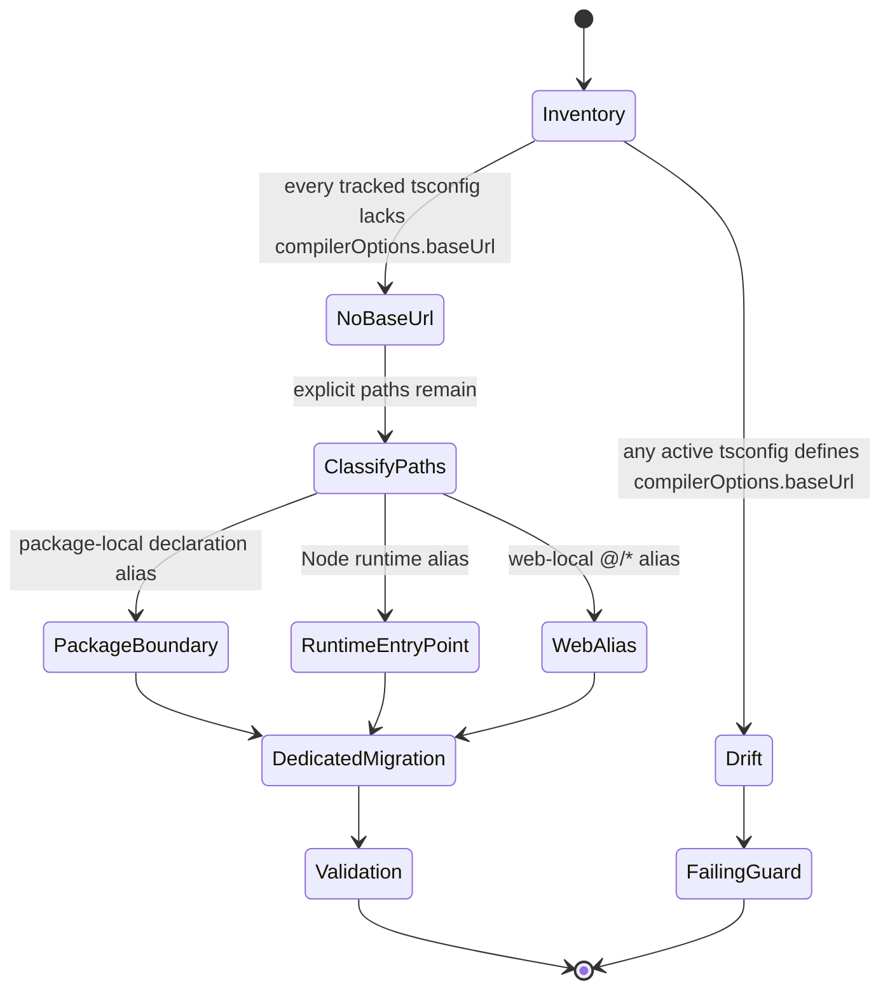
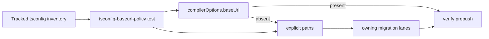

# Tsconfig BaseUrl Policy Component

## Owned Concern

This component owns the repository guard that keeps TypeScript
`compilerOptions.baseUrl` retired from active tracked `tsconfig*.json` files.
It also keeps remaining `paths` aliases classified by their real owner instead
of treating every alias as baseUrl cleanup.

## Public API

- `git ls-files *tsconfig*.json`: canonical tracked inventory for active
  TypeScript configuration files.
- `tools/ci/tsconfig-baseurl-policy.test.mjs`: executable semantic guard for
  the baseUrl retirement posture and local documentation contract.
- `docs/architecture/typescript-package-classification.md`: canonical lane
  model for Bundler, NodeNext, runtime-sensitive package, and web aliases.
- `docs/planning/proposals/mandatory/runtime-and-contracts/cfg-ts-t1-baseurl-deprecation-migration-plan-20260522.md`:
  accepted staged plan for CFG-TS-T1.
- `pnpm test:ci-tools`: local test surface that runs the CI policy guard.

## Invariants

- Active tracked `tsconfig*.json` files must not define
  `compilerOptions.baseUrl`.
- `paths` is not synonymous with retired baseUrl behavior.
- Root `tsconfig.json` may own source-alias `paths` for repo type-checking, but
  it is not an architectural package base.
- `tsconfig.node-runtime.base.json` may own explicit runtime package aliases
  until NodeNext startup/smoke validation proves export-map-only resolution.
- Package-local `paths` aliases remain package-boundary migration work, not
  global baseUrl cleanup.
- `apps/web/tsconfig.json` may own the web-local `@/*` alias until a dedicated
  frontend import rewrite creates value.
- Any future reintroduction of `compilerOptions.baseUrl` is configuration drift
  and must fail before merge.

## Transitions

## Consumers

- CI maintainers use the guard when TypeScript config files change.
- Package maintainers use the classification when removing package-local
  aliases.
- Runtime maintainers use the classification before removing NodeNext runtime
  aliases.
- Frontend maintainers use the classification before rewriting web-local
  imports.
- Agents use this component to close CFG-TS-T1 without creating fake follow-up
  work for already-retired `baseUrl`.

## Flow

## Validation

- `node --test tools/ci/tsconfig-baseurl-policy.test.mjs`
- `pnpm test:ci-tools`
- `pnpm verify:prepush`
