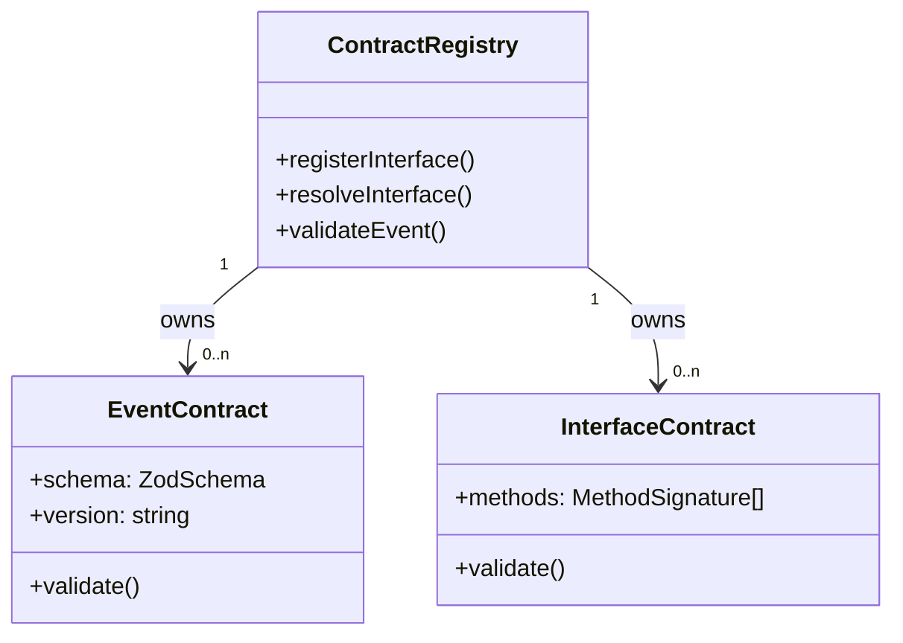

# contracts DDD Structure

## DDD Diagram

## Aggregates & Entities

- **ContractRegistry**: Conceptual root that organises all interface and event contract definitions exported by this package. Ensures consistency and discoverability across domains.
- **EventContract**: Represents a versioned schema definition for a domain event (e.g., `StepStarted`, `RunCompleted`). Owns the Zod schema and version string.
- **InterfaceContract**: Represents a typed interface definition (e.g., `IRunStateStore`, `ILineageSink`) that adapter and engine packages must implement.

## Domain Events

- `ContractSchemaViolation`: Raised (as a validation error) when an event payload does not satisfy the Zod schema for its declared contract version.
- `InterfaceContractBreached`: Raised at type-check time when an implementing class fails to satisfy the interface contract defined in this package.

## Key Files

- `packages/@dvt/contracts/src/engine/IRunStateStore.v1.ts`
- `packages/@dvt/contracts/src/events/`
- `packages/@dvt/contracts/src/index.ts`
