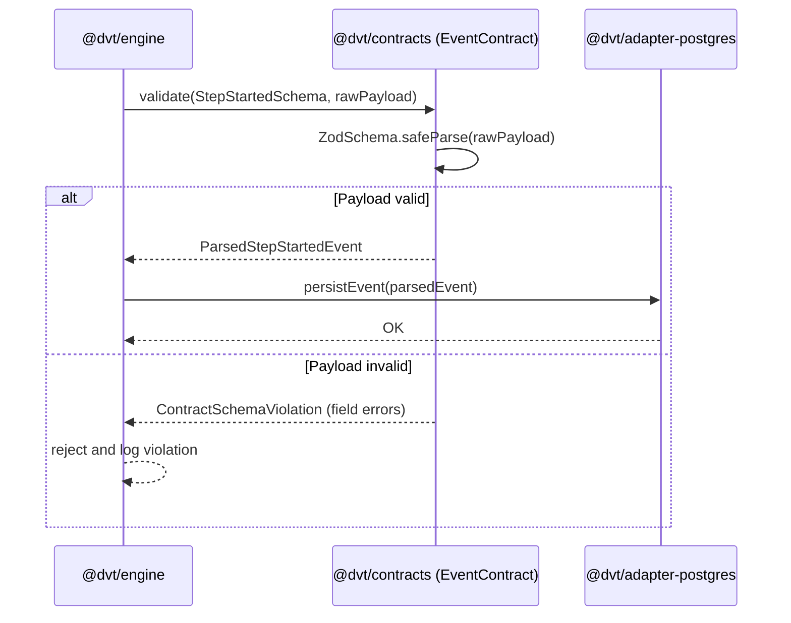

# contracts Sequence

## Main Flow: Event Payload Validation at a Domain Boundary

## Global Flow Position

`@dvt/contracts` is a shared foundation package that flows outward to all other DVT components. It does not call any other DVT package — it has no runtime dependencies within the monorepo. Every package that needs to exchange typed data (engine, api, adapter-postgres, adapter-temporal, web) imports from contracts. It is the root of the dependency graph for shared types and sits upstream of all domain implementations.

## Key Files

- `packages/@dvt/contracts/src/engine/IRunStateStore.v1.ts`
- `packages/@dvt/contracts/src/events/`
- `packages/@dvt/contracts/src/index.ts`
