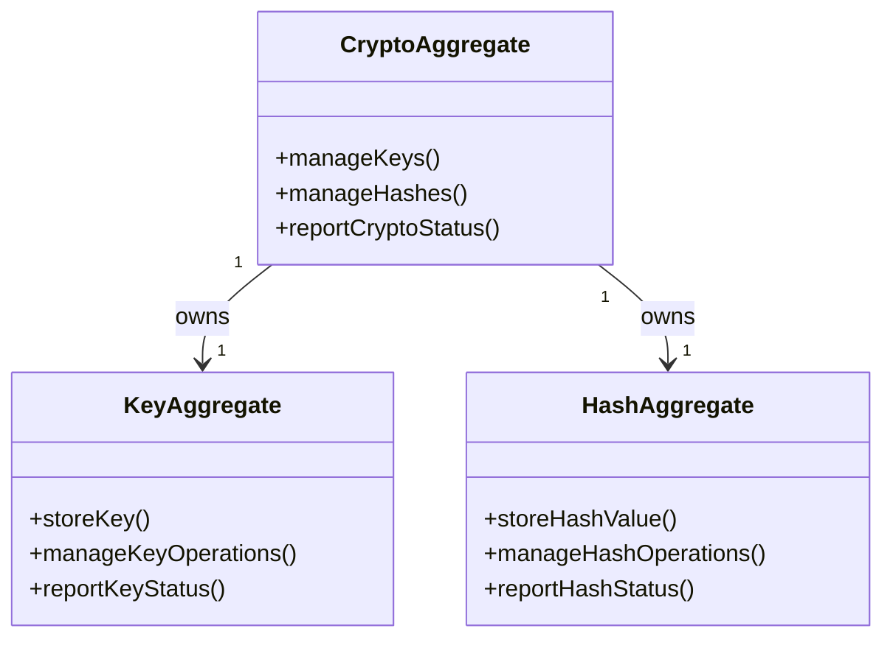

# crypto DDD Structure

## DDD Diagram

## Aggregates & Entities

- **CryptoAggregate**: Root aggregate representing the central crypto model. Owns key and hash management and is the primary entry point for all cryptographic operations within the Shared Boundary Domain.
- **KeyAggregate**: Subordinate aggregate responsible for storing and managing cryptographic keys, including generation, rotation, and revocation.
- **HashAggregate**: Subordinate aggregate responsible for storing and managing hash values, including SHA-256 digests used for `CompiledCodeRef` integrity verification.

## Domain Events

- `HashComputed`: Emitted when a SHA-256 digest is successfully computed for an artifact (e.g., a compiled code blob).
- `KeyGenerated`: Emitted when a new cryptographic key is generated and registered in the key store.
- `KeyRotated`: Emitted when an existing key is rotated and the previous key is archived.
- `HashVerificationFailed`: Emitted when a stored hash does not match a recomputed digest, indicating data integrity violation.

## Key Files

- `packages/@dvt/crypto/src/CryptoAggregate.ts`
- `packages/@dvt/crypto/src/KeyAggregate.ts`
- `packages/@dvt/crypto/src/HashAggregate.ts`
