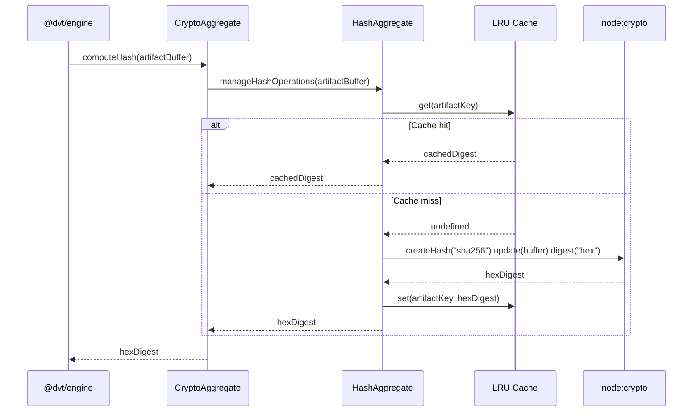

# crypto Sequence

## Main Flow: Computing and Caching a SHA-256 Hash for CompiledCodeRef

## Global Flow Position

`@dvt/crypto` sits in the Shared Boundary Domain alongside `@dvt/contracts`. It is called by `@dvt/engine` when computing `CompiledCodeRef` SHA-256 digests and by `@dvt/contracts` for payload integrity operations. It does not call any other DVT package at runtime; its only runtime dependency is `node:crypto` and the `lru-cache` library. Upstream callers: `@dvt/engine` and `@dvt/contracts`. Downstream: Node.js standard library only.

## Key Files

- `packages/@dvt/crypto/src/CryptoAggregate.ts`
- `packages/@dvt/crypto/src/KeyAggregate.ts`
- `packages/@dvt/crypto/src/HashAggregate.ts`
