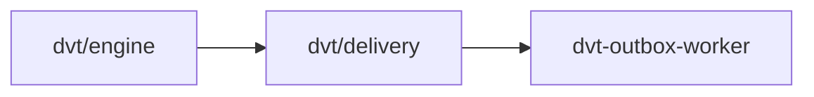

# @dvt/delivery

## Component Map

## Location

- packages/@dvt/delivery

## Domain

- [Delivery Domain](../domain-delivery.md)

## Main Responsibilities

- Delivery orchestration, event publishing, ownership management
- Root: DeliveryAggregate (central delivery model)
- Aggregates: OutboxAggregate
- Ensures event publication, ownership tracking, retry logic

## Explanation

@dvt/delivery is responsible for the lifecycle of delivery events:

- **Root:** [DeliveryAggregate](delivery.md#deliveryaggregate) — represents the central delivery model, owning event publication and ownership.
- **Aggregates:** [OutboxAggregate](delivery.md#outboxaggregate) (event publishing and retry).
- **Responsibilities:**
  - Orchestrate event delivery and publication.
  - Track delivery ownership and status.
  - Manage retry logic for failed events.

**Interactions:**

- **[OutboxWorker](outbox-worker.md):** Publishes events and manages retries.
- **[Engine](engine.md):** Receives delivery events for workflow execution.

Delivery coordinates these interactions to ensure reliable event publication and ownership tracking.

## DeliveryAggregate

Represents the central delivery model, owning event publication and ownership. Responsible for:

- Managing delivery state and ownership
- Tracking event publication
- Managing retry logic

**Delivery schema:** See [DeliveryAggregate types](../../packages/@dvt/delivery/src/domain/types.ts)
**Delivery contract:** See [Delivery Contracts](../../docs/contracts/index.md)

## OutboxAggregate

Represents event publishing and retry logic. Responsible for:

- Publishing events to external systems
- Managing retry attempts
- Reporting delivery status

**Outbox schema:** See [OutboxAggregate types](../../packages/@dvt/delivery/src/domain/types.ts)

## Restrictions

- Must comply with contract definitions in [Delivery Contracts](../../docs/contracts/index.md)
- Only interacts with Delivery domain components and engine

## Related Documentation

- [Component Map](../component-map.md)
- [Delivery Domain](../domain-delivery.md)
