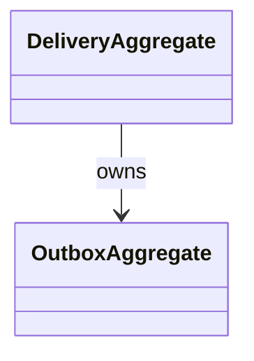

---
title: Delivery Constraints & Invariants
status: Draft
owner: Delivery Domain
last_reviewed: 2026-03-15
topics:
  - Constraints & Invariants
  - Validation Examples
  - Key Files & References
---

# Delivery Constraints & Invariants

## DDD Diagram

## Constraints and Invariants

| Constraint / Invariant | Where Enforced                         | Description                                            |
| ---------------------- | -------------------------------------- | ------------------------------------------------------ |
| Event publication      | `DeliveryAggregate`, `OutboxAggregate` | Events must be published reliably to external systems. |
| Ownership tracking     | `DeliveryAggregate`                    | Delivery ownership must be tracked and confirmed.      |
| Retry logic            | `OutboxAggregate`                      | Failed events must be retried according to policy.     |
| Contract compliance    | `DeliveryAggregate`                    | Must comply with delivery contract definitions.        |

## Validation Examples

- Event publication: `publishEvent` validates the event and confirms delivery.
- Ownership tracking: `trackOwnership` ensures ownership is recorded.
- Retry logic: `manageRetry` applies retry policy and confirms success.

## Key Files & References

- [DeliveryAggregate.ts](../../../../packages/@dvt/delivery/src/core/DeliveryAggregate.ts)
- [OutboxAggregate.ts](../../../../packages/@dvt/delivery/src/core/OutboxAggregate.ts)

## Component File List

List of all files in the delivery component folder:

- `DeliveryAggregate.ts`
- `OutboxAggregate.ts`
