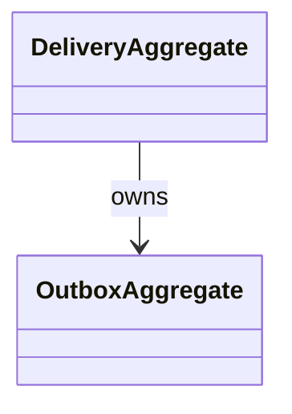

# Delivery DDD Structure

## DDD Diagram

## Aggregates & Entities

- DeliveryAggregate: Central delivery model, manages event publication and ownership.
- OutboxAggregate: Handles event publishing and retry logic.

## Main Methods

- publishEvent(event): Publishes event to external systems.
- manageRetry(event): Handles retry logic for failed events.
- trackOwnership(event): Tracks delivery ownership and status.

## Key Files & References

- [DeliveryAggregate.ts](../../../../packages/@dvt/delivery/src/core/DeliveryAggregate.ts)
- [OutboxAggregate.ts](../../../../packages/@dvt/delivery/src/core/OutboxAggregate.ts)

## Component File List

List of all files in the delivery component folder:

- DeliveryAggregate.ts
- OutboxAggregate.ts
- ...
