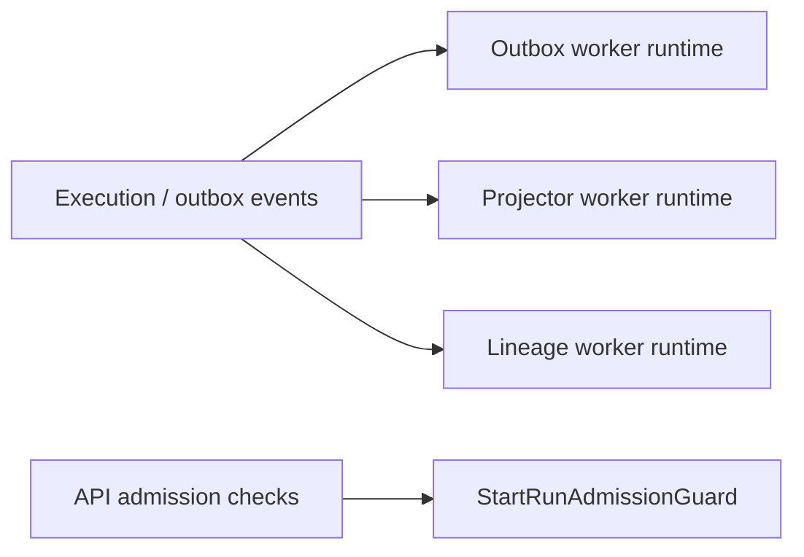

# Delivery DDD Structure

The current package does not expose a central `DeliveryAggregate`. It groups
runtime concerns that consume already-authoritative execution facts.

## Current bounded responsibilities

- `application/` owns worker orchestration and downstream event handling
- `backpressure/` owns delivery-side admission helpers
- canonical execution state remains outside this package in engine/state-store

## Code anchors

- [OutboxWorker.ts](../../../../packages/@dvt/delivery/src/application/OutboxWorker.ts)
- [OutboxWorkerRuntime.ts](../../../../packages/@dvt/delivery/src/application/OutboxWorkerRuntime.ts)
- [ProjectorWorkerRuntime.ts](../../../../packages/@dvt/delivery/src/application/ProjectorWorkerRuntime.ts)
- [LineageWorkerRuntime.ts](../../../../packages/@dvt/delivery/src/application/LineageWorkerRuntime.ts)
