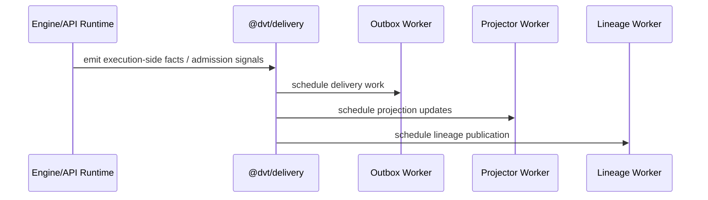

# Delivery Sequence

## Sequence diagram

## Runtime flow position

Delivery consumes execution-side facts and pushes them into delivery,
projection, and lineage runtimes. It does not become the source of truth for
execution or planning state.

## Code anchors

- [OutboxWorkerRuntime.ts](../../../../packages/@dvt/delivery/src/application/OutboxWorkerRuntime.ts)
- [ProjectorWorkerRuntime.ts](../../../../packages/@dvt/delivery/src/application/ProjectorWorkerRuntime.ts)
- [LineageWorkerRuntime.ts](../../../../packages/@dvt/delivery/src/application/LineageWorkerRuntime.ts)
