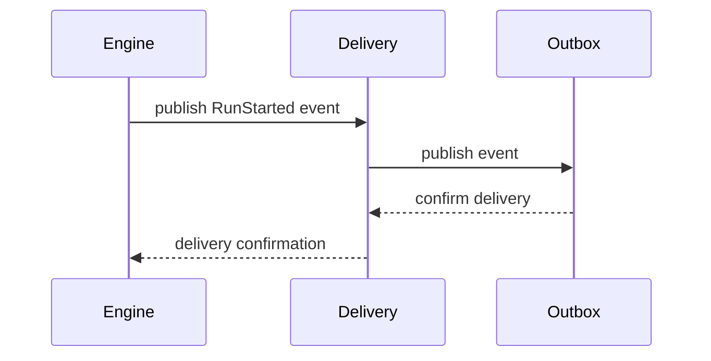

# Delivery Sequence

## Sequence Diagram

## Global Flow Position

Delivery receives events from Engine, manages publication and ownership, coordinates retries via Outbox, and confirms delivery to Engine.

## Key Files & References

- [DeliveryAggregate.ts](../../../../packages/@dvt/delivery/src/core/DeliveryAggregate.ts)
- [OutboxAggregate.ts](../../../../packages/@dvt/delivery/src/core/OutboxAggregate.ts)

## Component File List

List of all files in the delivery component folder:

- DeliveryAggregate.ts
- OutboxAggregate.ts
- ...
