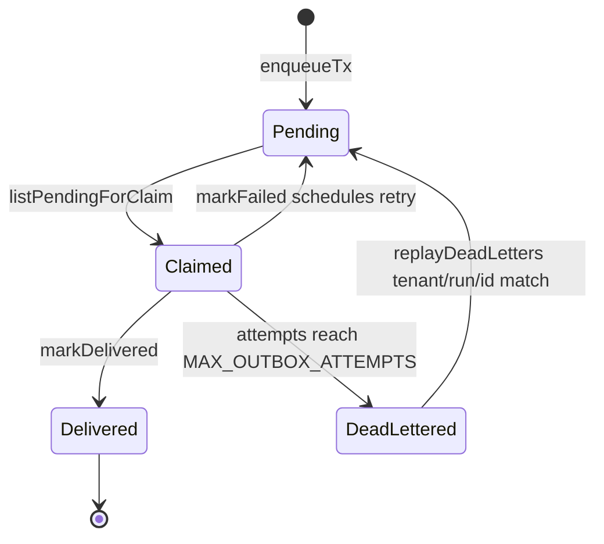
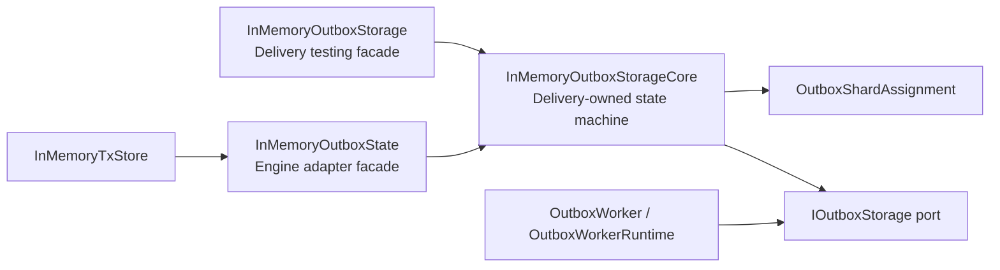

# In-Memory Outbox Storage Component

## Owned Concern

The in-memory outbox storage component owns Delivery's local/test implementation
of `IOutboxStorage` claim, retry, dead-letter, replay, shard, and tenant/run
ordering semantics.

It does not own durable PostgreSQL persistence, event publication, worker
process lifecycle, engine run-state transitions, or API admission.

## Public API

| API                                  | Owner                   | Purpose                                                                                 |
| ------------------------------------ | ----------------------- | --------------------------------------------------------------------------------------- |
| `InMemoryOutboxStorageCore`          | `@dvt/delivery/testing` | Reusable in-memory implementation of the Delivery-owned `IOutboxStorage` state machine. |
| `InMemoryOutboxStorage`              | `@dvt/delivery/testing` | Delivery testing/local facade that preserves the existing public testing API.           |
| `InMemoryOutboxState`                | `@dvt/engine`           | Engine state-store adapter facade that delegates to the Delivery-owned core.            |
| `IOutboxStorage.enqueueTx`           | Delivery port           | Adds persisted event envelopes to the outbox state machine.                             |
| `IOutboxStorage.listPendingForClaim` | Delivery port           | Returns claim-eligible records for the caller's owned shards.                           |
| `IOutboxStorage.markFailed`          | Delivery port           | Applies retry backoff or moves a record to dead letters.                                |
| `IOutboxStorage.replayDeadLetters`   | Delivery port           | Restores matching tenant-scoped dead letters to pending delivery.                       |

## Invariants

- Delivery owns the in-memory outbox state machine.
- Engine may keep an engine-local class name, but it must not implement retry,
  dead-letter, replay, claim ordering, shard assignment, or stream blocking
  semantics locally.
- Claim eligibility honors worker-owned shard ids when provided.
- A zero claim limit returns no records.
- Same `(tenantId, runId)` records are claimed by increasing `runSeq`.
- Retry backoff blocks only the stream head until `nextAttemptAt`.
- Dead-lettered stream heads block later records for the same `(tenantId,
runId)` until replay.
- Dead-letter listing and replay are tenant-scoped.
- Replay restores the original payload, clears failure state, resets attempts,
  and preserves the assigned shard id.
- Application runtime code depends on `IOutboxStorage`, not on the in-memory
  implementation.

## Transitions

## Component Relationships

## Consumers

- `packages/@dvt/delivery/test/**`
- `apps/outbox-worker/test/**`
- `packages/@dvt/engine/src/state/InMemoryTxStore.ts`
- `packages/@dvt/engine/test/state/InMemoryTxStore.outbox.test.ts`

## Architecture Guard

`packages/@dvt/delivery/test/OutboxInMemoryStorageOwnership.architecture.test.ts`
validates that:

- `InMemoryOutboxStorageCore` exists in Delivery;
- delivery and engine facades reference the core instead of local arrays and
  retry/dead-letter helpers;
- delivery worker runtime code depends on `IOutboxStorage`, not the in-memory
  test implementation.
