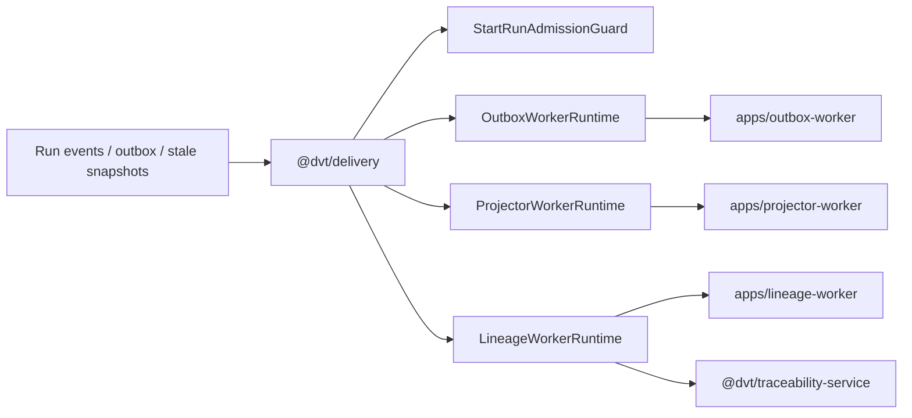

# @dvt/delivery

`@dvt/delivery` is the runtime library for downstream delivery concerns.

It provides the worker-facing primitives that drain outbox records, rebuild read
models, emit lineage, and support admission or retention helpers without moving
that behavior back into the engine or API layers.

## Current Responsibilities

- host the outbox worker runtime;
- host projector and lineage runtimes;
- provide delivery-side helpers such as the admission guard and lineage
  observer;
- keep delivery behavior reusable across multiple worker composition roots.

## Interface Map

## Code Anchors

- [index.ts](../../../../packages/@dvt/delivery/src/index.ts)
- [OutboxWorkerRuntime.ts](../../../../packages/@dvt/delivery/src/application/OutboxWorkerRuntime.ts)
- [ProjectorWorkerRuntime.ts](../../../../packages/@dvt/delivery/src/application/ProjectorWorkerRuntime.ts)
- [LineageWorkerRuntime.ts](../../../../packages/@dvt/delivery/src/application/LineageWorkerRuntime.ts)
- [StartRunAdmissionGuard.ts](../../../../packages/@dvt/delivery/src/backpressure/StartRunAdmissionGuard.ts)

## Current Posture

This is a real library component with runtime authority over downstream event
handling. It is no longer just a placeholder around worker apps.

## Planned Delta

- tighten envelope and lineage seams under `S05`, `S07`, and `S11`;
- keep retention and purge coordination explicit as delivery policy evolves.
- keep worker runtimes reusable without hiding operational ownership in the
  library surface.

## Historical Deep Dives

- [DDD Structure](./delivery-ddd.md)
- [Sequence diagram and flow](./delivery-sequence.md)
- [Constraints and invariants](./delivery-constraints.md)
- [Functionalities](./delivery-functional.md)
