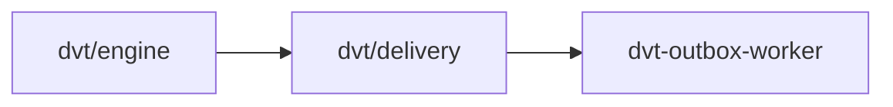

# @dvt/delivery

## Component Map

## Location

- `packages/@dvt/delivery`

## Domain

- [Delivery Domain](../../domain-delivery.md)

## Main Responsibilities

- Delivery orchestration, event publishing, ownership management
- Root: `DeliveryAggregate` (central delivery model)
- Aggregates: `OutboxAggregate`
- Ensures event publication, ownership tracking, retry logic

## Explanation

`@dvt/delivery` is responsible for the lifecycle of delivery events:

- **Root:** `DeliveryAggregate` — represents the central delivery model, owning
  event publication and ownership.
- **Aggregates:** `OutboxAggregate` — event publishing and retry.
- **Responsibilities:**
  - Orchestrate event delivery and publication.
  - Track delivery ownership and status.
  - Manage retry logic for failed events.

**Interactions:**

- **[OutboxWorker](../outbox-worker.md):** Publishes events and manages retries.
- **[Engine](../engine/index.md):** Receives delivery events for workflow execution.

## Detailed Documentation

- [DDD Structure](delivery-ddd.md)
- [Sequence Diagram & Flow](delivery-sequence.md)
- [Constraints & Invariants](delivery-constraints.md)
- [Functionalities](delivery-functional.md)

## Key Files

- `packages/@dvt/delivery/src/domain/DeliveryAggregate.ts`
- `packages/@dvt/delivery/src/domain/OutboxAggregate.ts`
- `packages/@dvt/delivery/src/domain/types.ts`

## Restrictions

- Must comply with contract definitions in [Delivery Contracts](../../../contracts/index.md)
- Only interacts with Delivery domain components and engine

## Related

- [Component Map](../../component-map.md)
- [Delivery Domain](../../domain-delivery.md)
- [Engine Component](../engine/index.md)
