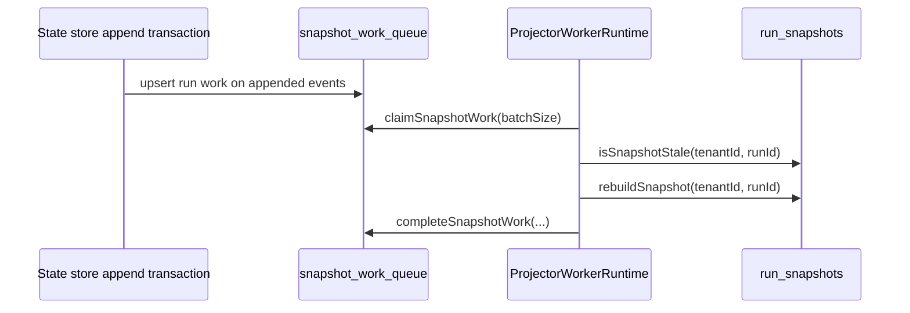

# Projector Event-Driven Invalidation Component

## Owned Concern

Projector event-driven invalidation owns how `ProjectorWorkerRuntime` discovers
snapshot rebuild work after run events are appended.

The canonical producer is the state-store append transaction that writes
`snapshot_work_queue`. The runtime consumes that queue through
`claimSnapshotWork(batchSize)`, rebuilds snapshots, and then completes or
retries the claimed item. Polling `listStaleSnapshotRuns()` is compatibility and
recovery behavior only; it is not the default discovery path when queue claiming
exists.

## Command And Query Rail

`ProjectorWorkerRuntime.runOnce` is an operational command rail.

- owning bounded context: Delivery
- DDD object: snapshot projection work item
- application port: `ProjectorStateStore.claimSnapshotWork`
- adapter surface: `snapshot_work_queue`
- scope: tenant/run scoped queue claims
- authorization: worker service capability for snapshot work queue access
- negative tests: queue-capable runtime must not call stale snapshot polling by
  default; explicit fallback polling remains opt-in

## Current Flow

## Runtime Rule

When a store exposes `claimSnapshotWork`, the runtime treats queue claiming as
the normal invalidation rail. The runtime does not also scan stale snapshots to
fill remaining batch capacity unless `enableFallbackPolling` is explicitly set.

This keeps sustained run-event load from reintroducing the scan bottleneck that
the snapshot work queue was added to remove.

## Evidence

- `docs/evidence/critical/ED-20260330-s19f1-phase1-phase2-snapshot-work-queue.md`
- `packages/@dvt/delivery/test/ProjectorWorkerRuntime.test.ts`
