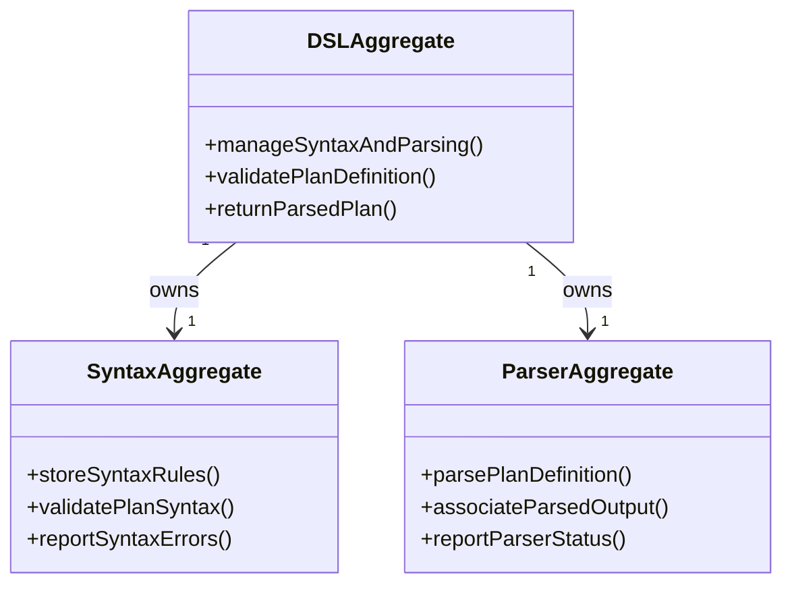

# dsl DDD Structure

## DDD Diagram

## Aggregates & Entities

- **DSLAggregate**: Root aggregate representing the central DSL model. Owns syntax validation and parser logic, and is the primary entry point for all plan-definition parsing operations within the Planning Domain.
- **SyntaxAggregate**: Subordinate aggregate responsible for storing DSL syntax rules and validating that a plan definition conforms to the grammar before parsing proceeds.
- **ParserAggregate**: Subordinate aggregate responsible for transforming a syntactically valid plan definition into a structured, typed plan object ready for use by the planner and interpreter.

## Domain Events

- `PlanParsed`: Emitted when a plan definition has been successfully parsed into a structured plan object and returned to the planner.
- `SyntaxValidationFailed`: Emitted when a plan definition violates one or more DSL syntax rules, with field-level error details.
- `ParserCompleted`: Emitted when the parser finishes processing a plan definition, regardless of success or failure.

## Key Files

- `packages/@dvt/planner/src/dsl/DSLAggregate.ts`
- `packages/@dvt/planner/src/dsl/SyntaxAggregate.ts`
- `packages/@dvt/planner/src/dsl/ParserAggregate.ts`
