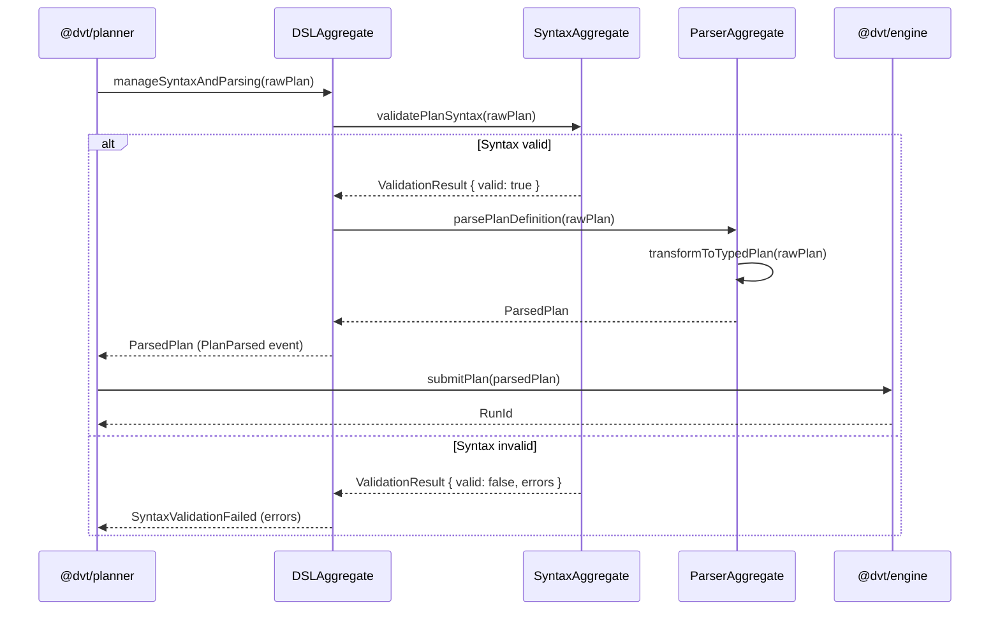

# dsl Sequence

## Main Flow: Parsing a Plan Definition

## Global Flow Position

`@dvt/dsl` (located within `packages/@dvt/planner`) sits at the plan authoring boundary of the Planning Domain. It is called by `@dvt/planner` when a raw plan definition needs to be validated and transformed into a typed object. After parsing, the planner forwards the result to `@dvt/engine` for execution. The DSL itself does not call the engine directly. Upstream: `@dvt/planner`. Downstream: parser output is consumed by `@dvt/planner` and subsequently passed to `@dvt/engine` and the interpreter.

## Key Files

- `packages/@dvt/planner/src/dsl/DSLAggregate.ts`
- `packages/@dvt/planner/src/dsl/SyntaxAggregate.ts`
- `packages/@dvt/planner/src/dsl/ParserAggregate.ts`
