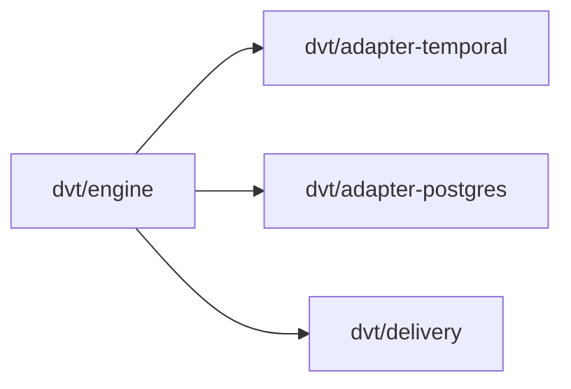
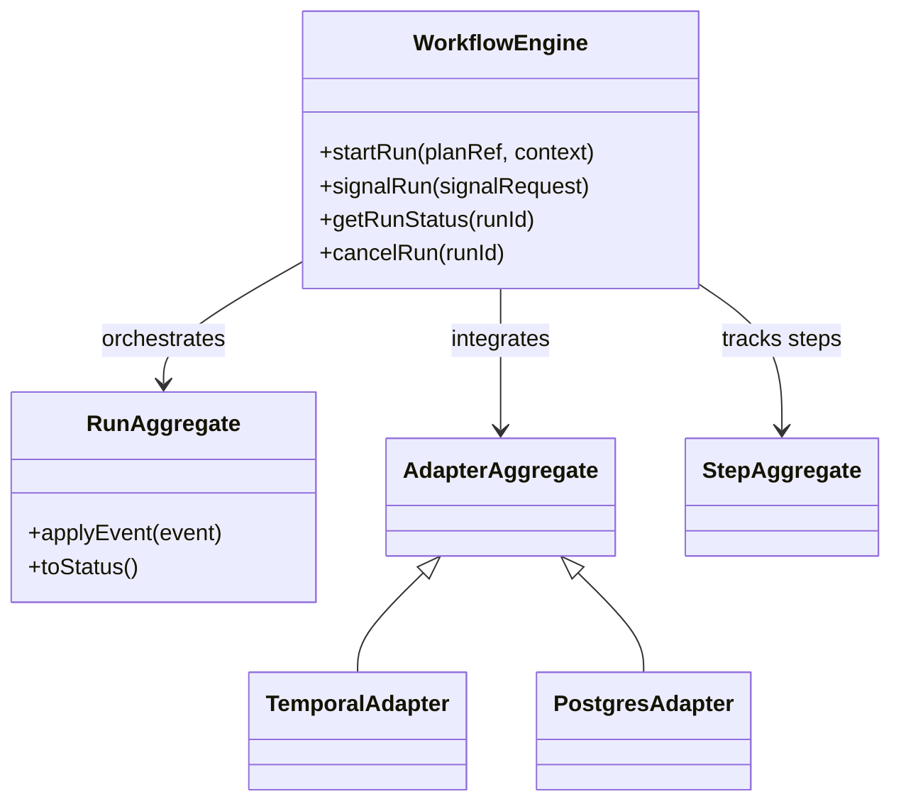
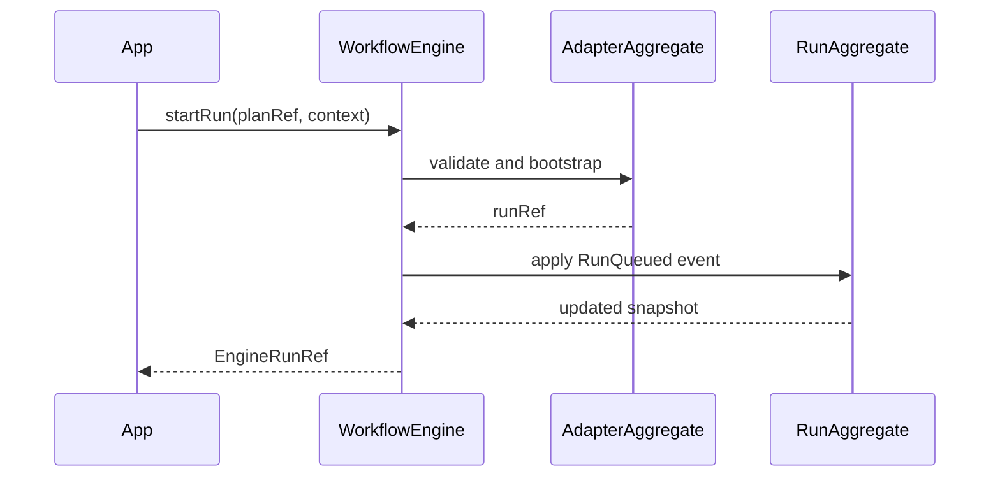
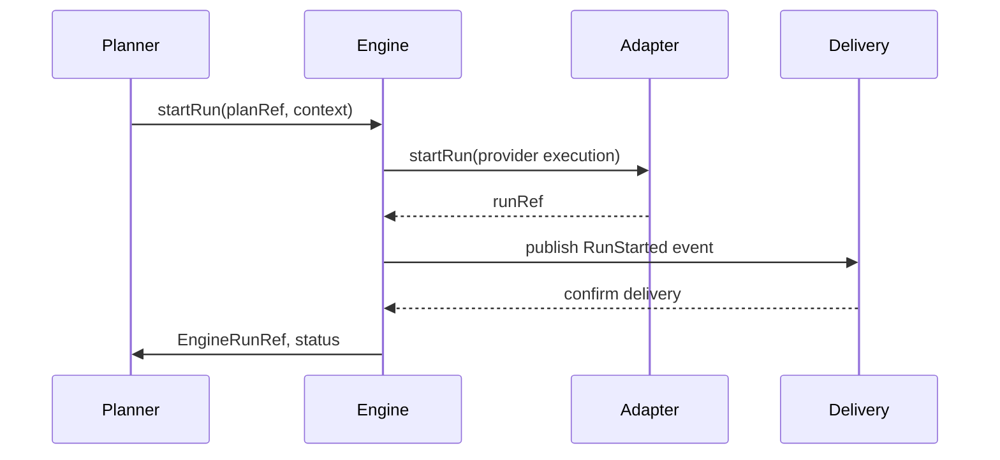

## @'

title: @dvt/engine
status: Draft
owner: Execution Domain
last_reviewed: 2026-03-15

---

# @dvt/engine

## Component Map

## Location

- `packages/@dvt/engine`

## Domain

- [Execution Domain](../domain-execution.md)

## Main Responsibilities

- Orchestrate workflow execution and run lifecycle transitions.
- Own the central run model through `RunAggregate`.
- Coordinate adapters for provider execution and persistence.
- Enforce execution invariants such as determinism, crash consistency, and access policy.

## Explanation

`@dvt/engine` owns the lifecycle of workflow runs inside the execution domain.
It is the orchestration boundary that turns a plan reference plus runtime context
into canonical run events, persisted state, and provider interactions.

The component works with three main internal roles:

- **RunAggregate**: central run model and event-sourced state authority.
- **StepAggregate**: step-level execution state and dependency tracking.
- **AdapterAggregate**: provider and persistence integration boundary.

It collaborates closely with:

- [adapter-temporal](adapter-temporal.md) for provider execution.
- [adapter-postgres](adapter-postgres.md) for durable state and outbox persistence.
- [delivery](delivery.md) for downstream publication of canonical events.

## RunAggregate

Represents the central run model and owns the canonical lifecycle state.
Responsibilities include:

- managing workflow state transitions
- tracking step execution progress
- applying canonical events to the snapshot

## StepAggregate

Represents an individual workflow step. Responsibilities include:

- defining step logic and parameters
- linking steps through dependencies
- reporting execution status back into the run model

## AdapterAggregate

Represents integration with execution and storage adapters. Responsibilities include:

- managing adapter selection and runtime calls
- delegating provider-specific operations
- reporting adapter outcomes back into canonical engine state

## Restrictions

- Must comply with the engine contracts under `docs/architecture/engine/contracts/`.
- Must keep execution semantics inside the execution domain boundary.
- Must not let provider runtimes become the semantic source of truth.

## Related Documentation

- [Component Map](../component-map.md)
- [Execution Domain](../domain-execution.md)
- [Engine C4 Architecture](engine/c4-engine.md)

## DDD Diagram

## Sequence Diagram: `startRun`

## Constraints and Invariants

| Constraint / Invariant | Where Enforced                         | Description                                                                                       |
| ---------------------- | -------------------------------------- | ------------------------------------------------------------------------------------------------- |
| PlanRef integrity      | WorkflowEngine, PlanIntegrityValidator | PlanRef must be valid and reference an existing plan, version, and hash.                          |
| Adapter registration   | WorkflowEngine                         | Adapter must be registered and support the required capabilities.                                 |
| Crash consistency      | WorkflowEngine, intent log             | `startRun` must preserve recovery semantics through the intent log.                               |
| Event sourcing         | RunAggregate, WorkflowEngine           | All state transitions are represented as canonical events.                                        |
| Access policy          | WorkflowEngine, RunAccessPolicy        | `tenantId`, `projectId`, `environmentId`, and permissions are validated before lifecycle changes. |
| Determinism            | WorkflowEngine, RunAggregate           | The same input must produce the same state and hash.                                              |
| Outbox rate limit      | WorkflowEngine                         | Event publication frequency remains bounded by configured limits.                                 |
| Provider ref update    | WorkflowEngine                         | `providerRunId` is updated after bootstrap using fail-soft semantics.                             |

## Validation Examples

- PlanRef integrity: validated in `startRun` and by `PlanIntegrityValidator`.
- Adapter registration: `getAdapterOrThrow` fails when an adapter is not registered.
- Crash consistency: the intent log (`markDispatched`, `markResolved`) protects recovery.
- Event sourcing: `RunAggregate.applyEvent` updates the snapshot through canonical events.
- Access policy: `RunAccessPolicy` validates tenant and permission preconditions.

## Engine in Global Flow

- The engine receives the plan from Planner, validates it, and orchestrates execution.
- It integrates adapters to execute the workflow in the provider runtime.
- It publishes lifecycle events to Delivery for downstream traceability.
- It returns canonical references and status to callers.

## Main Methods

- `startRun(planRef, context)`: start execution, validate inputs, integrate adapters, and apply events.
- `signalRun(signalRequest)`: send control signals to an active run.
- `getRunStatus(runId)`: return current run status from projected state.
- `cancelRun(runId)`: orchestrate run cancellation and state updates.

## Key Files and References

- `packages/@dvt/engine/src/core/RunAggregate.ts`
- `packages/@dvt/engine/src/core/WorkflowEngine.ts`
- `apps/api/src/application/services/engineStartRunUseCase.ts`
- `packages/@dvt/engine/test/contracts/engine.test.ts`
- `packages/@dvt/engine/src/adapters/`

## Functionalities

- orchestration of workflow execution
- state management and transitions via `RunAggregate`
- adapter integration for provider execution
- event-sourcing persistence
- crash consistency through the intent log
- integrity validation and access policy enforcement
- determinism and traceability
