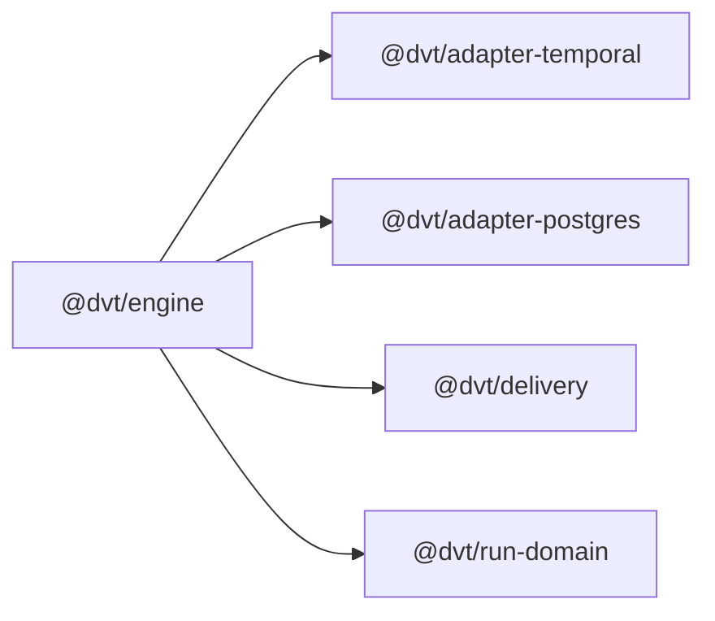
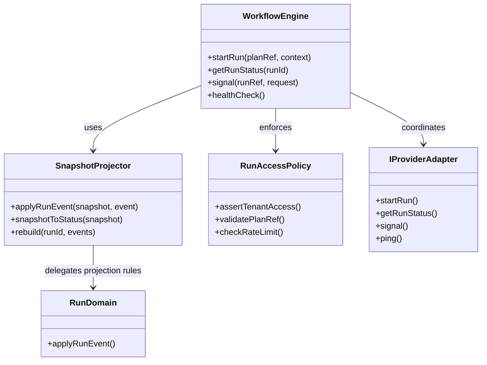
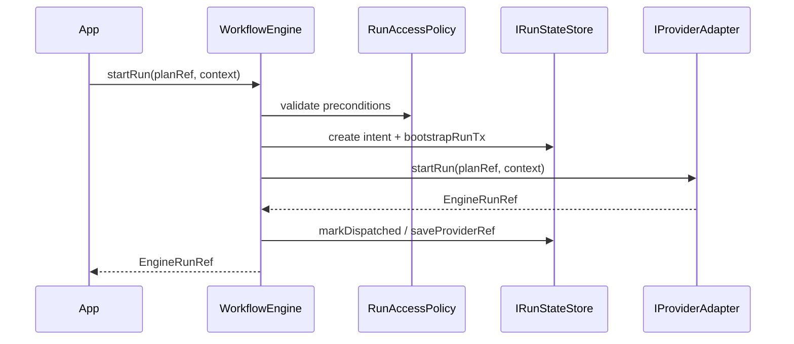

# @dvt/engine

## Component Map

## Location

- `packages/@dvt/engine`

## Domain

- [Execution Domain](../domain-execution.md)

## Main Responsibilities

- Orchestrate run lifecycle through `WorkflowEngine`.
- Enforce execution invariants such as adapter registration, plan integrity,
  access policy, crash consistency, and deterministic event emission.
- Expose projected status reads through `SnapshotProjector` and the run-state
  store boundary.
- Coordinate provider adapters without delegating semantic ownership to them.

## Explanation

`@dvt/engine` is the execution-domain orchestration boundary. The package does
not currently expose a separate live aggregate-root class such as
`RunAggregate`; instead, the current implementation is centered on:

- `WorkflowEngine` as the public application/service facade
- `SnapshotProjector` as the engine-side projection helper
- `@dvt/run-domain` as the canonical pure event-to-snapshot projector
- `RunAccessPolicy` as the grouped policy boundary for auth, plan-ref checks,
  and rate limiting

The package collaborates closely with:

- [adapter-temporal](adapter-temporal.md) for provider execution
- [adapter-postgres](adapter-postgres.md) for durable state, read models, and
  outbox persistence
- [delivery](delivery.md) for worker/runtime ownership outside the engine
- `@dvt/run-domain` for canonical projection rules shared with persistence

## Current Internal Shape

### `WorkflowEngine`

Current facade and orchestration service. Responsibilities include:

- `startRun`
- `getRunStatus`
- `signal`
- `healthCheck`
- intent-log-aware crash consistency
- provider registration and capability checks

### `SnapshotProjector`

Engine-local helper for replaying events into a `WorkflowSnapshot` and deriving
`RunStatusSnapshot`. It delegates mutation rules to `@dvt/run-domain` and keeps
hash derivation local to the engine boundary.

### `RunAccessPolicy`

Current grouped policy boundary that encapsulates:

- tenant access checks
- plan reference validation
- rate-limit validation

## Restrictions

- Must comply with the engine contracts under
  `docs/architecture/engine/contracts/`.
- Must preserve DVT ownership of execution semantics.
- Must not treat provider runtimes as the semantic source of truth.
- Must keep default status reads on projected state per ADR-0015.

## Related Documentation

- [Component Map](../component-map.md)
- [Execution Domain](../domain-execution.md)
- [Engine C4 Architecture](engine/c4-engine.md)
- [Current Status](../system-delivery-status.md)

## Current Structure Diagram

## Sequence Diagram: `startRun`

## Constraints and Invariants

| Constraint / Invariant | Where Enforced                                           | Description                                                                          |
| ---------------------- | -------------------------------------------------------- | ------------------------------------------------------------------------------------ |
| PlanRef integrity      | `WorkflowEngine`, `RunAccessPolicy`                      | `PlanRef` must be valid and reference the expected plan/version/hash.                |
| Adapter registration   | `WorkflowEngine`                                         | Provider adapter must be registered before orchestration continues.                  |
| Crash consistency      | `WorkflowEngine`, intent log, state store                | `startRun` preserves recovery semantics through pre-dispatch intent handling.        |
| Event sourcing         | `WorkflowEngine`, `SnapshotProjector`, `@dvt/run-domain` | State is derived from canonical events and deterministic replay.                     |
| Access policy          | `RunAccessPolicy`                                        | Tenant, project, environment, and rate-limit checks happen before lifecycle changes. |
| Determinism            | `SnapshotProjector`, `@dvt/run-domain`                   | Same event stream produces the same logical state and hash.                          |
| Read-model separation  | `WorkflowEngine`, state store                            | Default status reads use projected state rather than live provider lookup.           |

## Validation Examples

- Adapter registration: `WorkflowEngine` throws `AdapterNotRegisteredError`
  when the target adapter is missing.
- Crash consistency: intent log transitions (`markDispatched`,
  `markResolved`) allow orphan reconciliation.
- Event replay: `SnapshotProjector` and `@dvt/run-domain` reject invalid
  terminal-state transitions.
- Access policy: `RunAccessPolicy` validates start-run preconditions before
  orchestration continues.

## Key Files and References

- `packages/@dvt/engine/src/core/WorkflowEngine.ts`
- `packages/@dvt/engine/src/core/SnapshotProjector.ts`
- `packages/@dvt/engine/src/security/RunAccessPolicy.ts`
- `packages/@dvt/run-domain/src/applyRunEvent.ts`
- `packages/@dvt/engine/test/core/WorkflowEngine.test.ts`
- `packages/@dvt/engine/test/core/SnapshotProjector.transitions.test.ts`

## Functionalities

- run orchestration
- deterministic replay and status projection
- provider-adapter coordination
- crash-consistent start-run intent handling
- access policy enforcement
- state-store boundary integration
