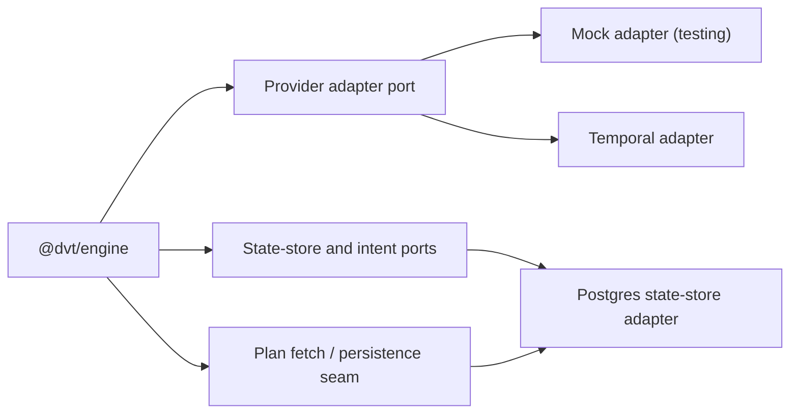

# Engine Adapters

## Purpose

Summarizes adapter integration points for the engine component map and links to
canonical adapter specifications.

## Current adapter topology

## Canonical adapter specs

- [Temporal adapter specification](../../engine/adapters/temporal/TemporalAdapter.spec.md)
- [Temporal engine policies](../../engine/adapters/temporal/EnginePolicies.md)
- [Conductor adapter specification](../../engine/adapters/conductor/ConductorAdapter.spec.md)
- [Postgres state-store adapter](../../engine/adapters/state-store/postgres/StateStoreAdapter.md)
- [Snowflake state-store adapter](../../engine/adapters/state-store/snowflake/StateStoreAdapter.md)

## Related contracts

- [Provider adapter contract](../../engine/contracts/engine/IProviderAdapter.v1.md)
- [Capabilities guide](../../engine/contracts/capabilities/README.md)
- [Adapter capabilities matrix](../../engine/contracts/capabilities/adapters.capabilities.json)

## Navigation

- [Core](core.md)
- [Workflows](workflows.md)
- [Security](security.md)
- [Operations](operations.md)
- [Contracts](contracts.md)
- [Capabilities](capabilities.md)
- [Canonical C4 architecture](../../engine/c4-engine.md)
