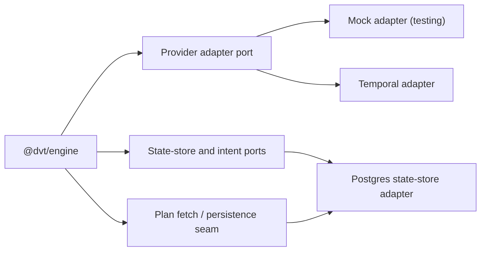

# Engine Adapters

## Purpose

Summarizes adapter integration points for the engine component and links to the
canonical adapter specifications.

## Current adapter topology

## Canonical adapter specs

- [Temporal adapter specification](./temporal/TemporalAdapter.spec.md)
- [Temporal engine policies](./temporal/EnginePolicies.md)
- [Conductor adapter draft](./conductor/ConductorAdapter.spec.md)
- [Postgres state-store adapter](./state-store/postgres/StateStoreAdapter.md)
- [Snowflake state-store adapter](./state-store/snowflake/StateStoreAdapter.md)

Current reading rule:

- treat Temporal as the only implemented provider-runtime adapter surface today;
- treat the Conductor document as draft/reference material, not as an active
  delivery commitment.

## Related contracts

- [Provider adapter contract](../contracts/engine/IProviderAdapter.v1.md)
- [Capabilities guide](../contracts/capabilities/README.md)
- [Adapter capabilities matrix](../contracts/capabilities/adapters.capabilities.json)

## Navigation

- [Engine component home](../index.md)
- [Core](../architecture/core.md)
- [Workflows](../architecture/workflows.md)
- [Security](../security/index.md)
- [Operations](../ops/index.md)
- [Contracts](../contracts/index.md)
- [Capabilities](../contracts/capabilities/index.md)
- [Canonical C4 architecture](../architecture/c4-engine.md)
