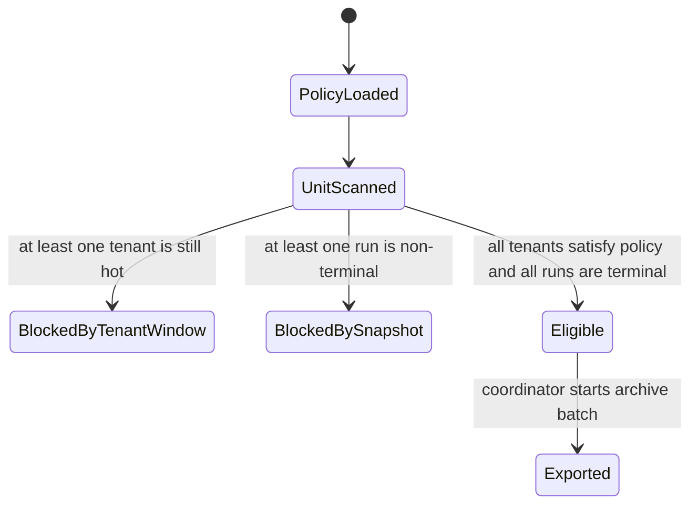
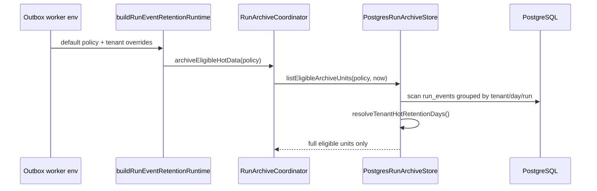
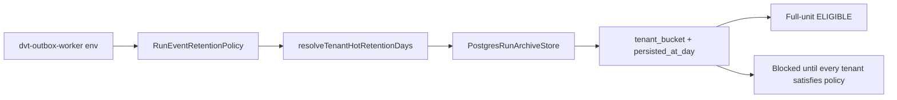

# Run Event Retention Policy Component

## Identity

- Component ID: `DVT-STATE-STORE-RUN-EVENT-RETENTION-POLICY-001`
- Packages:
  - `@dvt/state-store`
  - `@dvt/adapter-postgres`
  - `dvt-outbox-worker`
- Primary code:
  - `packages/@dvt/state-store/src/lifecycle/archiveRuntime.ts`
  - `packages/@dvt/adapter-postgres/src/PostgresRunArchiveStore.ts`
  - `apps/outbox-worker/src/runtime/buildRunEventRetentionRuntime.ts`

## Owned Concern

This component owns the policy that decides when hot `run_events` are old
enough to enter ADR-0037 archive export. It owns the
`ConfigureRunEventRetentionPolicy` command rail across worker configuration,
state-store policy resolution, and Postgres archive eligibility. Its core
behavior is tenant-specific hot-retention without changing archive-unit
identity. It does not own engine event semantics, object-storage layout,
restore, or delete-after-grace.

## Public API

```ts
interface RunEventRetentionPolicy {
  readonly hotRetentionDays: number;
  readonly archiveBucketCount: number;
  readonly pinTerminalSnapshots: boolean;
  readonly tenantHotRetentionDays?: readonly TenantRunEventRetentionOverride[];
}

interface TenantRunEventRetentionOverride {
  readonly tenantId: string;
  readonly hotRetentionDays: number;
}

function validateRunEventRetentionPolicy(policy: RunEventRetentionPolicy): void;
function resolveTenantHotRetentionDays(policy: RunEventRetentionPolicy, tenantId: string): number;
```

Adapter entry point:

```ts
IRunArchiveStore.listEligibleArchiveUnits(policy, nowIso);
```

Runtime configuration surface:

```text
DVT_RUN_EVENT_RETENTION_HOT_RETENTION_DAYS=90
DVT_RUN_EVENT_RETENTION_TENANT_HOT_RETENTION_DAYS=free-tier=7,enterprise=365
```

## Invariants

- `run_events` remains authoritative event history under ADR-0004.
- The lifecycle unit remains `tenant_bucket + persisted_at_day` under ADR-0037.
- `archiveBucketCount` remains deployment-configured and deterministic.
- A tenant override applies only to the named tenant.
- A tenant without override uses the default `hotRetentionDays`.
- Tenant IDs in overrides must be non-empty and unique.
- Every retention-day value must be a positive integer.
- A shared archive unit is eligible only when every tenant in that unit satisfies
  its own resolved retention window.
- The adapter enters service access through
  `POSTGRES_SERVICE_ACCESS.runArchiveMaintenance` before scanning archive
  candidates.
- The component does not partially export tenant subsets under an existing
  archive-unit key.

## Transitions



## Diagrams

### Runtime Flow



### Component Boundary



## Consumers

- `RunArchiveCoordinator` consumes eligible units and runs export.
- `RunEventRetentionRuntime` schedules the lifecycle command.
- `dvt-outbox-worker` composes the runtime policy from environment variables.
- Operators configure tenant overrides through deployment environment.

## Tests

- `packages/@dvt/state-store/test/RunEventRetentionPolicy.test.ts`
  - override resolution
  - invalid override rejection
- `packages/@dvt/adapter-postgres/test/PostgresRunArchiveStore.tenant-retention.test.ts`
  - shared archive units are not partially exported
  - shared units become eligible after all tenants satisfy their policy
- `packages/@dvt/adapter-postgres/test/PostgresRunArchiveStore.tenant-retention.integration.test.ts`
  - optional real-Postgres proof under `DVT_PG_INTEGRATION=1`
- `apps/outbox-worker/test/plugins/env.test.ts`
  - env override parsing
- `apps/outbox-worker/test/runtime/createOutboxWorkerRuntime.test.ts`
  - runtime passes overrides into the coordinator policy
- `packages/@dvt/adapter-postgres/test/PostgresRunEventRetentionPolicy.architecture.test.ts`
  - semantic alignment across policy object, adapter gateway, env parsing,
    component docs, evidence, risk, and Fowler analysis

## Drift Guard

If archive-unit key semantics change, this component must be reviewed with
ADR-0037 because tenant-specific retention and partial export semantics are
coupled to the physical unit key.
