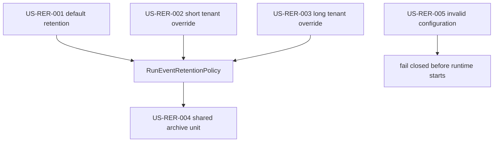

# Run Event Retention Policy User Stories

## Story 1: Default Retention

Story id: `US-RER-001`

As an operator with no tenant-specific retention requirements, I want run-event
archival to keep using the default hot-retention window so existing deployments
do not need a new setting.

Acceptance:

- A policy without overrides resolves every tenant to `hotRetentionDays`.
- Existing archive bucket and terminal-snapshot rules still apply.
- Existing runtime defaults remain valid.

## Story 2: Free-Tier Purging

Story id: `US-RER-002`

As an operator managing free-tier tenants, I want a tenant override with a short
hot-retention window so hot storage can be reduced aggressively for those
tenants.

Acceptance:

- `DVT_RUN_EVENT_RETENTION_TENANT_HOT_RETENTION_DAYS=free-tier=7` parses into a
  tenant override.
- The archive store resolves `free-tier` to 7 days.
- Other tenants keep the default policy.

## Story 3: Enterprise Retention

Story id: `US-RER-003`

As an operator managing enterprise tenants, I want a tenant override with a
longer hot-retention window so enterprise data is not archived from hot storage
too early.

Acceptance:

- `enterprise=365` resolves only for tenant `enterprise`.
- A run from `enterprise` younger than 365 days remains hot.
- The default retention window for other tenants is unchanged.

## Story 4: Shared Archive Unit

Story id: `US-RER-004`

As the archive lifecycle owner, I want mixed-tenant archive units to preserve
ADR-0037 unit integrity so partial exports do not strand tenant data under an
already-used archive-unit key.

Acceptance:

- A bucket/day unit containing free-tier and enterprise tenants is not eligible
  while enterprise is still inside its retention window.
- The same unit becomes eligible when both tenants satisfy their resolved
  retention windows.
- The emitted eligible unit contains the full sorted tenant set.

## Story 5: Invalid Configuration

Story id: `US-RER-005`

As an operator, I want malformed tenant-retention overrides rejected during
configuration so lifecycle behavior cannot silently drift.

Acceptance:

- Empty tenant IDs are rejected.
- Non-positive retention days are rejected.
- Duplicate tenant IDs are rejected by policy validation.

## Scenario Coverage

