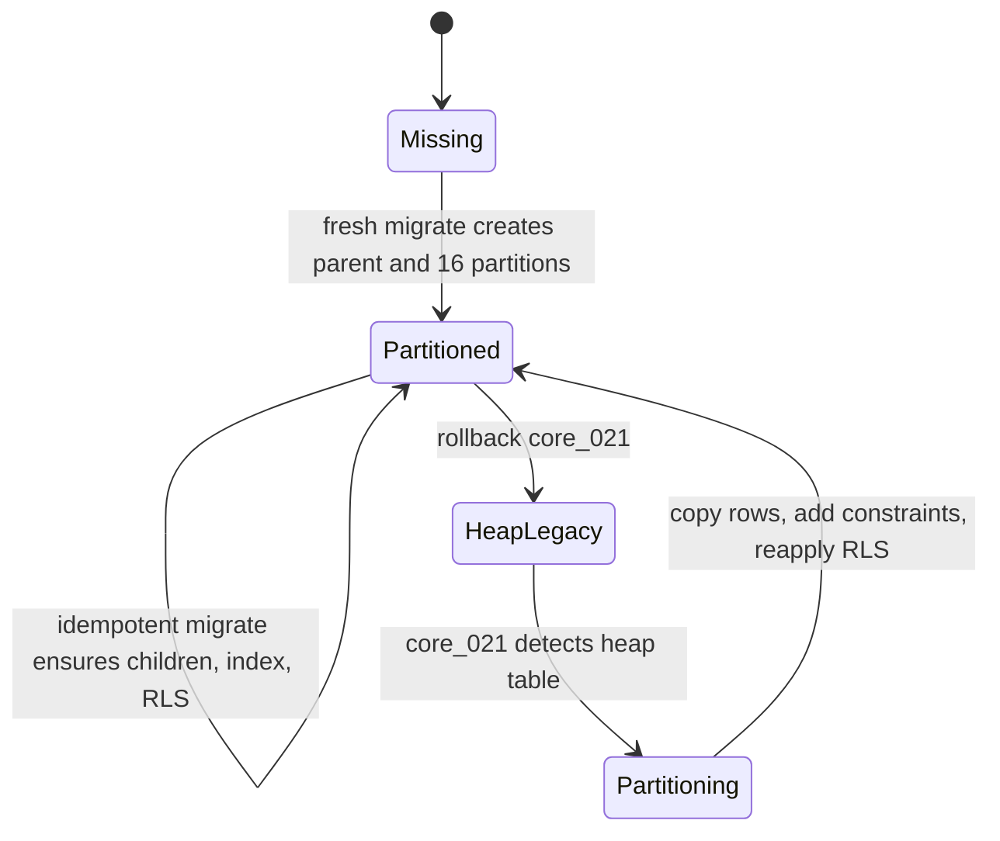
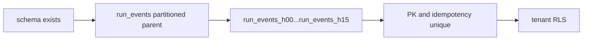
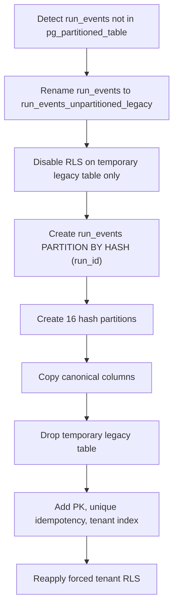
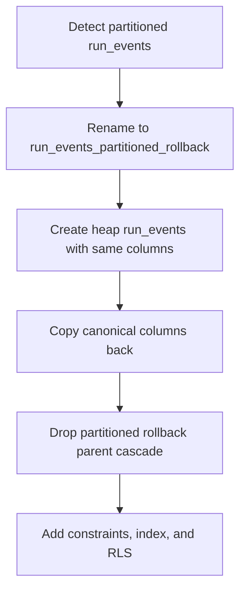

# Postgres Run Events Partitioning Component

## Identity

- Component ID: `DVT-ADAPTER-POSTGRES-RUN-EVENTS-PARTITIONING-001`
- Package: `@dvt/adapter-postgres`
- Owner: Adapter Postgres state-store schema manager
- Primary code: `packages/@dvt/adapter-postgres/src/PostgresSchemaManager.ts`

## Purpose

Keep the authoritative hot `run_events` log scalable without changing the
engine event-sourcing contract, tenant isolation contract, or idempotent append
semantics.

## Public API

No new public package API is added. The component is exercised through the
existing adapter entry points:

- `PostgresStateStoreAdapter.migrate()`
- `PostgresSchemaManager.planRollback(targetVersion)`
- `PostgresSchemaManager.rollbackTo(targetVersion)`
- Existing append/read paths that write or read `run_events`

## Invariants

- `run_events` remains append-only authoritative event history.
- The partition key is `run_id`.
- The parent table is created with `PARTITION BY HASH (run_id)`.
- The partition count is 16.
- The tenant-isolation catalog declares both the parent `run_events` table and
  all physical hash partitions.
- Canonical constraints remain:
  - `PRIMARY KEY (run_id, run_seq)`
  - `UNIQUE (run_id, idempotency_key)`
- The canonical column list is unchanged during heap-to-partition conversion.
- Tenant RLS is re-applied to the canonical `run_events` table after conversion.
- Tenant RLS is also re-applied to `run_events_h00` through `run_events_h15`
  so direct partition access remains fail-closed for proof roles.
- Temporary migration tables may have RLS disabled only while they are the
  temporary copy source or rollback source.
- The adapter does not introduce time-range deletion, compaction, or archive
  drop behavior in this slice.

## State Model

## Migration Transitions

Fresh schema:

Legacy heap conversion:

Rollback:

## Consumers

- `PostgresRunEventStore` appends and lists ordered events.
- `PostgresRunSnapshotStore` replays event tails and rebuilds snapshots.
- `PostgresSnapshotStalenessQuery` reads run event heads and event state.
- Archive and retention work governed by ADR-0037 remains a future lifecycle
  consumer, not part of this hot partitioning slice.

## Requirements Linked

- Lane D task: `run_events partitioning`
- `REQ-RUN-EVENTS-001`: preserve per-run event ordering.
- `REQ-RUN-EVENTS-002`: preserve duplicate idempotency rejection by
  `(run_id, idempotency_key)`.
- `REQ-RUN-EVENTS-003`: keep tenant isolation enforced after schema conversion.
- `REQ-RUN-EVENTS-004`: make rollback preserve rows and canonical constraints.

## ADRs Linked

- `ADR-0004`: Event sourcing strategy.
- `ADR-0008`: Signal idempotency.
- `ADR-0013`: Run state store bootstrap and explicit migration.
- `ADR-0031`: Adapter tenant isolation.
- `ADR-0037`: Run event lifecycle archival, verification, and restore model.

## Tests

- `packages/@dvt/adapter-postgres/test/PostgresStateStoreAdapter.migrate.test.ts`
  - fresh schema creates hash-partitioned `run_events`
  - legacy heap converts to partitioned parent without changing columns
  - migration step count and version include `core_021_run_events_hash_partitioning`
- `packages/@dvt/adapter-postgres/test/PostgresSchemaManager.rollback.test.ts`
  - rollback includes `core_021_run_events_hash_partitioning`
  - rollback preserves constraints and re-applies tenant isolation
- `packages/@dvt/adapter-postgres/test/PostgresTenantIsolationPolicy.test.ts`
  - run event hash partitions remain listed in the tenant isolation catalog
- `packages/@dvt/adapter-postgres/test/PostgresTenantRlsEnforcement.integration.test.ts`
  - every tenant-owned physical table, including partitions, has forced RLS

## Runtime Evidence

- `pg_partitioned_table` contains `run_events` after migration.
- Child partitions `run_events_h00` through `run_events_h15` exist.
- Constraint metadata includes `run_events_pkey` and
  `run_events_run_id_idempotency_key_key`.
- RLS metadata remains enabled and forced for canonical `run_events` and each
  physical hash partition.

## Lifecycle Policy

Hash partitioning is hot-storage scale work. It does not replace ADR-0037
archive units, verification, restore, delete-after-grace, or future retention
partition work.
