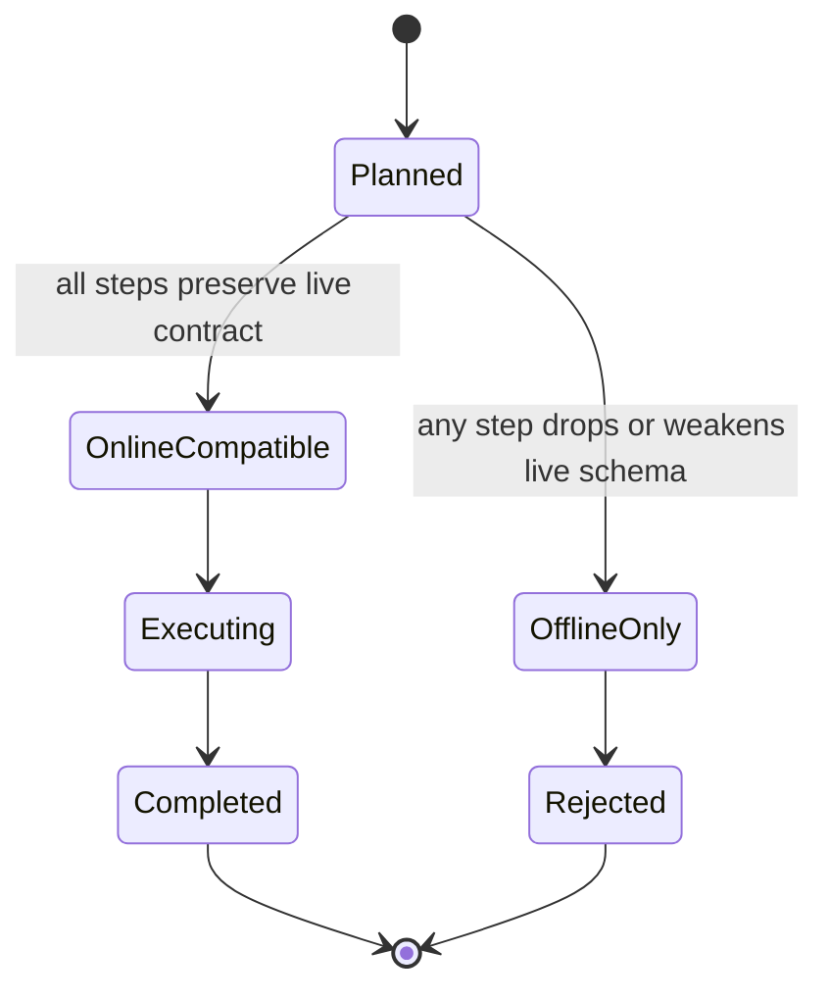
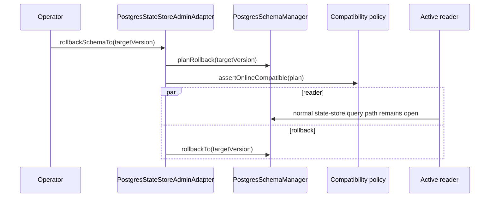

# Postgres schema rollback zero-downtime component

## Owned Concern

Owns PostgreSQL state-store schema rollback availability. A rollback may execute
without session maintenance mode, without setting `hasActiveClients=false`, only
when `PostgresSchemaRollbackCompatibilityPolicy` accepts every planned step.

## Public API

| API                                    | Kind    | Owner                            | Contract                                                   |
| -------------------------------------- | ------- | -------------------------------- | ---------------------------------------------------------- |
| `planSchemaRollback(targetVersion)`    | query   | `PostgresStateStoreAdminAdapter` | Returns target, current version, steps, and compatibility. |
| `rollbackSchemaTo(targetVersion)`      | command | `PostgresStateStoreAdminAdapter` | Executes only online-compatible rollback plans.            |
| `PostgresSchemaManager.planRollback()` | query   | `PostgresSchemaManager`          | Builds ordered rollback plan from applied migrations.      |
| `PostgresSchemaManager.rollbackTo()`   | command | `PostgresSchemaManager`          | Runs reverse steps under the schema advisory lock.         |

## Invariants

- Compatibility is derived from migration-step semantics, not active clients.
- Online-compatible rollback does not call `withMaintenanceMode()`.
- Offline-only rollback fails before DDL executes.
- Rollback remains a concrete Postgres adapter admin command, not an engine port.
- RLS hardening rollback reapplies current policy and never downgrades isolation.

## Transitions



## Consumers

| Consumer                          | Relationship                                  |
| --------------------------------- | --------------------------------------------- |
| Operators / deployment automation | Calls planning and rollback commands.         |
| Runtime state-store clients       | Continue normal reads during compatible work. |
| `PostgresSchemaManager`           | Owns migration facts and DDL execution.       |

## Diagrams



## Architecture Guard

```text
pnpm --filter @dvt/adapter-postgres test -- test/PostgresSchemaRollbackZeroDowntime.architecture.test.ts
```
