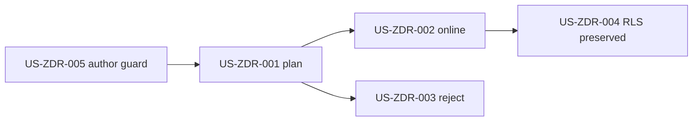

# Postgres schema rollback zero-downtime user stories

## US-ZDR-001: Plan rollback compatibility

As an operator, I can inspect reverse steps and their online/offline class before
execution. Unknown or unapplied targets fail closed.

## US-ZDR-002: Online-compatible rollback with active reads

As an operator, compatible rollback proceeds while active readers keep acquiring
clients. The schema advisory lock still serializes schema lifecycle commands.

## US-ZDR-003: Destructive rollback rejection

As an operator, destructive plans are rejected before DDL with
`SCHEMA_ROLLBACK_REQUIRES_OFFLINE_COMPATIBILITY`, including the incompatible
migration version.

Acceptance examples:

- Rolling back `core_011_retry_lineage_columns` is rejected because it drops
  retry lineage columns from `run_metadata`.
- Rolling back `core_012_lineage_outbox_retry_schedule` or
  `core_013_lineage_outbox_claim_timeout` is rejected because the rollback
  rebuilds lineage outbox pending indexes with blocking DDL.

## US-ZDR-004: Tenant isolation hardening is not downgraded

As a platform owner, RLS hardening rollback reapplies current tenant policy and
does not disable row-level security for tenant-owned online state tables.

## US-ZDR-005: Future migration authors classify compatibility

As a maintainer, architecture and behavior tests fail when rollback
compatibility, docs, and implementation drift.

