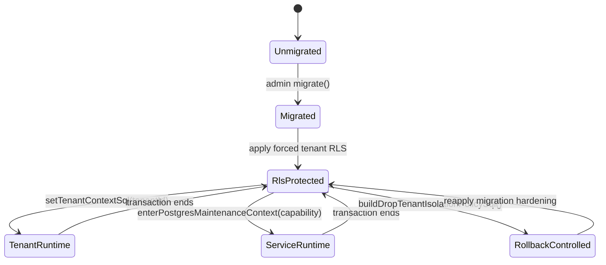
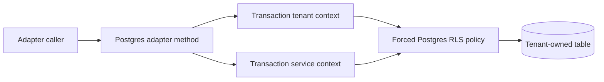

# Postgres Tenant Isolation Component

## Owned Concern

This component owns Postgres adapter tenant isolation for online state-store and
runtime support tables. It turns the `ADR-0031` decision into a concrete table
catalog, transaction-local context model, service-access capability matrix, and
real PostgreSQL RLS proof surface.

## Public API

Production-facing package exports remain the adapter entry points from
`@dvt/adapter-postgres`. Tenant isolation itself is adapter-internal.

Internal API:

- `TENANT_ISOLATION_TABLES`: canonical tenant-owned table catalog.
- `buildTenantIsolationPolicySql(schema, table)`: generates forced RLS policy
  DDL for one catalog table.
- `buildDropTenantIsolationPolicySql(schema, tables)`: removes RLS policy state
  during controlled rollback.
- `setTenantContextSql()`: creates transaction-local tenant context.
- `setServiceContextSql()`: creates transaction-local service context.
- `POSTGRES_SERVICE_ACCESS`: closed service owner capability catalog.
- `enterPostgresMaintenanceContext(client, capability)`: admits an approved
  service owner into service mode for a transaction.

## Invariants

- Every online tenant-owned table with `tenant_id` must appear in
  `TENANT_ISOLATION_TABLES`.
- Every catalog entry must use `tenant_id` as the tenant column.
- RLS must be enabled and forced for every catalog table after migration.
- Tenant mode requires both `dvt.access_mode = 'tenant'` and matching
  `dvt.tenant_id`.
- Service mode requires `dvt.access_mode = 'service'` and a table-approved
  `dvt.service_access_owner`.
- No table may grant every service owner as a global bypass.
- The public package root must not export service-access authority.
- API code must not import Postgres maintenance authority.
- App-role runtime proof must run with a non-owner, non-`BYPASSRLS`,
  non-schema-creating database role.

## Transitions

## Consumers

- `PostgresStateStoreAdapter`: tenant-scoped run metadata, run events,
  snapshots, outbox, dead letters, and snapshot work queue.
- `PostgresStartRunIntentStore`: tenant-scoped start-run intent rows.
- `PostgresBackpressureSnapshotReader`: service owner
  `backpressure-snapshot-reader`.
- `PostgresDeliveryBufferPurgeStore`: service owner
  `delivery-buffer-purge`.
- `PostgresLineageOutboxStore`: service owner `lineage-outbox-worker`.
- Outbox worker paths: service owner `outbox-worker`.
- Run archive maintenance: service owner `run-archive-maintenance`.
- Run metadata tenant resolver: service owner
  `run-metadata-tenant-resolver`.
- Snapshot staleness query: service owner `snapshot-staleness-query`.
- Snapshot work queue maintenance: service owner `snapshot-work-queue`.
- Start-run intent reconciliation: service owner
  `start-run-intent-reconciler`.

## Table And Service-Owner Matrix

| Table                 | Approved service owners                                                                    |
| --------------------- | ------------------------------------------------------------------------------------------ |
| `run_metadata`        | `backpressure-snapshot-reader`, `run-metadata-tenant-resolver`, `snapshot-staleness-query` |
| `run_events`          | `run-archive-maintenance`, `snapshot-staleness-query`                                      |
| `run_events_h00`      | `run-archive-maintenance`, `snapshot-staleness-query`                                      |
| `run_events_h01`      | `run-archive-maintenance`, `snapshot-staleness-query`                                      |
| `run_events_h02`      | `run-archive-maintenance`, `snapshot-staleness-query`                                      |
| `run_events_h03`      | `run-archive-maintenance`, `snapshot-staleness-query`                                      |
| `run_events_h04`      | `run-archive-maintenance`, `snapshot-staleness-query`                                      |
| `run_events_h05`      | `run-archive-maintenance`, `snapshot-staleness-query`                                      |
| `run_events_h06`      | `run-archive-maintenance`, `snapshot-staleness-query`                                      |
| `run_events_h07`      | `run-archive-maintenance`, `snapshot-staleness-query`                                      |
| `run_events_h08`      | `run-archive-maintenance`, `snapshot-staleness-query`                                      |
| `run_events_h09`      | `run-archive-maintenance`, `snapshot-staleness-query`                                      |
| `run_events_h10`      | `run-archive-maintenance`, `snapshot-staleness-query`                                      |
| `run_events_h11`      | `run-archive-maintenance`, `snapshot-staleness-query`                                      |
| `run_events_h12`      | `run-archive-maintenance`, `snapshot-staleness-query`                                      |
| `run_events_h13`      | `run-archive-maintenance`, `snapshot-staleness-query`                                      |
| `run_events_h14`      | `run-archive-maintenance`, `snapshot-staleness-query`                                      |
| `run_events_h15`      | `run-archive-maintenance`, `snapshot-staleness-query`                                      |
| `run_snapshots`       | `run-archive-maintenance`, `snapshot-staleness-query`, `snapshot-work-queue`               |
| `outbox`              | `backpressure-snapshot-reader`, `delivery-buffer-purge`, `outbox-worker`                   |
| `outbox_dead_letter`  | `delivery-buffer-purge`, `outbox-worker`                                                   |
| `lineage_outbox`      | `lineage-outbox-worker`                                                                    |
| `lineage_dead_letter` | `delivery-buffer-purge`, `lineage-outbox-worker`                                           |
| `run_event_heads`     | `snapshot-staleness-query`                                                                 |
| `snapshot_work_queue` | `snapshot-work-queue`                                                                      |
| `start_run_intents`   | `start-run-intent-reconciler`                                                              |

## Flow

## Verification

- `PostgresTenantIsolationPolicy.test.ts`: static table catalog and policy SQL.
- `PostgresTenantRlsEnforcement.integration.test.ts`: real PostgreSQL forced
  RLS, missing-context denial, tenant matching, service owner approval, and
  tenant-owned table catalog drift.
- `PostgresAppRoleRuntime.integration.test.ts`: app-role runtime behavior after
  admin migration.
- `PostgresServiceAccessCapability.architecture.test.ts`: closed service
  capability and forbidden public/API imports.
- `PostgresTenantIsolationSemantic.architecture.test.ts`: semantic alignment
  between code catalog, service owners, component documentation, and user
  stories.
