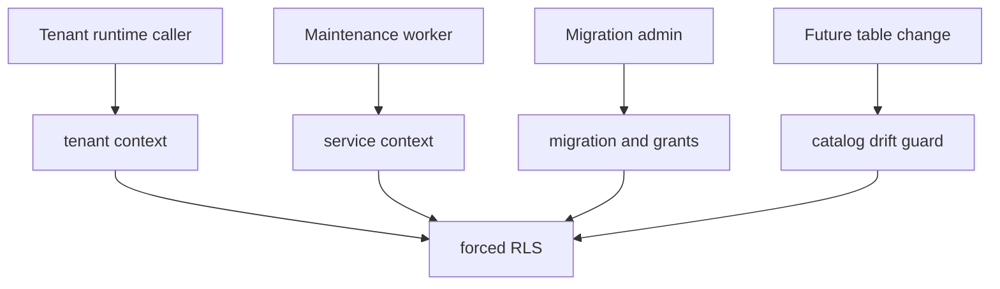

# Postgres Tenant Isolation User Stories

## User Stories

### US-RLS-001: Tenant reads only its own rows

As a tenant-scoped runtime caller, I want Postgres reads to return only rows for
my tenant so that another tenant's runs, events, snapshots, and work queues are
not observable.

Acceptance:

- `setTenantContextSql()` is used inside the transaction.
- Missing tenant context returns zero rows.
- Mismatched tenant writes are rejected by forced RLS.

### US-RLS-002: App runtime runs without schema authority

As a platform operator, I want the application database role to run online
adapter operations after admin migration without owning schema creation rights.

Acceptance:

- Runtime smoke uses a non-owner app role.
- The role cannot bypass RLS.
- The role cannot create schema objects.

### US-RLS-003: Service access is table-scoped

As a security reviewer, I want service-mode access to be approved per table so
that a maintenance path cannot become a global tenant-data bypass.

Acceptance:

- `backpressure-snapshot-reader` can read only its approved tables.
- `delivery-buffer-purge` can access purge-owned queues only.
- `lineage-outbox-worker` can access lineage outbox surfaces only.
- `outbox-worker` cannot read `run_metadata`.
- `run-archive-maintenance` can access archive-owned event/snapshot tables.
- `run-metadata-tenant-resolver` can read `run_metadata`.
- `snapshot-staleness-query` can access its read-model inputs.
- `snapshot-work-queue` can access snapshot queue surfaces.
- `start-run-intent-reconciler` can access `start_run_intents`.

### US-RLS-004: Future tenant table drift fails closed

As a maintainer adding a tenant-owned table, I want tests to fail until the table
is added to the tenant isolation catalog and documented with approved service
owners.

Acceptance:

- Any new table with `tenant_id` is detected by catalog drift proof.
- The component document lists the table.
- Semantic architecture tests fail if documentation and code diverge.

### US-RLS-005: Rollback does not become isolation downgrade

As an operator, I want controlled rollback SQL to remove and reapply RLS only
through the adapter-owned policy path so that rollback remains an explicit
maintenance transition.

Acceptance:

- `buildDropTenantIsolationPolicySql()` is the only rollback policy builder.
- Reapplication uses `buildTenantIsolationPolicySql()`.
- Partitioned run-event tables remain cataloged.

## Scenario Map

