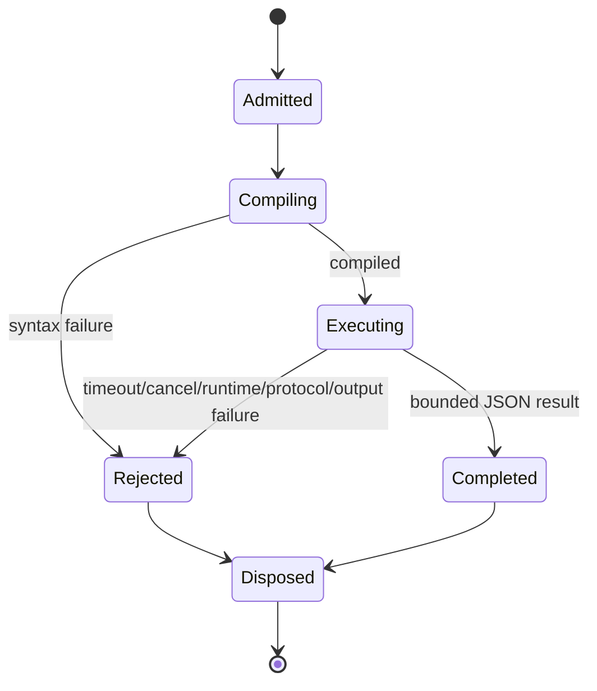
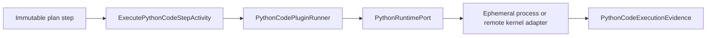
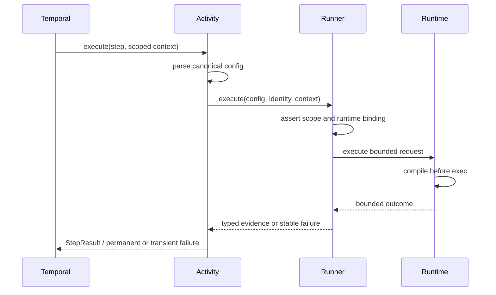

# Python Code Runtime Plugin

## Owned Concern

The Python code runtime plugin owns schema-admitted execution of one
`EXECUTE_PYTHON_CODE` plan step and the mapping between a provider-neutral
Python runtime port and bounded canonical step evidence.

It does not own Canvas mutation, plan creation, Temporal orchestration, worker
deployment isolation, package installation, or cross-step data binding.

## Public API

| API | Path | Role |
| --- | --- | --- |
| `PythonCodeStepTypeConfigSchema` | `@dvt/contracts` | Strict immutable plan config and scope contract |
| `PythonRuntimePort` | `@dvt/temporal-python-plugin` | Validate and execute one bounded Python request |
| `PythonCodePluginRunner` | `@dvt/temporal-python-plugin` | Enforce scope/binding and map provider outcome to evidence |
| `ExecutePythonCodeStepActivity` | `@dvt/temporal-python-plugin` | Temporal step adapter and permanent/transient failure mapping |
| `createPythonCodePluginProfile` | `@dvt/temporal-python-plugin` | Independently composed step-kind profile |
| `EphemeralPythonProcessRuntime` | `apps/temporal-worker` | Fresh-process provider adapter |

## Invariants

- The canonical step kind is `EXECUTE_PYTHON_CODE`.
- The generic Temporal dispatcher contains no Python-specific condition.
- Every call uses a fresh provider execution context; no kernel/process state is
  reused.
- The provider compiles before executing any user statement.
- Source and input are bounded before process creation.
- Protocol, stdout, stderr, result and duration are bounded before mapping.
- `result` must be JSON serializable.
- Runtime refs use `python-runtime:*` and resolve through a server-owned
  allowlist.
- Activity results contain typed bounded evidence or stable refusal codes, never
  source, input, secrets, raw stdout/stderr, or provider exception strings.
- Cancellation terminates the active provider request and always disposes
  resources.
- `python -I` reduces environmental influence but is not a sandbox; deployment
  isolation remains mandatory for untrusted code.

## State Transitions

## Command And Query Rails

| Rail | Type | Owner | Negative proof |
| --- | --- | --- | --- |
| `ExecutePythonCode` | command | Python runtime plugin | scope/runtime mismatch and invalid schema reject before provider call |
| `GetRunStatus` | query | Run operational read model | provider state cannot override canonical run state |
| `GetRunEvents` | query | Run event feed | raw code/input/stdout/stderr/secrets absent |

`ValidatePythonSource` is not a public v1 transport rail. Authoritative compile
is the first provider phase of `ExecutePythonCode`. A future interactive
validation query must call the same runtime port through an isolated runtime
service; it cannot execute in the Web or API process.

## Architecture

## Provider Comparison

| Provider | State model | Isolation owner | Intended use |
| --- | --- | --- | --- |
| Ephemeral native process | one process per call | dedicated worker deployment | selected v1 and local/CI proof |
| Jupyter kernel | one ephemeral kernel per call | Jupyter server/gateway deployment | rich managed Python/R adapter |
| Enterprise Gateway | remote ephemeral kernel | gateway plus Kubernetes/runtime class | managed multi-language production candidate |
| Kubernetes sandbox Job | one job/pod per call | cluster/runtime class/network policy | high-assurance untrusted workloads |

## Consumers

- `@dvt/contracts` registers and validates the canonical step kind.
- Planner derives required runtime capability from the step registry.
- Temporal worker composes the optional profile.
- Run state persists only bounded canonical evidence.
- Web projects authored Python node metadata into the immutable step config.

## References

- [ADR-0064](../../../../adr/ADR-0064-governed-code-runtime-provider.md)
- [Python vertical plan](../../../../planning/proposals/mandatory/runtime-and-contracts/python-code-node-vertical-plan-20260808.md)
- [Python code-runtime risk](../../../../risk-register/quality/R-20260808-PYTHON-CODE-RUNTIME.yaml)
