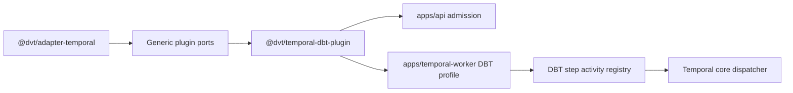
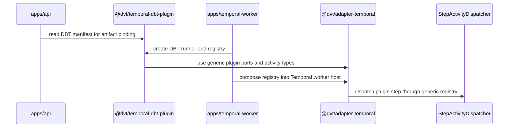

# Temporal DBT Plugin Package Component

This guide documents the concrete DBT plugin package used by the Temporal
worker profile. It is the package-level companion to the generic
[Temporal step plugin profile](./temporal-step-plugin-profile.md).

Use this guide with:

- [Temporal DBT worker plugin profile](./temporal-dbt-worker-plugin-profile.md)
- [Temporal PlanRef workflow boundary component](./temporal-planref-workflow-boundary.md)
- [Temporal worker DBT plugin runtime runbook](../../../../../runbooks/temporal-worker-dbt-plugin-runtime-20260414.md)
- `buzon/20260514-codex-fowler-ar-d-plan-pointer-dbt-package-extraction-analysis.md`

## Owned Concern

The component owns one concern:

- publish concrete DBT plugin manifest, step activity registry, and local DBT
  CLI runner from `@dvt/temporal-dbt-plugin`.

It does **not** own:

- generic Temporal workflow orchestration;
- generic step plugin profile composition;
- engine lifecycle semantics;
- PlanRef validation;
- DBT sandboxing beyond the current worker process boundary.

## Public API

- `DBT_PLUGIN_ID`
  Stable DBT plugin id used by worker composition and API artifact admission.
- `TEMPORAL_DBT_PLUGIN_EXECUTABLE_STEP_KINDS`
  DBT executable step-kind manifest for Temporal DBT execution.
- `resolveDbtCliSubcommand(stepKind)`
  Maps the DBT plugin step kind to the DBT CLI subcommand.
- `createDbtStepActivityRegistry(deps)`
  Builds the DBT step activity registry for worker composition.
- `DbtStepActivity`
  Activity implementation that validates run execution context and delegates to
  a DBT plugin runner.
- `DbtCliPluginRunner`
  Local DBT CLI runner implementation behind the DBT plugin runner port.
- `assertDbtCliAvailable(dbtBin)`
  Worker readiness probe for local DBT CLI availability.
- `DbtPluginRunner`
  DBT-specialized implementation of the generic Temporal plugin runner port.

## Invariants

- `@dvt/adapter-temporal` MUST NOT export concrete DBT plugin symbols.
- `@dvt/temporal-dbt-plugin` MUST depend on the generic plugin ports from
  `@dvt/adapter-temporal`, not the other way around.
- API admission imports DBT step-kind ownership from the DBT plugin package.
- Worker DBT profile imports DBT activity/runner construction from the DBT
  plugin package.
- DBT support remains optional and is omitted when
  `DVT_TEMPORAL_DBT_ENABLED=false`.
- DBT CLI runner responsibilities remain split across manifest, arguments,
  process, materialization, failure mapping, and helper-contract modules.

## Transitions

1. API admission reads `DBT_PLUGIN_ID` and executable DBT step kinds from the
   DBT plugin package when binding DBT bundle requirements.
2. Worker runtime checks `DVT_TEMPORAL_DBT_ENABLED`.
3. If disabled, no DBT package runtime objects are created.
4. If enabled, worker profile creates artifact readers, a `DbtCliPluginRunner`,
   and a DBT step activity registry from `@dvt/temporal-dbt-plugin`.
5. Worker resource composition merges the DBT registry through the generic
   Temporal step plugin profile seam.
6. Temporal core dispatch executes DBT only through the composed registry.

## Consumers

- `apps/api` consumes the DBT plugin manifest for start-run artifact admission.
- `apps/temporal-worker` consumes the package to build the optional DBT worker
  profile.
- `@dvt/adapter-temporal` consumes none of the DBT package; it only publishes
  generic ports consumed by the package.
- Architecture tests consume this guide as a semantic drift guard.

## Component Map

| Module                                                               | Owned concern                                             |
| -------------------------------------------------------------------- | --------------------------------------------------------- |
| `packages/@dvt/temporal-dbt-plugin/src/index.ts`                     | DBT plugin package public API                             |
| `packages/@dvt/temporal-dbt-plugin/src/dbtPluginManifest.ts`         | DBT plugin id, executable step kinds, and CLI command map |
| `packages/@dvt/temporal-dbt-plugin/src/DbtStepActivity.ts`           | DBT step activity profile and explicit registry           |
| `packages/@dvt/temporal-dbt-plugin/src/dbtPluginTypes.ts`            | DBT plugin activity contracts                             |
| `packages/@dvt/temporal-dbt-plugin/src/DbtCliPluginRunner.ts`        | Local DBT CLI runner orchestration behind the plugin port |
| `packages/@dvt/temporal-dbt-plugin/src/dbtCliArguments.ts`           | DBT step metadata to CLI argument translation             |
| `packages/@dvt/temporal-dbt-plugin/src/dbtCliProcess.ts`             | DBT subprocess command runner and availability probe      |
| `packages/@dvt/temporal-dbt-plugin/src/dbtCliProjectMaterializer.ts` | DBT bundle extraction and worker-local project discovery  |
| `packages/@dvt/temporal-dbt-plugin/src/dbtCliFailures.ts`            | DBT CLI and bundle failure classification                 |
| `packages/@dvt/temporal-dbt-plugin/src/dbtCliTypes.ts`               | DBT CLI helper contracts internal to the plugin boundary  |

## Diagrams

## Drift Guards

- `packages/@dvt/adapter-temporal/test/dbt-package-extraction.architecture.test.ts`
  fails if `@dvt/adapter-temporal` exports DBT concrete symbols.
- The same guard requires this guide to contain public API, invariants,
  transitions, consumers, component map, diagrams, and drift guards.
- `@dvt/temporal-dbt-plugin` package tests keep the DBT CLI runner and activity
  behavior executable after package extraction.
