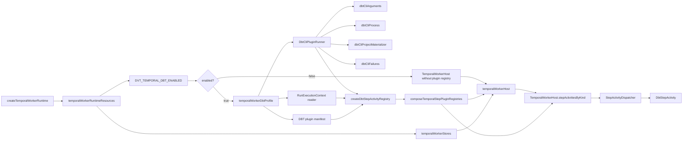
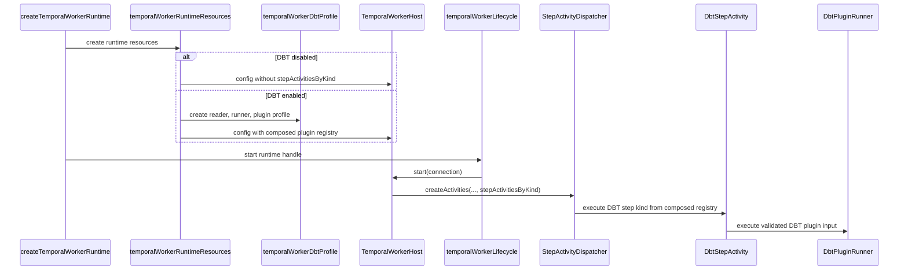

# Temporal DBT Worker Plugin Profile

This local component guide documents the DBT execution profile that is composed
by `apps/temporal-worker` when `DVT_TEMPORAL_DBT_ENABLED=true`.

Use this guide with:

- [Temporal adapter specification](./temporal-adapter-spec.md)
- [Temporal step plugin profile component](./temporal-step-plugin-profile.md)
- [Temporal PlanRef workflow boundary component](./temporal-planref-workflow-boundary.md)
- [Temporal Worker DBT Runtime Runbook](../../../../../runbooks/temporal-worker-dbt-plugin-runtime-20260414.md)
- [Fowler DBT core decoupling analysis](../../../../../../buzon/20260428-codex-fowler-temporal-dbt-core-decoupling-analysis-and-remediation.md)
- [ADR-0003 execution model](../../../../../adr/ADR-0003-execution-model.md)
- [ADR-0014 run-driven adapter model](../../../../../adr/ADR-0014-run-driven-adapter-model.md)
- [ADR-0046 execution plan definition and run execution policy separation](../../../../../adr/ADR-0046-execution-plan-definition-and-run-execution-policy-separation.md)

## Owned Concern

The component owns one concern:

- compose DBT step-kind activity support at the worker profile boundary without
  making DBT part of the Temporal core activity dispatcher or default registry

It does **not** own:

- engine lifecycle semantics
- PlanRef workflow orchestration
- generic step-kind dispatch policy
- plan authoring, validation, or planner compile semantics
- DBT marketplace packaging or sandbox isolation beyond the current worker
  process boundary

## Public API

- `createDbtStepActivityRegistry({ runExecutionContextReader, dbtPluginRunner })`
  returns the DBT plugin-owned step-activity registry.
- `TEMPORAL_DBT_PLUGIN_EXECUTABLE_STEP_KINDS` is the DBT plugin manifest for
  currently executable Temporal DBT plan steps. It is not a claim that these
  are all DBT commands or all future DBT product concepts.
- `DbtStepActivity.execute(step, context)` resolves the run execution context,
  validates `pluginContexts.dbt`, delegates to the configured
  `DbtPluginRunner`, and rejects mismatched `stepId` results.
- `TemporalStepPluginRunner<TExecutionInput>` is the generic executable plugin
  runner port; DBT specializes it as `DbtPluginRunner`.
- `DbtPluginRunner.execute(input)` is the DBT-specialized plugin execution port
  used by the DBT profile.
- `DbtCliPluginRunner` is the current local CLI runner implementation behind
  the DBT plugin port. It orchestrates focused DBT-local helpers rather than
  owning filesystem materialization, process execution, argument derivation,
  and failure classification directly.
- `composeTemporalStepPluginRegistries([...profiles])` is the generic Temporal
  plugin composition API. DBT, SQL, and future executor profiles enter through
  this seam rather than through core dispatch edits.
- `apps/temporal-worker/src/runtime/temporalWorkerDbtProfile.ts` creates the
  DBT plugin profile only when `DVT_TEMPORAL_DBT_ENABLED=true`.
- `apps/temporal-worker/src/runtime/createTemporalWorkerRuntime.ts` remains the
  public runtime entrypoint and delegates concrete resource, host, and lifecycle
  construction to focused runtime modules.

## Invariants

- `createDefaultStepActivityRegistry()` remains plugin-free and does not
  register DBT step kinds.
- `ActivityDeps` remains free of `runExecutionContextReader` and
  `dbtPluginRunner`; those dependencies belong to the DBT profile.
- DBT support is omitted entirely when `DVT_TEMPORAL_DBT_ENABLED=false`.
- When DBT support is enabled, the worker composes the DBT registry explicitly
  through the generic step-plugin profile composition seam and then passes the
  merged registry to `TemporalWorkerHostConfig.stepActivitiesByKind`.
- Workflow artifact emission does not gate on DBT step kinds. Any plugin step
  with a valid `compiledCodeRef` emits a generic `compiled-sql` artifact
  reference.
- DBT steps fail closed when `runExecutionContextRef` is missing, the resolved
  context is rejected, the `dbt` plugin context is absent, or the plugin runner
  returns a result for a different `stepId`.
- Runtime composition may install alternate DBT step-kind implementations by
  choosing which plugin profile registry to pass; duplicate plugin claims fail
  closed and core dispatch does not reserve DBT kinds.
- DBT CLI runtime responsibilities remain grouped inside `src/plugins/dbt`:
  runner orchestration, command arguments, subprocess execution, project
  materialization, failure mapping, and helper contracts are separate modules.

## Transitions

1. Worker runtime entrypoint delegates environment and option resolution to
   `temporalWorkerRuntimeResources.ts`.
2. If `DVT_TEMPORAL_DBT_ENABLED=false`, no DBT runner, reader, or registry is
   constructed.
3. If `DVT_TEMPORAL_DBT_ENABLED=true`, `temporalWorkerDbtProfile.ts` creates the
   artifact-backed run execution context reader, DBT bundle reader, availability
   probe, and `DbtCliPluginRunner`.
4. The DBT profile returns `{ pluginId: "dbt", stepActivitiesByKind }`.
5. `temporalWorkerRuntimeResources.ts` merges enabled plugin profiles through
   `composeTemporalStepPluginRegistries(...)` and returns the optional merged
   registry as a runtime resource.
6. `temporalWorkerHost.ts` passes the registry through
   `TemporalWorkerHostConfig.stepActivitiesByKind`.
7. `temporalWorkerRuntimeHandle.ts` delegates startup to
   `temporalWorkerLifecycle.ts`, which runs the DBT availability probe before
   migrations and Temporal host startup.
8. Core `StepActivityDispatcher` resolves DBT kinds only from that composed
   registry.

## Consumers

- `apps/temporal-worker` consumes this profile in the standalone runtime
  composition root.
- `TemporalWorkerHost` consumes the composed registry without knowing DBT
  construction details.
- `StepActivityDispatcher` consumes a generic `StepActivityRegistry`.
- Adapter unit and integration tests consume `createDbtStepActivityRegistry`
  directly to prove positive and negative DBT behavior without changing the
  core default registry.
- Operations consume the worker DBT runbook for startup, readiness, and incident
  behavior.

## Component Map

| Module                                                               | Owned concern                                              |
| -------------------------------------------------------------------- | ---------------------------------------------------------- |
| `src/plugins/TemporalStepPluginProfile.ts`                           | Generic Temporal step plugin profile composition           |
| `src/plugins/TemporalStepPluginRunner.ts`                            | Generic Temporal step plugin runner execution port         |
| `src/plugins/dbt/dbtPluginManifest.ts`                               | DBT plugin id, executable step kinds, and CLI command map  |
| `src/plugins/dbt/DbtStepActivity.ts`                                 | DBT step activity profile and explicit registry            |
| `src/plugins/dbt/dbtPluginTypes.ts`                                  | DBT plugin activity contracts                              |
| `src/plugins/dbt/DbtCliPluginRunner.ts`                              | Local DBT CLI runner orchestration behind the plugin port  |
| `src/plugins/dbt/dbtCliArguments.ts`                                 | DBT step metadata to CLI argument translation              |
| `src/plugins/dbt/dbtCliProcess.ts`                                   | DBT subprocess command runner and availability probe       |
| `src/plugins/dbt/dbtCliProjectMaterializer.ts`                       | DBT bundle extraction and worker-local project discovery   |
| `src/plugins/dbt/dbtCliFailures.ts`                                  | DBT CLI and bundle failure classification                  |
| `src/plugins/dbt/dbtCliTypes.ts`                                     | DBT CLI helper contracts internal to the plugin boundary   |
| `apps/temporal-worker/src/runtime/createTemporalWorkerRuntime.ts`    | Public runtime assembly entrypoint                         |
| `apps/temporal-worker/src/runtime/temporalWorkerRuntimeResources.ts` | Environment and option resolution into runtime resources   |
| `apps/temporal-worker/src/runtime/temporalWorkerStores.ts`           | State, plan, and activity dependency construction          |
| `apps/temporal-worker/src/runtime/temporalWorkerDbtProfile.ts`       | Optional DBT profile construction and registry composition |
| `apps/temporal-worker/src/runtime/temporalWorkerHost.ts`             | Temporal worker host config and instance construction      |
| `apps/temporal-worker/src/runtime/temporalWorkerRuntimeHandle.ts`    | Runtime handle idempotency and lifecycle delegation        |
| `apps/temporal-worker/src/runtime/temporalWorkerLifecycle.ts`        | Startup, shutdown, connection, cleanup, and abort behavior |
| `src/activities/stepActivityDispatcher.ts`                           | Plugin-free core dispatch through generic registry         |

## Diagrams

## Drift Guards

- `packages/@dvt/adapter-temporal/test/dbt-core-decoupling.architecture.test.ts`
  verifies core activity modules do not import DBT implementation symbols.
- The same test verifies `DbtCliPluginRunner` remains a thin orchestrator over
  focused DBT-local helper modules and that DBT implements the generic
  `TemporalStepPluginRunner` port.
- The same test verifies workflow artifact emission stays plugin-agnostic and
  does not reintroduce DBT step-kind gates.
- The same test verifies this guide contains public API, invariants,
  transitions, consumers, component map, and diagrams.
- `packages/@dvt/adapter-temporal/test/activities.test.ts` proves the default
  core registry rejects DBT kinds and accepts them only when the worker composes
  the DBT registry explicitly. It also proves a SQL-shaped plugin can be
  composed through the same registry seam and that duplicate plugin claims fail
  closed.
- `packages/@dvt/adapter-temporal/test/workflow-compiled-code-ref.test.ts`
  proves generic `compiledCodeRef` artifact emission for DBT and non-DBT
  plugin step kinds.
- `apps/temporal-worker/test/runtime/createTemporalWorkerRuntime.test.ts`
  proves the standalone worker omits DBT registry wiring when DBT mode is
  disabled and composes it when enabled.
- `apps/temporal-worker/test/runtime/createTemporalWorkerRuntime.srp.architecture.test.ts`
  verifies the public runtime entrypoint stays thin and that extracted runtime
  modules declare their semantic owned concern.
