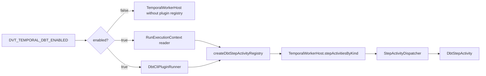
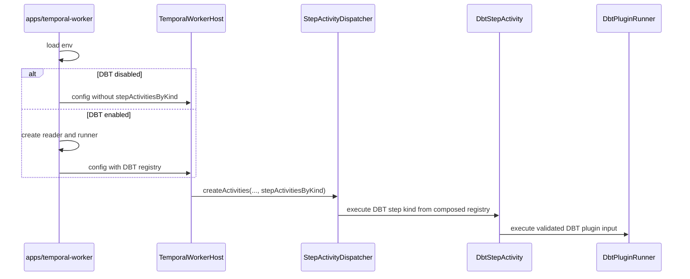

# Temporal DBT Worker Plugin Profile

This local component guide documents the DBT execution profile that is composed
by `apps/temporal-worker` when `DVT_TEMPORAL_DBT_ENABLED=true`.

Use this guide with:

- [Temporal adapter specification](./temporal-adapter-spec.md)
- [Temporal PlanRef workflow boundary component](./temporal-planref-workflow-boundary.md)
- [Temporal Worker DBT Runtime Runbook](../../../../../runbooks/temporal-worker-dbt-plugin-runtime-20260414.md)
- [Fowler DBT core decoupling analysis](../../../../../../buzon/20260428-codex-fowler-temporal-dbt-core-decoupling-analysis-and-remediation.md)
- [ADR-0003 execution model](../../../../../adr/adr-0003-execution-model.md)
- [ADR-0014 run-driven adapter model](../../../../../adr/adr-0014-run-driven-adapter-model.md)
- [ADR-0046 execution plan definition and run execution policy separation](../../../../../adr/adr-0046-execution-plan-definition-and-run-execution-policy-separation.md)

## Owned Concern

The component owns one concern:

- compose DBT step-kind activity support at the worker profile boundary without
  making DBT part of the Temporal core activity dispatcher or default registry

It does **not** own:

- engine lifecycle semantics
- PlanRef workflow orchestration
- generic step-kind dispatch policy
- plan authoring, validation, or planner compile semantics
- DBT marketplace packaging or sandbox isolation beyond the current worker
  process boundary

## Public API

- `createDbtStepActivityRegistry({ runExecutionContextReader, dbtPluginRunner })`
  returns a step-activity registry for `DBT_MODEL`, `DBT_TEST`, and
  `DBT_SNAPSHOT`.
- `DbtStepActivity.execute(step, context)` resolves the run execution context,
  validates `pluginContexts.dbt`, delegates to the configured
  `DbtPluginRunner`, and rejects mismatched `stepId` results.
- `DbtPluginRunner.execute(input)` is the plugin execution port used by the DBT
  profile.
- `DbtCliPluginRunner` is the current local CLI runner implementation behind
  the plugin port.
- `apps/temporal-worker/src/runtime/createTemporalWorkerRuntime.ts` is the
  composition root that creates the DBT registry only when
  `DVT_TEMPORAL_DBT_ENABLED=true`.

## Invariants

- `createDefaultStepActivityRegistry()` remains plugin-free and does not
  register DBT step kinds.
- `ActivityDeps` remains free of `runExecutionContextReader` and
  `dbtPluginRunner`; those dependencies belong to the DBT profile.
- DBT support is omitted entirely when `DVT_TEMPORAL_DBT_ENABLED=false`.
- When DBT support is enabled, the worker composes the DBT registry explicitly
  through `TemporalWorkerHostConfig.stepActivitiesByKind`.
- DBT steps fail closed when `runExecutionContextRef` is missing, the resolved
  context is rejected, the `dbt` plugin context is absent, or the plugin runner
  returns a result for a different `stepId`.
- Runtime composition may replace DBT step-kind activity implementations by
  passing an explicit registry; core dispatch does not reserve DBT kinds.

## Transitions

1. Worker runtime loads environment and base state/Temporal dependencies.
2. If `DVT_TEMPORAL_DBT_ENABLED=false`, no DBT runner, reader, or registry is
   constructed.
3. If `DVT_TEMPORAL_DBT_ENABLED=true`, the worker validates DBT CLI
   availability.
4. The worker creates an artifact-backed run execution context reader.
5. The worker creates a DBT bundle reader and `DbtCliPluginRunner`.
6. The worker calls `createDbtStepActivityRegistry(...)`.
7. `TemporalWorkerHost` receives the registry through `stepActivitiesByKind`.
8. Core `StepActivityDispatcher` resolves DBT kinds only from that composed
   registry.

## Consumers

- `apps/temporal-worker` consumes this profile in the standalone runtime
  composition root.
- `TemporalWorkerHost` consumes the composed registry without knowing DBT
  construction details.
- `StepActivityDispatcher` consumes a generic `StepActivityRegistry`.
- Adapter unit and integration tests consume `createDbtStepActivityRegistry`
  directly to prove positive and negative DBT behavior without changing the
  core default registry.
- Operations consume the worker DBT runbook for startup, readiness, and incident
  behavior.

## Component Map

| Module                                                            | Owned concern                                      |
| ----------------------------------------------------------------- | -------------------------------------------------- |
| `src/plugins/dbt/DbtStepActivity.ts`                              | DBT step activity profile and explicit registry    |
| `src/plugins/dbt/dbtPluginTypes.ts`                               | DBT plugin activity contracts                      |
| `src/plugins/dbt/DbtCliPluginRunner.ts`                           | Local DBT CLI runner behind the plugin port        |
| `apps/temporal-worker/src/runtime/createTemporalWorkerRuntime.ts` | Worker composition root for optional DBT profile   |
| `src/activities/stepActivityDispatcher.ts`                        | Plugin-free core dispatch through generic registry |

## Diagrams

## Drift Guards

- `packages/@dvt/adapter-temporal/test/dbt-core-decoupling.architecture.test.ts`
  verifies core activity modules do not import DBT implementation symbols.
- The same test verifies this guide contains public API, invariants,
  transitions, consumers, component map, and diagrams.
- `packages/@dvt/adapter-temporal/test/activities.test.ts` proves the default
  core registry rejects DBT kinds and accepts them only when the worker composes
  the DBT registry explicitly.
- `apps/temporal-worker/test/runtime/createTemporalWorkerRuntime.test.ts`
  proves the standalone worker omits DBT registry wiring when DBT mode is
  disabled and composes it when enabled.
