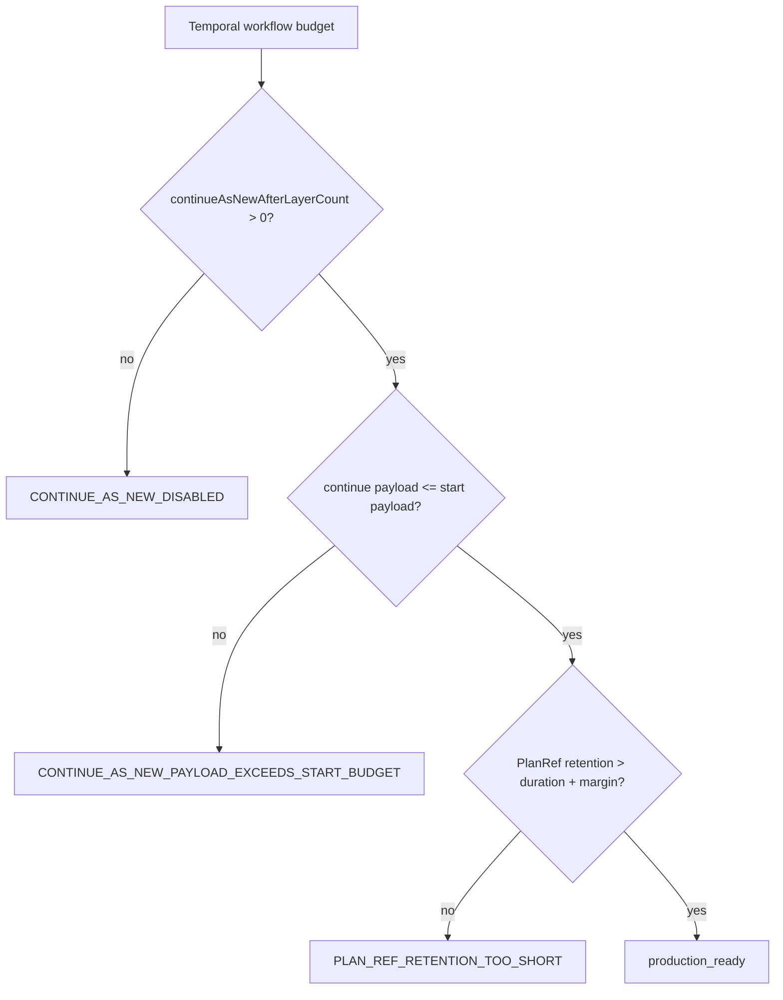

# Temporal PlanRef capacity SLA

This document closes the AR-D2 capacity gap for Temporal workflows that execute
an engine-approved `PlanRef`. It defines the production profile used to decide
whether a configured workflow budget is large-DAG ready.

Use this document with:

- [Temporal PlanRef workflow boundary component](./temporal-planref-workflow-boundary.md)
- [Temporal adapter spec](./temporal-adapter-spec.md)
- [Temporal PlanRef workflow boundary user stories](./temporal-planref-workflow-boundary-user-stories.md)
- [Temporal PlanRef drained cutover runbook](../../../../../runbooks/temporal-planref-drained-cutover-20260427.md)
- [ADR-0052 PlanRef continuation safety](../../../../../adr/adr-0052-planref-continuation-safety.md)

## Owned Concern

The capacity SLA owns one concern: classify whether Temporal PlanRef workflow
budgets are production-ready before long-running runs depend on them.

It does not own:

- executable-plan validation
- Temporal worker deployment sizing
- tenant-specific commercial retention policy
- runtime enforcement of diagnostic incident overrides

## Public API

- `TEMPORAL_PLANREF_CAPACITY_PROFILE.standard`
  The governed production profile for default PlanRef workflow capacity.
- `evaluateTemporalPlanRefCapacitySla(input)`
  Pure policy function that returns `production_ready` or
  `not_production_ready` plus explicit violation codes.
- `CONTINUE_AS_NEW_DISABLED`
  Production profile violation when `continueAsNewAfterLayerCount` is `0`.
- `CONTINUE_AS_NEW_PAYLOAD_EXCEEDS_START_BUDGET`
  Violation when rollover input can exceed the workflow start admission budget.
- `PLAN_REF_RETENTION_TOO_SHORT`
  Violation when `PlanRef` retention does not outlive the expected workflow
  duration plus the profile safety margin.
- `LAYER_COUNT_EXCEEDS_PROFILE`, `SEGMENT_COUNT_EXCEEDS_PROFILE`,
  `WORKFLOW_HISTORY_EVENTS_EXCEEDS_PROFILE`, and
  `WORKFLOW_HISTORY_BYTES_EXCEEDS_PROFILE`
  Violations when estimated production scale exceeds the standard profile.

## Production capacity profile

| Field                           |                           Standard profile |
| ------------------------------- | -----------------------------------------: |
| `continueAsNewAfterLayerCount`  |                       `> 0`, default `100` |
| maximum workflow history size   |      `10,000` events or `40,000,000` bytes |
| maximum segment count           |           `1,000` continue-as-new segments |
| maximum layer count per segment |                               `100` layers |
| maximum continue-as-new payload |                            `500,000` bytes |
| PlanRef retention               | expected workflow duration plus `24` hours |

The profile makes `continueAsNewAfterLayerCount = 0` a valid parser value for
local diagnostics or incident rollback, but not a production-ready SLA value.
That separation keeps runtime recovery possible without presenting disabled
rollover as mature scale posture.

## Invariants

- Workflow input remains `PlanRef plus compact cursor`; the full
  `ExecutionPlan` is never used as capacity storage.
- `maxContinueAsNewPayloadBytes` must not exceed `maxStartPayloadBytes`.
- `PlanRef retention` must exceed the expected maximum workflow duration plus
  the profile safety margin.
- The production profile requires non-zero rollover so Temporal history does
  not become the hidden storage layer.
- Estimated segment count and workflow history must remain below the governed
  profile maximums before claiming large-DAG readiness.
- Capacity evaluation is a pure policy and does not fetch plan material, call
  Temporal, or mutate runtime configuration.

## Transitions

1. Operator or deployment profile loads Temporal workflow budget values.
2. `evaluateTemporalPlanRefCapacitySla` compares those values with the
   production capacity profile.
3. Green evaluation allows production readiness evidence for AR-D2.
4. Violations route to configuration correction, retention correction, or
   explicit incident-mode authorization before production use.

## Consumers

- `packages/@dvt/adapter-temporal/src/temporalPlanRefCapacitySlaPolicy.ts`
  implements the executable policy.
- `packages/@dvt/adapter-temporal/test/temporalPlanRefCapacitySlaPolicy.test.ts`
  covers positive and negative SLA paths.
- `packages/@dvt/adapter-temporal/test/workflow-component-semantics.architecture.test.ts`
  prevents this document from drifting away from the workflow boundary stories.
- Lane D `AR-D2` uses this profile as the governed capacity threshold evidence.

## Diagram

## Validation

- `pnpm --filter @dvt/adapter-temporal exec vitest run test/temporalPlanRefCapacitySlaPolicy.test.ts`
- `pnpm --filter @dvt/adapter-temporal exec vitest run test/workflow-component-semantics.architecture.test.ts`
- `pnpm --filter @dvt/adapter-temporal typecheck`
