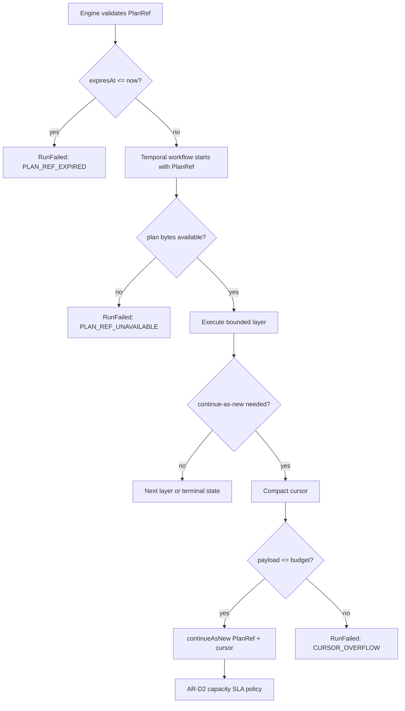

# Temporal PlanRef workflow boundary user stories

These stories cover the AR-D PlanRef workflow boundary from engine dispatch
through Temporal continuation and failure settlement.

## Actors

- Runtime operator: needs distinct terminal reasons for incidents.
- Engine caller: expects plan admission to reject expired pointers before
  provider dispatch.
- Temporal worker: executes bounded segments without durable full-plan input.
- StateStore consumer: reads DVT lifecycle events as the source of truth.

## Story coverage matrix

- `US-TPW-001`: expired PlanRef at validation boundary. Outcome:
  `PLAN_REF_EXPIRED`. Primary test:
  `packages/@dvt/engine/test/contracts/engine.test.ts`.
- `US-TPW-002`: plan bytes unavailable during segment resolution. Outcome:
  `PLAN_REF_UNAVAILABLE`. Primary test:
  `workflowRuntimePayloadHelpers.test.ts`.
- `US-TPW-003`: continue-as-new cursor exceeds payload budget. Outcome:
  `CURSOR_OVERFLOW`. Primary test: `workflow-continue-as-new.test.ts`.
- `US-TPW-004`: control signals exceed retention window. Outcome: retain only
  bounded recent ids. Primary test: `workflow-continue-as-new.test.ts`.
- `US-TPW-005`: component docs drift from executable semantics. Outcome:
  architecture fitness test goes red. Primary test:
  `workflow-component-semantics.architecture.test.ts`.
- `US-TPW-006`: production capacity profile is violated. Outcome:
  explicit SLA violation codes. Primary test:
  `temporalPlanRefCapacitySlaPolicy.test.ts`.

## User stories

### US-TPW-001 - Expired PlanRef is rejected before dispatch

As an engine caller, I want an expired `PlanRef` to fail before fetching plan
bytes or dispatching to a provider, so that DVT never executes a stale
execution pointer.

Acceptance:

- `PlanRef.expiresAt <= clock.nowIsoUtc()` fails as `PLAN_REF_EXPIRED`.
- The fetcher is not called for expired pointers.
- The error remains visible to lifecycle failure mapping.

### US-TPW-002 - Missing plan bytes are visible as pointer unavailability

As a runtime operator, I want missing plan material to surface as
`PLAN_REF_UNAVAILABLE`, so that artifact-retention incidents are not hidden as
generic workflow failures.

Acceptance:

- Missing plan bytes map to `PLAN_REF_UNAVAILABLE`.
- Known fetcher evidence such as `PLAN_BYTES_NOT_REGISTERED` and
  `PLAN_FETCH_UNAVAILABLE` maps to the same governed reason.
- The workflow failure payload can still include the original message for
  operations evidence.

### US-TPW-003 - Cursor overflow is not reported as generic workflow failure

As a runtime operator, I want continue-as-new payload overflow to surface as
`CURSOR_OVERFLOW`, so that rollover capacity incidents can be routed to AR-D2
threshold work instead of plan-artifact or step-runtime triage.

Acceptance:

- The cursor is compacted before payload-size validation.
- A payload that still exceeds the budget fails closed.
- The failure reason is `CURSOR_OVERFLOW`.

### US-TPW-004 - Control-signal dedupe history remains bounded

As the Temporal workflow runtime, I want only a recent bounded control-signal id
window in cursor state, so that long-lived pause/resume/cancel traffic does not
turn Temporal input into an append-only store.

Acceptance:

- The recent retention window is deterministic.
- Retention keeps insertion order for the retained ids.
- The maximum retained id count is governed by the workflow retention policy.

### US-TPW-005 - Architecture documentation remains executable

As a maintainer, I want the component guide, mailbox analysis, user stories, and
owned-concern module headers to be checked by tests, so that future changes do
not silently drift from the PlanRef boundary design.

Acceptance:

- The component guide publishes public API, invariants, transitions, consumers,
  component map, and diagrams.
- The mailbox review records Fowler analysis, antipatterns, remediation, and
  teachings.
- The architecture test fails if the docs or semantic module ownership are
  removed.

### US-TPW-006 - Production capacity is evaluated before large-DAG readiness

As a runtime operator, I want the Temporal PlanRef workflow budget to be checked
against the governed [capacity SLA](./temporal-planref-capacity-sla.md), so that
diagnostic overrides are not mistaken for a production-ready scale posture.

Acceptance:

- Non-zero `continueAsNewAfterLayerCount`, bounded continue-as-new payload, and
  sufficient `PlanRef retention` evaluate as `production_ready`.
- `continueAsNewAfterLayerCount = 0` evaluates as
  `CONTINUE_AS_NEW_DISABLED` for production profiles.
- A rollover payload budget greater than the start payload budget evaluates as
  `CONTINUE_AS_NEW_PAYLOAD_EXCEEDS_START_BUDGET`.
- `PlanRef retention` shorter than expected workflow duration plus profile
  safety margin evaluates as `PLAN_REF_RETENTION_TOO_SHORT`.
- Segment count, layer count, workflow-history event count, and
  workflow-history byte estimates above the profile evaluate as explicit
  profile maximum violations.

## Scenario diagram

## Traceability

- ADR: `docs/adr/adr-0052-planref-continuation-safety.md`
- Component guide:
  `docs/architecture/components/engine/adapters/temporal/temporal-planref-workflow-boundary.md`
- Capacity SLA:
  `docs/architecture/components/engine/adapters/temporal/temporal-planref-capacity-sla.md`
- Mailbox:
  `buzon/20260430-codex-fowler-ar-d-continuation-safety-analysis-and-remediation.md`
